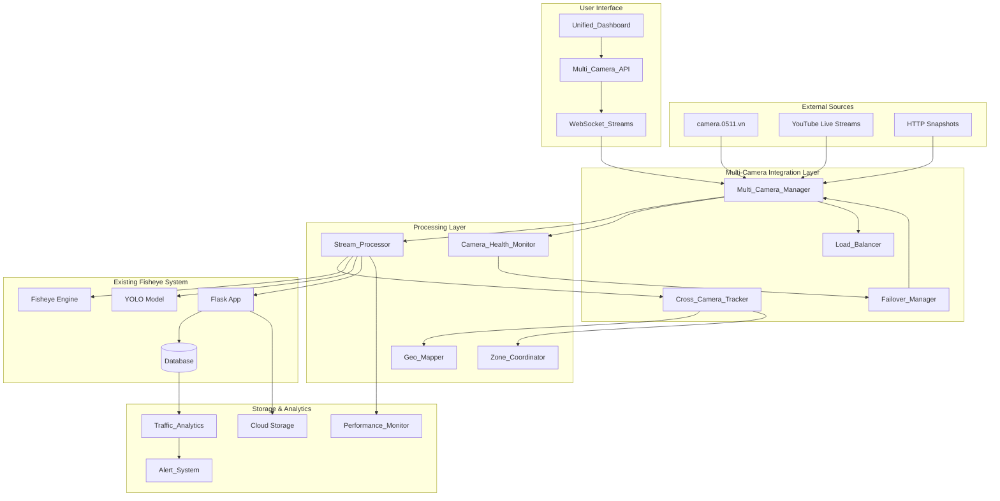

# Design Document - Multi-Camera Integration

## Overview

Tính năng Multi-Camera Integration mở rộng hệ thống fisheye demo hiện có để hỗ trợ quản lý và phân tích đồng thời nhiều camera feeds từ nguồn camera.0511.vn. Hệ thống sẽ cho phép theo dõi giao thông trên nhiều tuyến đường, đồng bộ hóa dữ liệu, và cung cấp unified dashboard để giám sát toàn diện mạng lưới giao thông đô thị.

Thiết kế này tận dụng kiến trúc hiện có của fisheye demo system và mở rộng nó với các thành phần mới để hỗ trợ multi-camera operations, cross-camera tracking, và advanced analytics.

## Architecture

### High-Level Architecture



### Component Architecture

#### 1. Multi-Camera Management Layer
- **Multi_Camera_Manager**: Quản lý tập trung các camera feeds
- **Camera_Feed_Registry**: Đăng ký và metadata của camera
- **Stream_Coordinator**: Điều phối luồng dữ liệu từ nhiều camera
- **Connection_Pool**: Pool kết nối tối ưu cho multiple streams

#### 2. Processing & Analytics Layer
- **Stream_Processor**: Xử lý real-time từ multiple cameras
- **Cross_Camera_Tracker**: Theo dõi đối tượng giữa cameras
- **Spatial_Analyzer**: Phân tích không gian và khoảng cách
- **Traffic_Correlator**: Tương quan dữ liệu giao thông

#### 3. Infrastructure Layer
- **Load_Balancer**: Cân bằng tải xử lý
- **Failover_Manager**: Quản lý chuyển đổi dự phòng
- **Camera_Health_Monitor**: Giám sát trạng thái camera
- **Performance_Monitor**: Giám sát hiệu suất hệ thống

## Components and Interfaces

### 1. Multi_Camera_Manager

**Responsibilities:**
- Quản lý kết nối đến 6 camera feeds từ camera.0511.vn
- Auto-discovery và parsing camera metadata
- Hỗ trợ YouTube embed streams và HTTP snapshots
- Caching và synchronization

**Interface:**
```python
class MultiCameraManager:
    def __init__(self, config: MultiCameraConfig):
        self.cameras: Dict[str, CameraFeed] = {}
        self.config = config
        self.connection_pool = ConnectionPool()
    
    async def discover_cameras(self, source_url: str) -> List[CameraInfo]:
        """Discover available cameras from camera.0511.vn"""
        pass
    
    async def add_camera(self, camera_info: CameraInfo) -> str:
        """Add camera to management system"""
        pass
    
    async def remove_camera(self, camera_id: str) -> bool:
        """Remove camera from system"""
        pass
    
    async def get_camera_status(self, camera_id: str) -> CameraStatus:
        """Get current status of specific camera"""
        pass
    
    async def sync_timestamps(self) -> Dict[str, float]:
        """Synchronize timestamps across all cameras"""
        pass
```

**Data Models:**
```python
@dataclass
class CameraInfo:
    id: str
    title: str
    location_description: str
    stream_url: str
    snapshot_url: str
    stream_type: StreamType  # YOUTUBE_LIVE, HTTP_SNAPSHOT
    coordinates: Optional[Tuple[float, float]]
    coverage_area: Optional[Polygon]

@dataclass
class CameraFeed:
    info: CameraInfo
    status: CameraStatus
    last_frame: Optional[np.ndarray]
    last_update: datetime
    health_score: float
    processing_stats: ProcessingStats
```

### 2. Stream_Processor

**Responsibilities:**
- Xử lý real-time frames từ multiple cameras
- Maintain 15 FPS per camera
- Apply fisheye correction và object detection
- Buffer management và resource optimization

**Interface:**
```python
class StreamProcessor:
    def __init__(self, model_registry: ModelRegistry, config: ProcessingConfig):
        self.model_registry = model_registry
        self.config = config
        self.frame_buffers: Dict[str, FrameBuffer] = {}
        self.processing_queue = asyncio.Queue()
    
    async def process_camera_stream(self, camera_id: str, frame: np.ndarray) -> ProcessingResult:
        """Process single frame from specific camera"""
        pass
    
    async def process_multiple_streams(self, frames: Dict[str, np.ndarray]) -> Dict[str, ProcessingResult]:
        """Process frames from multiple cameras simultaneously"""
        pass
    
    def set_priority(self, camera_id: str, priority: Priority):
        """Set processing priority for camera"""
        pass
    
    def get_processing_stats(self) -> Dict[str, ProcessingStats]:
        """Get processing statistics for all cameras"""
        pass
```

### 3. Cross_Camera_Tracker

**Responsibilities:**
- Track vehicles moving between camera coverage areas
- Maintain trajectory history across cameras
- Calculate travel times between checkpoints
- Generate unique journey IDs

**Interface:**
```python
class CrossCameraTracker:
    def __init__(self, spatial_analyzer: SpatialAnalyzer):
        self.spatial_analyzer = spatial_analyzer
        self.active_tracks: Dict[str, VehicleTrack] = {}
        self.journey_history: List[Journey] = []
    
    def update_detections(self, camera_id: str, detections: List[Detection]) -> List[TrackUpdate]:
        """Update tracking with new detections from camera"""
        pass
    
    def match_cross_camera(self, exiting_track: VehicleTrack, entering_detections: List[Detection]) -> Optional[str]:
        """Match vehicle exiting one camera with entering another"""
        pass
    
    def get_active_journeys(self) -> List[Journey]:
        """Get currently active cross-camera journeys"""
        pass
    
    def calculate_travel_time(self, from_camera: str, to_camera: str) -> Optional[float]:
        """Calculate average travel time between cameras"""
        pass
```

**Data Models:**
```python
@dataclass
class VehicleTrack:
    track_id: str
    camera_id: str
    vehicle_class: str
    first_seen: datetime
    last_seen: datetime
    trajectory: List[Tuple[float, float]]
    features: VehicleFeatures  # Color, size, shape descriptors
    confidence: float

@dataclass
class Journey:
    journey_id: str
    vehicle_class: str
    start_camera: str
    end_camera: str
    start_time: datetime
    end_time: Optional[datetime]
    travel_time: Optional[float]
    checkpoints: List[Checkpoint]
```

### 4. Unified_Dashboard

**Responsibilities:**
- Display live feeds from all cameras in grid layouts
- Show real-time traffic statistics
- Provide camera health indicators
- Support custom layouts và full-screen mode

**Interface:**
```python
class UnifiedDashboard:
    def __init__(self, camera_manager: MultiCameraManager):
        self.camera_manager = camera_manager
        self.layout_manager = LayoutManager()
        self.websocket_handler = WebSocketHandler()
    
    async def get_dashboard_data(self) -> DashboardData:
        """Get complete dashboard data"""
        pass
    
    async def stream_live_data(self, websocket: WebSocket):
        """Stream real-time data to dashboard"""
        pass
    
    def set_layout(self, user_id: str, layout: DashboardLayout):
        """Set custom dashboard layout for user"""
        pass
    
    def get_camera_grid(self, grid_size: GridSize) -> List[List[str]]:
        """Get camera arrangement for grid display"""
        pass
```

### 5. Camera_Health_Monitor

**Responsibilities:**
- Monitor connectivity, frame rate, resolution, latency
- Generate alerts for camera issues
- Maintain uptime statistics
- Calculate health scores

**Interface:**
```python
class CameraHealthMonitor:
    def __init__(self, alert_manager: AlertManager):
        self.alert_manager = alert_manager
        self.health_metrics: Dict[str, HealthMetrics] = {}
        self.monitoring_tasks: Dict[str, asyncio.Task] = {}
    
    async def start_monitoring(self, camera_id: str):
        """Start health monitoring for camera"""
        pass
    
    async def check_camera_health(self, camera_id: str) -> HealthStatus:
        """Perform health check on specific camera"""
        pass
    
    def calculate_health_score(self, camera_id: str) -> float:
        """Calculate health score (0-100) for camera"""
        pass
    
    def get_uptime_stats(self, camera_id: str) -> UptimeStats:
        """Get uptime statistics for camera"""
        pass
```

### 6. Load_Balancer

**Responsibilities:**
- Distribute processing load across GPU resources
- Adjust quality based on resource constraints
- Support horizontal scaling
- Provide resource utilization metrics

**Interface:**
```python
class LoadBalancer:
    def __init__(self, resource_monitor: ResourceMonitor):
        self.resource_monitor = resource_monitor
        self.processing_nodes: List[ProcessingNode] = []
        self.load_distribution: Dict[str, float] = {}
    
    def distribute_cameras(self, cameras: List[str]) -> Dict[str, str]:
        """Distribute cameras across processing nodes"""
        pass
    
    def adjust_quality(self, resource_usage: ResourceUsage):
        """Adjust processing quality based on resource constraints"""
        pass
    
    def add_processing_node(self, node: ProcessingNode):
        """Add new processing node for scaling"""
        pass
    
    def get_resource_metrics(self) -> ResourceMetrics:
        """Get current resource utilization metrics"""
        pass
```

## Data Models

### Core Data Structures

```python
# Camera Management
@dataclass
class CameraConfig:
    id: str
    name: str
    source_url: str
    stream_type: StreamType
    coordinates: Tuple[float, float]
    fisheye_params: FisheyeParams
    priority: Priority
    health_check_interval: int = 30

@dataclass
class StreamMetadata:
    camera_id: str
    timestamp: datetime
    frame_number: int
    resolution: Tuple[int, int]
    fps: float
    latency_ms: float

# Processing Results
@dataclass
class MultiCameraDetection:
    camera_id: str
    timestamp: datetime
    detections: List[Detection]
    processing_time_ms: float
    frame_metadata: StreamMetadata

@dataclass
class CrossCameraEvent:
    event_id: str
    event_type: EventType  # VEHICLE_ENTER, VEHICLE_EXIT, JOURNEY_COMPLETE
    camera_id: str
    track_id: str
    timestamp: datetime
    metadata: Dict[str, Any]

# Analytics Data
@dataclass
class TrafficFlowData:
    camera_id: str
    time_bucket: datetime
    vehicle_counts: Dict[str, int]
    average_speed: Optional[float]
    congestion_level: CongestionLevel
    flow_direction: FlowDirection

@dataclass
class ZoneAnalytics:
    zone_id: str
    cameras: List[str]
    total_vehicles: int
    average_travel_time: float
    congestion_score: float
    bottleneck_cameras: List[str]
```

### Database Schema Extensions

```sql
-- Multi-Camera Tables
CREATE TABLE cameras (
    id TEXT PRIMARY KEY,
    name TEXT NOT NULL,
    source_url TEXT NOT NULL,
    stream_type TEXT NOT NULL,
    coordinates POINT,
    coverage_area POLYGON,
    fisheye_params JSONB,
    priority INTEGER DEFAULT 1,
    created_at TIMESTAMPTZ NOT NULL,
    updated_at TIMESTAMPTZ NOT NULL
);

CREATE TABLE camera_health (
    camera_id TEXT REFERENCES cameras(id),
    timestamp TIMESTAMPTZ NOT NULL,
    status TEXT NOT NULL,
    fps REAL,
    latency_ms REAL,
    health_score REAL,
    error_message TEXT,
    PRIMARY KEY (camera_id, timestamp)
);

CREATE TABLE cross_camera_tracks (
    journey_id TEXT PRIMARY KEY,
    vehicle_class TEXT NOT NULL,
    start_camera TEXT REFERENCES cameras(id),
    end_camera TEXT REFERENCES cameras(id),
    start_time TIMESTAMPTZ NOT NULL,
    end_time TIMESTAMPTZ,
    travel_time_seconds REAL,
    checkpoints JSONB,
    created_at TIMESTAMPTZ NOT NULL
);

CREATE TABLE traffic_zones (
    zone_id TEXT PRIMARY KEY,
    name TEXT NOT NULL,
    cameras TEXT[] NOT NULL,
    boundary POLYGON,
    zone_type TEXT NOT NULL,
    created_at TIMESTAMPTZ NOT NULL
);

CREATE TABLE zone_analytics (
    zone_id TEXT REFERENCES traffic_zones(zone_id),
    time_bucket TIMESTAMPTZ NOT NULL,
    total_vehicles INTEGER DEFAULT 0,
    average_travel_time REAL,
    congestion_score REAL,
    flow_data JSONB,
    PRIMARY KEY (zone_id, time_bucket)
);

-- Indexes for performance
CREATE INDEX idx_camera_health_timestamp ON camera_health(timestamp);
CREATE INDEX idx_cross_camera_tracks_time ON cross_camera_tracks(start_time);
CREATE INDEX idx_zone_analytics_time ON zone_analytics(time_bucket);
CREATE INDEX idx_cameras_coordinates ON cameras USING GIST(coordinates);
```

## Correctness Properties

*A property is a characteristic or behavior that should hold true across all valid executions of a system — essentially, a formal statement about what the system should do. Properties serve as the bridge between human-readable specifications and machine-verifiable correctness guarantees.*

### Property 1: Camera Discovery Round-Trip Consistency

**Statement:** For any valid camera configuration object, serializing it to a dictionary and then parsing it back must produce an equivalent object.

**Formal definition:**
```
∀ config ∈ ValidCameraConfig:
    parse(serialize(config)) ≡ config
```

**What to test:**
- Generate arbitrary `CameraInfo` objects with valid fields (id, title, stream_url, stream_type, etc.)
- Serialize each object to a dict/JSON representation
- Parse the serialized form back into a `CameraInfo` object
- Assert that all fields are equal between original and round-tripped object

**Validates:** Requirements 11.4 (round-trip parsing property)

---

### Property 2: Health Score Invariant

**Statement:** For any combination of valid performance metrics (fps, latency, uptime ratio, error rate), the computed health score must always be within the closed interval [0, 100].

**Formal definition:**
```
∀ metrics ∈ ValidHealthMetrics:
    0 ≤ calculate_health_score(metrics) ≤ 100
```

**What to test:**
- Generate arbitrary health metric inputs: fps ∈ [0, 120], latency_ms ∈ [0, 10000], uptime_ratio ∈ [0.0, 1.0], error_rate ∈ [0.0, 1.0]
- Call `calculate_health_score(metrics)` for each generated input
- Assert the result is always in [0, 100]
- Include edge cases: all-zero metrics, all-maximum metrics, mixed extremes

**Validates:** Requirements 5.7 (health score 0-100)

---

### Property 3: Cross-Camera No Duplicate Counting

**Statement:** For any set of detections from cameras with overlapping coverage areas, the total unique vehicle count reported by the Cross_Camera_Tracker must be less than or equal to the sum of individual camera counts.

**Formal definition:**
```
∀ detections ∈ OverlappingCameraDetections:
    unique_count(merge(detections)) ≤ Σ count(camera_i)
```

**What to test:**
- Generate sets of detections where the same vehicle appears in 2+ overlapping cameras (same vehicle_class, similar features, within matching time window)
- Feed detections into `CrossCameraTracker.update_detections()` for each camera
- Assert that the total unique tracked vehicles ≤ sum of per-camera detection counts
- Verify no journey_id is assigned to the same physical vehicle twice

**Validates:** Requirements 3.5 (avoid duplicate vehicle counting in overlapping cameras)

---

### Property 4: Load Distribution Does Not Exceed Capacity

**Statement:** For any assignment of cameras to processing nodes by the Load_Balancer, the total load assigned to each node must not exceed that node's declared capacity.

**Formal definition:**
```
∀ assignment ∈ LoadBalancer.distribute_cameras(cameras):
    ∀ node ∈ assignment:
        Σ load(camera_i assigned to node) ≤ node.capacity
```

**What to test:**
- Generate arbitrary lists of cameras with varying processing weights (1–6 cameras)
- Generate processing nodes with varying capacities
- Call `distribute_cameras(cameras)` and inspect the resulting assignment
- Assert that no node's total assigned load exceeds its capacity
- Verify all cameras are assigned (no camera is dropped)

**Validates:** Requirements 6.1 (distribute processing load), 6.4 (horizontal scaling)

---

### Property 5: Timestamp Synchronization Accuracy

**Statement:** After synchronization, the absolute difference between any two camera timestamps must not exceed 100 milliseconds.

**Formal definition:**
```
∀ (cam_i, cam_j) ∈ SynchronizedCameras:
    |timestamp(cam_i) - timestamp(cam_j)| ≤ 100ms
```

**What to test:**
- Simulate cameras with clock offsets drawn from a realistic distribution (e.g., ±500ms before sync)
- Call `MultiCameraManager.sync_timestamps()` to perform synchronization
- For all pairs of synchronized camera timestamps, assert the absolute difference ≤ 100ms
- Test with varying numbers of cameras (2–6)

**Validates:** Requirements 10.1 (synchronize timestamps within 100ms accuracy)

---

### Property 6: Journey ID Uniqueness

**Statement:** For any sequence of cross-camera tracking events, all generated journey IDs must be globally unique — no two distinct journeys share the same ID.

**Formal definition:**
```
∀ journeys ∈ CrossCameraTracker.get_active_journeys() ∪ journey_history:
    ∀ (j_i, j_j) where i ≠ j:
        j_i.journey_id ≠ j_j.journey_id
```

**What to test:**
- Simulate a large number of vehicle tracking events across multiple cameras (e.g., 100+ journeys)
- Collect all generated journey IDs from `get_active_journeys()` and `journey_history`
- Assert that the set of IDs has the same cardinality as the list (no duplicates)
- Test under concurrent tracking scenarios

**Validates:** Requirements 3.7 (generate unique journey IDs)

---

### Property 7: Traffic Correlation Coefficient Bounds

**Statement:** For any pair of camera traffic volume time series, the computed Pearson correlation coefficient must always be within the mathematically valid range [-1, 1].

**Formal definition:**
```
∀ (series_i, series_j) ∈ CameraTrafficPairs:
    -1 ≤ Traffic_Correlator.correlation(series_i, series_j) ≤ 1
```

**What to test:**
- Generate arbitrary pairs of traffic volume time series (non-negative integers, varying lengths ≥ 2)
- Call `Traffic_Correlator.calculate_correlation(series_i, series_j)` for each pair
- Assert the result is always in [-1, 1]
- Include edge cases: identical series (should return 1.0), constant series (handle division by zero gracefully), anti-correlated series

**Validates:** Requirements 15.3 (calculate correlation coefficients between camera traffic volumes)
