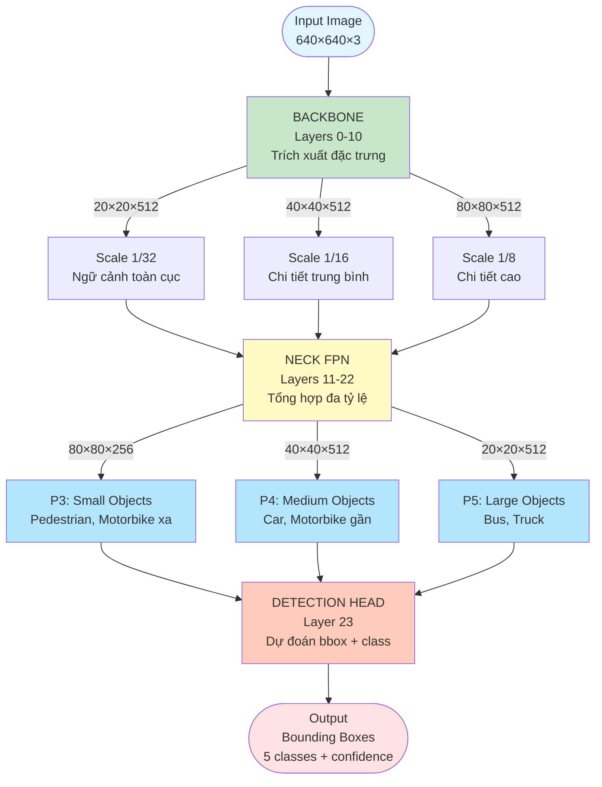
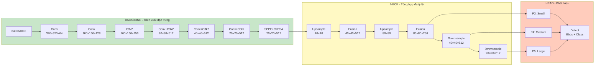

# Nghiên cứu Phát hiện Đối tượng trên Ảnh Camera Fisheye 8K sử dụng YOLO11

Người Hướng Dẫn : Dr.Nguyễn Đức Dư
## Mục lục

1. [AI City Challenge 2024 và bài toán FishEye8K](#1-ai-city-challenge-2024-và-bài-toán-fisheye8k)
2. [Nghiên cứu của chúng tôi — Giới thiệu bài toán](#2-nghiên-cứu-của-chúng-tôi--giới-thiệu-bài-toán)
3. [Tập dữ liệu (Dataset)](#3-tập-dữ-liệu-dataset)
4. [Mô hình (Model)](#4-mô-hình-model)
5. [Xử lý dữ liệu (Data Pipeline)](#5-xử-lý-dữ-liệu-data-pipeline)
6. [Huấn luyện mô hình](#6-huấn-luyện-mô-hình)
7. [Kết quả thực nghiệm](#7-kết-quả-thực-nghiệm)
8. [Kết luận và hướng phát triển](#8-kết-luận-và-hướng-phát-triển)

---

## 1. AI City Challenge 2024 và bài toán FishEye8K

### 1.1. Tổng quan AI City Challenge

**AI City Challenge** là cuộc thi nghiên cứu thường niên do **NVIDIA** và **IEEE** đồng tổ chức, gắn liền với hội nghị **CVPR (IEEE/CVF Conference on Computer Vision and Pattern Recognition)** — hội nghị hàng đầu thế giới về thị giác máy tính. Cuộc thi tập trung vào các bài toán ứng dụng AI trong lĩnh vực giao thông thông minh (Intelligent Transportation Systems).

Năm **2024**, AI City Challenge đưa ra nhiều bài toán (tracks), trong đó **Track 4: Road Object Detection in Fish-Eye Cameras** là một bài toán hoàn toàn mới, lần đầu tiên đưa thách thức phát hiện đối tượng trên camera fisheye vào một cuộc thi quy mô quốc tế.

### 1.2. Track 4 — Road Object Detection in Fish-Eye Cameras

#### 1.2.1. Mô tả bài toán

Bài toán yêu cầu các đội thi xây dựng mô hình **phát hiện đối tượng giao thông** (object detection) trên ảnh thu từ **camera fisheye** — loại camera có góc nhìn siêu rộng (>180 độ), thường được lắp đặt tại các nút giao thông, bãi đỗ xe và đường phố để giám sát. Camera fisheye tạo ra ảnh bị **méo hình barrel distortion**, khiến các đối tượng ở rìa ảnh bị biến dạng nghiêm trọng — đây là thách thức lớn đối với các thuật toán phát hiện đối tượng truyền thống.

#### 1.2.2. Tập dữ liệu FishEye8K

Cuộc thi sử dụng tập dữ liệu **FishEye8K** — một benchmark chuyên biệt được giới thiệu bởi nhóm nghiên cứu **HCMIU-VisionLab** (Đại học Quốc tế, ĐHQG TP.HCM). Đây là tập dữ liệu lớn nhất dành riêng cho bài toán phát hiện đối tượng trên ảnh camera fisheye tại thời điểm công bố.

| Thông số | Giá trị |
|----------|---------|
| **Tổng số ảnh** | 8,000 (5,288 train + 2,712 test) |
| **Tổng số annotations** | ~157,000 bounding boxes |
| **Số camera fisheye** | 18 camera (từ nhiều vị trí giao thông khác nhau) |
| **Độ phân giải ảnh** | Đa dạng (lên đến 8K) |
| **Số lớp đối tượng** | 5: **Bus, Bike (Motorbike), Car, Pedestrian, Truck** |
| **Định dạng annotation** | COCO JSON |
| **Nguồn dữ liệu** | Camera giám sát giao thông thực tế |

#### 1.2.3. Metric đánh giá

Ban đầu cuộc thi sử dụng **mAP (mean Average Precision)** làm metric chính. Tuy nhiên, sau đó đã chuyển sang sử dụng **F1-score** (trung bình điều hòa của Precision và Recall) làm tiêu chí xếp hạng chính, vì mAP bị phát hiện là có xu hướng ưu ái các chiến lược tạo ra nhiều false positives.

### 1.3. Kết quả cuộc thi và các đội thắng giải

Cuộc thi thu hút sự tham gia của **hơn 50 đội** từ khắp nơi trên thế giới. Kết quả top 3 như sau:

| Hạng | Đội | F1-score | Bài báo |
|------|-----|----------|---------|
| **1st (Winner)** | **VNPT AI** (Team 9) | **0.6406** | "Robust Data Augmentation and Ensemble Method for Object Detection in Fisheye Camera Images" |
| **2nd (Runner-up)** | **Nota / NetsPresso** (Team 40) | **0.6196** | "Road Object Detection Robust to Distorted Objects at the Edge Regions of Images" |
| **3rd (Honorable)** | **SKKU-AutoLab** (Team 5) | **0.6194** | "Improving Object Detection to Fisheye Cameras with Open-Vocabulary Pseudo-Label Approach" |

### 1.4. Kỹ thuật chính của các đội dẫn đầu

Các đội đạt thứ hạng cao đã sử dụng nhiều kỹ thuật tiên tiến để giải quyết thách thức của bài toán fisheye:

| Kỹ thuật | Mô tả |
|----------|-------|
| **Model Ensemble** | Kết hợp nhiều mô hình (YOLO variants + Transformer-based models như Co-DETR) và sử dụng **Weighted Boxes Fusion (WBF)** để hợp nhất kết quả |
| **Data Augmentation mạnh** | Các kỹ thuật augmentation chuyên biệt cho fisheye: barrel distortion simulation, mosaic, mixup, copy-paste |
| **Pseudo-labeling** | Sử dụng mô hình pre-trained để sinh nhãn giả (pseudo-labels) cho dữ liệu chưa gán nhãn, mở rộng tập huấn luyện |
| **Dữ liệu bổ sung** | Tận dụng các dataset công khai khác như **VisDrone**, **MIO-TCD**, **UAV datasets** để tăng cường dữ liệu |
| **SAHI (Slicing Aided Hyper Inference)** | Kỹ thuật chia nhỏ ảnh đầu vào để cải thiện phát hiện đối tượng nhỏ trong ảnh fisheye méo |
| **Multi-scale Training/Testing** | Huấn luyện và suy luận ở nhiều độ phân giải khác nhau |

### 1.5. Ý nghĩa của cuộc thi

AI City Challenge 2024 Track 4 đánh dấu một **bước ngoặt quan trọng** trong lĩnh vực nghiên cứu phát hiện đối tượng trên camera fisheye:

- **Lần đầu tiên** bài toán fisheye object detection được đưa vào một cuộc thi quy mô quốc tế tại CVPR
- Chứng minh rằng các kỹ thuật hiện đại (YOLO, Transformer, ensemble) có thể đạt kết quả khả quan trên ảnh fisheye
- Tạo ra benchmark chuẩn (FishEye8K) để cộng đồng nghiên cứu có thể so sánh và phát triển
- Chỉ ra các hướng nghiên cứu tiềm năng: domain adaptation, fisheye-specific augmentation, small object detection

---

## 2. Nghiên cứu của chúng tôi — Giới thiệu bài toán

### 2.1. Bối cảnh nghiên cứu

Lấy cảm hứng từ AI City Challenge 2024 Track 4 và tập dữ liệu FishEye8K, nghiên cứu này thực hiện một pipeline end-to-end cho bài toán phát hiện đối tượng giao thông trên ảnh camera fisheye sử dụng mô hình **YOLO11** (trước đây thường được gọi là YOLOv11) — phiên bản mới nhất của dòng YOLO, được Ultralytics phát hành vào tháng 9 năm 2024.

Khác với các đội thi tại AI City Challenge thường sử dụng kỹ thuật ensemble phức tạp và nhiều mô hình kết hợp, nghiên cứu này tập trung vào việc đánh giá hiệu năng của **một mô hình đơn (YOLO11l)** khi được huấn luyện trên dữ liệu kết hợp FishEye8K và VisDrone, nhằm đưa ra baseline và phân tích chi tiết các yếu tố ảnh hưởng đến hiệu suất.

### 2.2. Mục tiêu cụ thể

- Xây dựng pipeline dữ liệu kết hợp **FishEye8K** và **VisDrone** để tăng cường khả năng tổng quát hóa.
- Áp dụng kỹ thuật biến đổi fisheye (barrel distortion) cho dữ liệu VisDrone để tạo dữ liệu huấn luyện đồng nhất.
- Huấn luyện và đánh giá mô hình YOLO11l trên tập dữ liệu kết hợp.
- Phân tích chi tiết kết quả theo từng lớp đối tượng và đề xuất hướng cải thiện.

### 2.3. Thách thức chính

| Thách thức | Mô tả |
|------------|-------|
| **Méo hình (Distortion)** | Ảnh fisheye có hiệu ứng barrel distortion mạnh, khiến các đối tượng ở rìa ảnh bị biến dạng nghiêm trọng |
| **Đa tỷ lệ (Multi-scale)** | Đối tượng gần tâm ảnh có kích thước lớn, trong khi đối tượng ở rìa rất nhỏ |
| **Thiếu dữ liệu** | Tập FishEye8K có giới hạn (~5,288 ảnh train), cần bổ sung dữ liệu từ nguồn khác |
| **Mất cân bằng lớp** | Lớp Car chiếm đa số (~90% instances), trong khi Bus, Truck, Pedestrian có rất ít mẫu |
| **Domain gap** | Sự khác biệt đặc trưng giữa dữ liệu FishEye8K thật và VisDrone (đã chuyển đổi fisheye) |

---

## 3. Tập dữ liệu (Dataset)

### 3.1. FishEye8K

FishEye8K là tập dữ liệu chuyên biệt cho bài toán phát hiện đối tượng trên ảnh camera fisheye, được thu thập từ các camera giám sát giao thông thực tế.

| Thông số | Giá trị |
|----------|---------|
| **Ảnh huấn luyện (Train)** | 5,288 ảnh |
| **Nhãn huấn luyện (Labels)** | 112,213 bounding boxes |
| **Ảnh kiểm thử (Test)** | 2,712 ảnh |
| **Số camera** | 15 camera |
| **Số lớp đối tượng** | 5 (Car, Bus, Truck, Pedestrian, Motorbike) |
| **Định dạng annotation** | COCO JSON |

### 3.2. VisDrone

VisDrone là tập dữ liệu phát hiện đối tượng từ góc nhìn trên cao (aerial view), được sử dụng bổ sung để tăng lượng dữ liệu huấn luyện.

| Tập con | Số ảnh | Số labels |
|---------|--------|-----------|
| **train** | 6,471 | 343,205 |
| **val** | 548 | 38,759 |
| **test-dev** | 1,610 | 75,102 |
| **Tổng** | **8,629** | **457,066** |

### 3.3. Ánh xạ lớp đối tượng (Class Mapping)

Dữ liệu VisDrone có hệ thống nhãn khác với FishEye8K, do đó cần thực hiện ánh xạ:

| VisDrone (index - tên) | FishEye8K (index - tên) |
|------------------------|------------------------|
| 1: pedestrian, 2: people | 3: Pedestrian |
| 3: bicycle, 7: tricycle, 8: awning-tricycle, 10: motor | 4: Motorbike |
| 4: car, 5: van | 0: Car |
| 6: truck | 2: Truck |
| 9: bus | 1: Bus |

> **Lưu ý:** Lớp 0 (ignored) của VisDrone được bỏ qua hoàn toàn.

---

## 4. Mô hình (Model)

### 4.1. Tổng quan về YOLO11

**YOLO11** (Ultralytics, tháng 9/2024) là thế hệ mới nhất trong dòng mô hình YOLO, mang đến nhiều cải tiến kiến trúc quan trọng so với các phiên bản trước (YOLOv8, YOLOv9). YOLO11 tập trung vào việc nâng cao hiệu quả trích xuất đặc trưng, cải thiện cơ chế chú ý không gian (spatial attention), và tối ưu hóa cả tốc độ lẫn độ chính xác.

Các cải tiến chính của YOLO11 so với YOLOv8:

| Đặc điểm | Thay đổi trong YOLO11 | Lợi ích |
|-----------|----------------------|--------|
| **Trích xuất đặc trưng** | Thay thế module C2f bằng **C3k2** | Hiệu quả tính toán cao hơn, xử lý nhanh hơn |
| **Nhận thức không gian** | Thêm module **C2PSA** | Tập trung tốt hơn vào vùng quan trọng, cải thiện phát hiện đối tượng nhỏ |
| **Hiệu suất tổng thể** | Tối ưu hóa backbone/neck | Đạt mAP cao hơn với ít tham số hơn (ví dụ: YOLO11m giảm 22% tham số so với YOLOv8m) |

YOLO11 tiếp tục phương pháp phát hiện đối tượng **anchor-free, multi-scale**, đồng thời tinh chỉnh cấu trúc mạng để gọn nhẹ và hiệu quả hơn cho nhiều tác vụ bao gồm object detection, instance segmentation, pose estimation, và oriented bounding boxes (OBB).

### 4.2. YOLO11l — Kiến trúc chi tiết

Dự án sử dụng **YOLO11l** (Large variant) từ thư viện Ultralytics 8.4.24.

| Thông số | Giá trị |
|----------|---------|
| **Pretrained weights** | yolo11l.pt (pre-trained trên COCO) |
| **Tổng số layers** | 358 |
| **Tổng số parameters** | 25,314,335 (~25.3M) |
| **Gradients** | 25,314,319 |
| **GFLOPs** | 87.3 |
| **Số lớp đầu ra (nc)** | 5 (fine-tune từ 80 lớp COCO sang 5 lớp FishEye8K) |

### 4.3. Các module kiến trúc chính

Kiến trúc YOLO11l được chia thành 3 phần chính: **Backbone**, **Neck (FPN)**, và **Head**.

#### 4.3.1. Backbone — Trích xuất đặc trưng

| Layer | Module | Đầu vào | Tham số | Mô tả |
|-------|--------|---------|---------|-------|
| 0 | Conv | Ảnh RGB | 1,856 | Conv 3×3, stride 2 — giảm kích thước ½ |
| 1 | Conv | Layer 0 | 73,984 | Conv 3×3, stride 2 — giảm kích thước ¼ |
| 2 | **C3k2** | Layer 1 | 173,824 | CSP với kernel 3×3, 256 channels |
| 3 | Conv | Layer 2 | 590,336 | Conv 3×3, stride 2 — giảm kích thước ⅛ |
| 4 | **C3k2** | Layer 3 | 691,712 | CSP với kernel 3×3, 512 channels |
| 5 | Conv | Layer 4 | 2,360,320 | Conv 3×3, stride 2 — giảm kích thước 1/16 |
| 6 | **C3k2** | Layer 5 | 2,234,368 | CSP full (không reduce), 512 channels |
| 7 | Conv | Layer 6 | 2,360,320 | Conv 3×3, stride 2 — giảm kích thước 1/32 |
| 8 | **C3k2** | Layer 7 | 2,234,368 | CSP full, 512 channels |
| 9 | **SPPF** | Layer 8 | 656,896 | Spatial Pyramid Pooling Fast, kernel 5 |
| 10 | **C2PSA** | Layer 9 | 1,455,616 | Cross-Stage Partial với Spatial Attention |

#### 4.3.2. Neck (FPN) — Tổng hợp đa tỷ lệ

| Layer | Module | Đầu vào | Tham số | Mô tả |
|-------|--------|---------|---------|-------|
| 11 | Upsample | Layer 10 | 0 | Nearest-neighbor ×2 |
| 12 | Concat | [11, 6] | 0 | Nối features 1/16 và 1/32 |
| 13 | **C3k2** | Layer 12 | 2,496,512 | Fusion features, 512 channels |
| 14 | Upsample | Layer 13 | 0 | Nearest-neighbor ×2 |
| 15 | Concat | [14, 4] | 0 | Nối features 1/8 và 1/16 |
| 16 | **C3k2** | Layer 15 | 756,736 | Fusion features, 256 channels |
| 17 | Conv | Layer 16 | 590,336 | Downsample ×2 |
| 18 | Concat | [17, 13] | 0 | Nối features |
| 19 | **C3k2** | Layer 18 | 2,365,440 | Fusion features, 512 channels |
| 20 | Conv | Layer 19 | 2,360,320 | Downsample ×2 |
| 21 | Concat | [20, 10] | 0 | Nối features |
| 22 | **C3k2** | Layer 21 | 2,496,512 | Fusion features, 512 channels |

#### 4.3.3. Head — Phát hiện đối tượng

| Layer | Module | Đầu vào | Tham số | Mô tả |
|-------|--------|---------|---------|-------|
| 23 | **Detect** | [16, 19, 22] | 1,414,879 | Anchor-free detection head, 5 lớp, reg_max=16 |

### 4.4. Sơ đồ luồng xử lý YOLO11 (Mermaid Workflow)

Dưới đây là sơ đồ tóm lược luồng xử lý của YOLO11l, làm rõ mục đích của từng giai đoạn:



#### Mục đích của từng giai đoạn:

| Giai đoạn | Layers | Mục đích chính | Kỹ thuật sử dụng |
|-----------|--------|----------------|------------------|
| **BACKBONE** | 0-10 | **Trích xuất đặc trưng từ ảnh thô**<br/>- Giảm kích thước không gian (640→20)<br/>- Tăng số channels (3→512)<br/>- Học các pattern từ đơn giản đến phức tạp | • Conv layers: Downsampling<br/>• C3k2: Trích xuất đặc trưng hiệu quả<br/>• SPPF: Mở rộng receptive field<br/>• C2PSA: Tập trung vào vùng quan trọng |
| **NECK (FPN)** | 11-22 | **Kết hợp thông tin đa tỷ lệ**<br/>- Tổng hợp features từ nhiều độ phân giải<br/>- Tạo feature pyramid cho detection<br/>- Cân bằng giữa chi tiết và ngữ cảnh | • Upsample: Phục hồi độ phân giải<br/>• Concat: Kết hợp features<br/>• C3k2 Fusion: Tổng hợp thông tin<br/>• Downsample: Tạo pyramid |
| **HEAD** | 23 | **Dự đoán đối tượng**<br/>- Tạo bounding boxes<br/>- Phân loại đối tượng (5 classes)<br/>- Tính confidence scores | • Anchor-free detection<br/>• Multi-scale prediction (P3, P4, P5)<br/>• NMS post-processing |

#### Luồng xử lý chi tiết theo scale:



#### Ý nghĩa của kiến trúc đa tỷ lệ trong bài toán Fisheye:

| Đặc điểm Fisheye | Giải pháp YOLO11 | Lợi ích |
|------------------|------------------|---------|
| **Đối tượng nhỏ ở rìa** (Pedestrian xa) | P3 (80×80) với độ phân giải cao | Giữ được chi tiết nhỏ, phát hiện người đi bộ bị méo ở rìa |
| **Đối tượng trung bình** (Car, Motorbike) | P4 (40×40) cân bằng chi tiết-ngữ cảnh | Phát hiện chính xác đối tượng phổ biến nhất |
| **Đối tượng lớn gần tâm** (Bus, Truck) | P5 (20×20) với receptive field lớn | Nắm bắt toàn bộ đối tượng lớn, hiểu ngữ cảnh |
| **Biến dạng barrel** | C2PSA spatial attention | Tập trung vào vùng quan trọng, bỏ qua méo hình |
| **Đa tỷ lệ cực đoan** | FPN kết hợp 3 scales | Xử lý đồng thời đối tượng từ rất nhỏ đến rất lớn |

### 4.5. Mô tả chi tiết các module mới trong YOLO11

#### C3k2 — Cross-Stage Partial Bottleneck với Kernel 3×3

**C3k2** là module cốt lõi mới nhất trong YOLO11, thay thế module C2f của YOLOv8. Đặc điểm chính:

- Sử dụng **kernel 3×3 nhỏ** trong các nhánh CSP (Cross Stage Partial), giảm chi phí tính toán (FLOPs) đáng kể
- Duy trì hoặc cải thiện khả năng nắm bắt đặc trưng quan trọng từ ảnh đầu vào
- Có hai chế độ: **reduce** (giảm channels, dùng ở đầu backbone) và **full** (giữ nguyên channels, dùng ở cuối backbone và trong neck)
- Tăng tốc độ xử lý mà không hy sinh độ chính xác

#### C2PSA — Cross-Stage Partial with Spatial Attention

**C2PSA** là module hoàn toàn mới, được tích hợp vào cả backbone và neck:

- Kết hợp **cơ chế chú ý không gian** (spatial attention) vào thiết kế CSP
- Cho phép mô hình **tập trung hiệu quả hơn vào các vùng quan trọng** trong ảnh
- Cải thiện đáng kể hiệu suất phát hiện **đối tượng nhỏ** — đặc biệt quan trọng trong bối cảnh ảnh fisheye nơi đối tượng ở rìa bị thu nhỏ và biến dạng
- Giúp xử lý tốt hơn các tình huống **che khuất phức tạp** (complex occlusions)

#### SPPF — Spatial Pyramid Pooling Fast

**SPPF** được kế thừa từ các phiên bản YOLO trước, với vai trò:

- Gộp đặc trưng (pooling) từ các vùng khác nhau của ảnh ở **nhiều tỷ lệ khác nhau**
- Cho phép mô hình tổng hợp thông tin đa tỷ lệ (multi-scale) một cách hiệu quả
- Trong YOLO11, SPPF được tích hợp chặt chẽ hơn vào các lớp sâu của backbone để **mở rộng receptive field**
- Sử dụng max pooling với kernel size = 5

### 4.6. Fused model (sau huấn luyện)

Sau khi huấn luyện, mô hình được tối ưu hóa bằng kỹ thuật **layer fusion** (gộp Conv + BatchNorm):

| Thông số | Giá trị |
|----------|---------|
| **Layers (fused)** | 191 |
| **Parameters** | 25,283,167 |
| **GFLOPs** | 86.6 |
| **Kích thước file** | ~51.2 MB |

---

## 5. Xử lý dữ liệu (Data Pipeline)

### 5.1. Tổng quan Pipeline

Pipeline xử lý dữ liệu gồm 5 pha chính:

- Phase 1: EDA + Split + Export YOLO labels (FishEye8K)
- Phase 2: Convert VisDrone sang Fisheye + Merge
- Phase 3: Train YOLO11l
- Phase 4: Validation + Per-class AP
- Phase 5: Save checkpoint + Export

### 5.2. Biến đổi Fisheye (Barrel Distortion)

Để đồng nhất dữ liệu giữa FishEye8K (đã có méo fisheye) và VisDrone (ảnh thẳng), toàn bộ ảnh VisDrone được **chuyển đổi sang dạng fisheye** bằng hàm to_fisheye():

**Nguyên lý hoạt động:**

1. Tính tâm ảnh (cx, cy) và bán kính R = min(w, h) / 2
2. Chuẩn hóa tọa độ pixel về hệ tọa độ cực (r, theta)
3. Áp dụng biến đổi barrel distortion: r_src = tan(r_dst x s x pi/2) / tan(s x pi/2)
4. Remap ảnh gốc bằng cv2.remap() với nội suy Lanczos4

**Tham số chính:** FISHEYE_STRENGTH = 0.5 (phạm vi tốt: 0.4 – 0.6)

### 5.3. Biến đổi Bounding Box theo Fisheye

Khi ảnh bị biến dạng fisheye, các bounding box cũng cần được biến đổi tương ứng. Hàm transform_bbox_fisheye() thực hiện:

1. Lấy mẫu các điểm trên 4 cạnh của bbox gốc (mỗi cạnh n_pts=8 điểm)
2. Áp dụng **biến đổi ngược** fisheye cho từng điểm
3. Tính bbox bao quanh (axis-aligned bounding box) từ các điểm đã biến đổi
4. Lọc bỏ các bbox quá nhỏ (width hoặc height < 0.004 so với kích thước ảnh)

### 5.4. Dữ liệu sau khi merge

| Tập | Số ảnh |
|-----|--------|
| **Train** | 11,296 |
| **Val** | 1,768 |
| **Test** | 853 |
| **Train annotations** | 406,355 bounding boxes |
| **VisDrone converted** | 8,629 ảnh (336,449 bbox) |

### 5.5. Augmentation

Quá trình huấn luyện sử dụng các kỹ thuật augmentation:

| Kỹ thuật | Tham số |
|----------|---------|
| Mosaic | 1.0 (tắt sau epoch 35) |
| MixUp | 0.05 |
| Copy-Paste | 0.05 (flip mode) |
| HSV (H/S/V) | 0.015 / 0.7 / 0.4 |
| Degrees (rotation) | 5.0 |
| Scale | 0.5 |
| Shear | 1.0 |
| Perspective | 0.0001 |
| FlipLR | 0.5 |
| FlipUD | 0.1 |
| Erasing | 0.3 |
| Albumentations | Blur, MedianBlur, ToGray, CLAHE |

---

## 6. Huấn luyện mô hình

Quá trình huấn luyện được thực hiện qua **2 giai đoạn** trên nền tảng Kaggle Notebooks:

### 6.1. Giai đoạn 1 — Huấn luyện ban đầu (v4, 50 epochs)

| Tham số | Giá trị |
|---------|---------|
| **GPU** | 1× Tesla P100-PCIE-16GB |
| **Framework** | Ultralytics 8.4.24, PyTorch 2.3.1+cu121 |
| **Image size** | 640 × 640 |
| **Batch size** | 16 |
| **Epochs** | 50 |
| **Optimizer** | AdamW |
| **Learning rate (lr0)** | 0.0005 |
| **Learning rate final (lrf)** | 0.005 |
| **Momentum** | 0.937 |
| **Weight decay** | 0.0005 |
| **Warmup epochs** | 5 |
| **Patience (early stop)** | 30 |
| **Workers** | 2 |
| **Cache** | Disk |
| **AMP** | Enabled |

Kết quả giai đoạn 1: Best epoch ~31, mAP 0.5 = **0.427**, mAP 0.5:0.95 = **0.275**
Tổng thời gian giai đoạn 1: **~9.64 giờ**

### 6.2. Giai đoạn 2 — Resume Training (v5, thêm 80 epochs)

Sau giai đoạn 1, checkpoint tốt nhất được load lại để tiếp tục huấn luyện với cấu hình mới:

| Tham số | Giá trị |
|---------|---------|
| **GPU** | 2× Tesla T4 (15,360 MiB mỗi card, device="0,1") |
| **Framework** | Ultralytics 8.4.24, PyTorch 2.3.1+cu121 |
| **Image size** | 640 × 640 |
| **Batch size** | 16/card → **32 effective** |
| **Epochs (bổ sung)** | 80 (tổng cộng 130 epochs) |
| **Optimizer** | AdamW |
| **Learning rate (lr0)** | **0.001** |
| **Learning rate final (lrf)** | **0.002** |
| **Momentum** | 0.937 |
| **Weight decay** | 0.0005 |
| **Warmup epochs** | **3** |
| **Patience (early stop)** | **40** |
| **Workers** | 2 |
| **Cache** | False |
| **AMP** | Enabled |

### 6.3. Loss functions

| Loss | Weight |
|------|--------|
| Box loss | 7.5 |
| Classification loss | 0.5 |
| DFL loss | 1.5 |

### 6.4. Tiến trình huấn luyện — Giai đoạn 2 (v5)

Tổng thời gian giai đoạn 2: **~5.21 giờ** (80 epochs)

| Epoch (v5) | Box Loss | Cls Loss | DFL Loss | mAP 0.5 | mAP 0.5:0.95 |
|------------|----------|----------|----------|---------|---------------|
| 1/80 | 1.409 | 0.921 | 0.926 | 0.418 | 0.219 |
| 10/80 | 1.395 | 0.921 | 0.926 | 0.425 | 0.228 |
| 20/80 | 1.324 | 0.842 | 0.906 | 0.476 | 0.259 |
| 30/80 | 1.281 | 0.793 | 0.897 | 0.508 | 0.286 |
| 40/80 | 1.240 | 0.758 | 0.888 | 0.541 | 0.310 |
| 50/80 | 1.208 | 0.721 | 0.879 | 0.567 | 0.329 |
| 60/80 | 1.182 | 0.692 | 0.872 | 0.594 | 0.350 |
| 70/80 | 1.152 | 0.659 | 0.866 | 0.609 | 0.362 |
| 79/80 | 1.054 | 0.581 | 0.859 | **0.617** | **0.368** |
| 80/80 | 1.048 | 0.576 | 0.858 | 0.617 | 0.368 |

> **Best model** đạt được tại epoch 79/80 (v5) với mAP 0.5 = **0.617** và mAP 0.5:0.95 = **0.368**

---

## 7. Kết quả thực nghiệm

### 7.1. Kết quả tổng hợp (Best Model — Sau 130 epochs)

Kết quả validation từ best checkpoint (`best.pt`) của giai đoạn 2 (v5):

| Metric | Giá trị |
|--------|---------|
| **mAP 0.5** | **0.616** |
| **mAP 0.5:0.95** | **0.368** |
| **Precision** | 0.654 |
| **Recall** | 0.582 |

### 7.2. Kết quả theo từng lớp (Per-class)

Validation set: 862 ảnh, 27,193 instances tổng

| Lớp | Images | Instances | Precision | Recall | AP 0.5 | AP 0.5:0.95 |
|-----|--------|-----------|-----------|--------|--------|-------------|
| **Car** | 671 | 3,894 | 0.718 | 0.719 | 0.776 | 0.534 |
| **Bus** | 337 | 2,469 | 0.623 | 0.569 | 0.565 | 0.267 |
| **Truck** | 111 | 286 | 0.519 | 0.486 | 0.515 | 0.304 |
| **Pedestrian** | 411 | 4,232 | 0.603 | 0.276 | 0.339 | 0.129 |
| **Motorbike** | 814 | 16,312 | 0.805 | 0.858 | 0.887 | 0.607 |

### 7.3. Tốc độ xử lý

| Giai đoạn | Thời gian |
|-----------|-----------|
| Preprocess | 0.1 ms/ảnh |
| Inference | 4.5 ms/ảnh |
| Loss computation | 0.0 ms/ảnh |
| Postprocess | 0.9 ms/ảnh |
| **Tổng** | **~5.5 ms/ảnh (~181 FPS)** |

### 7.4. Phân tích kết quả

**Điểm mạnh:**
- Lớp **Motorbike** đạt AP 0.5 = **0.887** — kết quả xuất sắc, nhờ có số instances lớn nhất (16,312) và đặc trưng rõ ràng
- Lớp **Car** đạt AP 0.5 = **0.776**, Recall = 0.719 — phát hiện ổn định trên đối tượng phổ biến nhất
- Lớp **Bus** đạt AP 0.5 = **0.565**, Recall = 0.569 — kết quả tốt cho đối tượng kích thước lớn
- Lớp **Truck** đạt AP 0.5 = **0.515** dù chỉ có 286 instances — mô hình học được đặc trưng xe tải
- Tốc độ inference rất nhanh (**~181 FPS**) phù hợp ứng dụng real-time
- Resume training cải thiện đáng kể: mAP 0.5 tăng từ **0.427 → 0.616** (+44.3%)

**Điểm yếu:**
- Lớp **Pedestrian** có Recall thấp (0.276) — mô hình bỏ sót nhiều người đi bộ do kích thước nhỏ và biến dạng fisheye mạnh ở rìa ảnh
- AP 0.5:0.95 thấp hơn AP 0.5 đáng kể ở Pedestrian (0.129 vs 0.339) — bounding box chưa khớp chính xác

**Nguyên nhân hạn chế:**
- Mất cân bằng dữ liệu giữa các lớp (Motorbike ~60%, Pedestrian ~15%, Car ~14%)
- Đối tượng nhỏ (pedestrian) bị ảnh hưởng nặng bởi barrel distortion ở rìa ảnh
- Sự khác biệt domain giữa FishEye8K và VisDrone (dù đã apply fisheye transform)

### 7.5. So sánh với các đội thắng giải AI City Challenge 2024

#### 7.5.1. Bảng so sánh tổng quan

| Tiêu chí | **VNPT AI (1st)** | **Nota (2nd)** | **SKKU-AutoLab (3rd)** | **Nghiên cứu của chúng tôi** |
|----------|-------------------|----------------|------------------------|------------------------------|
| **F1-score** | **0.6406** | **0.6196** | **0.6194** | ~0.614* |
| **Số models** | 4 models (ensemble) | Multi-model ensemble | Multi-model ensemble | **1 model duy nhất** |
| **Models sử dụng** | CO-DETR, YOLOv9, YOLOR-W6, InternImage | YOLO + Transformer variants | YOLO + Open-Vocabulary models | **YOLO11l** |
| **Kỹ thuật fusion** | Weighted Boxes Fusion (WBF) | WBF | WBF | Không (single model) |
| **Pseudo-labeling** | Có (CO-DETR pre-trained) | Có | Có (Open-Vocabulary) | Không |
| **SAHI** | Có | Có | Có | Không |
| **Dữ liệu bổ sung** | FishEye8K + VisDrone + Synthetic | FishEye8K + External data | FishEye8K + External data | FishEye8K + VisDrone |
| **Tốc độ inference** | Chậm (multi-model) | Chậm (multi-model) | Chậm (multi-model) | **~181 FPS (real-time)** |

> *F1-score ước tính từ Precision=0.654 và Recall=0.582: F1 = 2 × (0.654 × 0.582) / (0.654 + 0.582) ≈ 0.616

#### 7.5.2. Phân tích chênh lệch

**Khoảng cách F1-score:** Nghiên cứu của chúng tôi đạt F1 ≈ 0.616, thấp hơn đội vô địch VNPT AI khoảng **0.025 điểm** (~4%). Khoảng cách này đến từ các yếu tố sau:

| Yếu tố | Ảnh hưởng | Giải thích |
|---------|-----------|------------|
| **Model Ensemble** | Rất lớn | VNPT AI kết hợp 4 mô hình mạnh (CO-DETR, YOLOv9, YOLOR-W6, InternImage) qua WBF. Ensemble thường cải thiện 5-15% so với single model |
| **Pseudo-labeling** | Lớn | Sinh thêm nhãn chất lượng cao cho dữ liệu chưa gán nhãn, mở rộng hiệu quả tập huấn luyện |
| **SAHI** | Trung bình | Slicing Aided Hyper Inference giúp phát hiện đối tượng nhỏ tốt hơn đáng kể — đặc biệt quan trọng với Pedestrian và Motorbike |
| **Multi-scale TTA** | Trung bình | Test-Time Augmentation ở nhiều scale giúp tăng robustness |
| **YOLO11 vs YOLOv9** | Nhỏ | YOLO11 là phiên bản mới hơn với các module C3k2 và C2PSA cải tiến, nhưng single model vẫn không bằng ensemble |

#### 7.5.3. Điểm mạnh của nghiên cứu chúng tôi

Mặc dù F1-score thấp hơn các đội thắng giải, nghiên cứu này có những **ưu điểm riêng**:

| Ưu điểm | Chi tiết |
|---------|---------|
| **Tốc độ real-time** | ~181 FPS với single model, trong khi ensemble của các đội top thường chỉ đạt 5-15 FPS |
| **Đơn giản triển khai** | Chỉ cần 1 file weight (~51.2 MB), dễ deploy trên edge devices |
| **Chi phí thấp** | Không cần nhiều GPU để chạy multi-model inference |
| **Kết quả cạnh tranh** | F1 ≈ 0.616, chỉ cách đội vô địch ~4% dù dùng 1 model |
| **Fisheye transform pipeline** | Pipeline biến đổi VisDrone sang fisheye có thể tái sử dụng cho các nghiên cứu khác |

#### 7.5.4. Bài học từ các đội thắng giải

Từ phân tích phương pháp của các đội dẫn đầu, có thể rút ra các hướng cải thiện trực tiếp:

1. **Áp dụng SAHI:** Kỹ thuật này có thể cải thiện đáng kể Recall cho Pedestrian (hiện chỉ 0.276) mà không cần thay đổi model
2. **Thêm pseudo-labeling:** Sử dụng model hiện tại để sinh nhãn cho dữ liệu test FishEye8K, sau đó retrain
3. **Multi-scale TTA:** Inference ở nhiều scale (640, 960, 1280) và fuse kết quả
4. **Thử nghiệm CO-DETR:** Transformer-based detector có thể bổ trợ tốt cho YOLO trong ensemble

---

## 8. Kết luận và hướng phát triển

### 8.1. Kết luận

Dự án đã xây dựng thành công một pipeline end-to-end cho bài toán phát hiện đối tượng giao thông trên ảnh camera fisheye 8K:

1. **Data pipeline:** Kết hợp thành công 2 dataset (FishEye8K + VisDrone) thông qua kỹ thuật biến đổi fisheye, tăng tổng số ảnh train từ ~5,300 lên ~11,300
2. **Model:** YOLO11l với 25.3M tham số, sử dụng các module C3k2, C2PSA, SPPF tiên tiến cho kết quả inference rất nhanh (**~181 FPS**)
3. **Huấn luyện 2 giai đoạn:** Phase 1 (50 epochs, P100) + Phase 2 resume (80 epochs, 2×T4) = **130 epochs tổng cộng**
4. **Kết quả cuối:** mAP 0.5 = **0.616**, mAP 0.5:0.95 = **0.368** trên tập validation
5. **Hiệu quả resume training:** mAP 0.5 tăng **+44.3%** (từ 0.427 lên 0.616) sau giai đoạn 2

### 8.2. Hướng phát triển

| Hướng | Chi tiết |
|-------|---------|
| **Cân bằng dữ liệu** | Áp dụng oversampling cho các lớp thiểu số (Bus, Truck, Pedestrian) hoặc sử dụng focal loss |
| **Tăng cường dữ liệu** | Thu thập thêm dữ liệu fisheye thực tế, đặc biệt cho pedestrian và motorbike |
| **Multi-scale training** | Thử nghiệm input size lớn hơn (1280) để cải thiện phát hiện đối tượng nhỏ |
| **Architecture tuning** | Thử nghiệm YOLO11x (extra-large) hoặc các backbone chuyên biệt cho fisheye, tận dụng module C2PSA cho small object detection |
| **Domain adaptation** | Nghiên cứu các kỹ thuật domain adaptation tiên tiến hơn thay vì chỉ apply fisheye transform |
| **Post-processing** | Tối ưu NMS threshold và confidence threshold cho từng lớp đối tượng |

---

## Thông tin kỹ thuật bổ sung

### Môi trường thực nghiệm
- **Platform:** Kaggle Notebooks (GPU-enabled)
- **GPU:** Tesla P100-PCIE-16GB
- **Python:** 3.12.12
- **PyTorch:** 2.3.1+cu121
- **Ultralytics:** 8.4.24
- **OpenCV:** 4.10.0.84
- **NumPy:** 2.0.2

### Cấu trúc thư mục output

```
/kaggle/working/
  fisheye8k_prepared/
    yolo_dataset/
      train/
        images/
        labels/
      val/
        images/
        labels/
      test/
        images/
        labels/
  runs/
    yolo11_fisheye/
      weights/
        best.pt (51.2 MB)
        last.pt (51.2 MB)
  checkpoints/
    yolo11_fisheye_best.pt
    yolo11_fisheye_last.pt
```
 