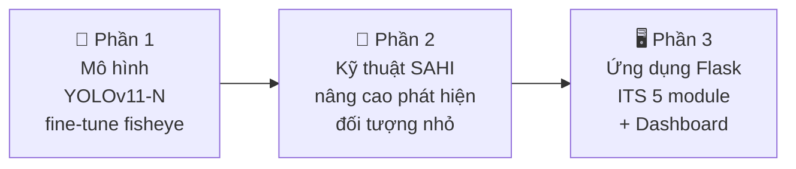
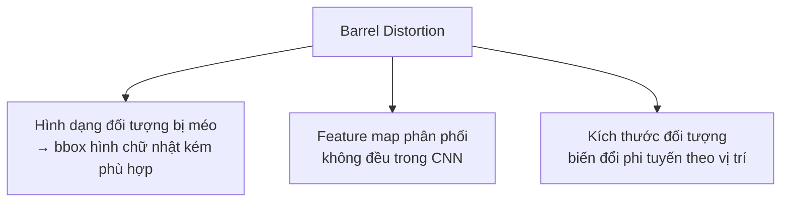
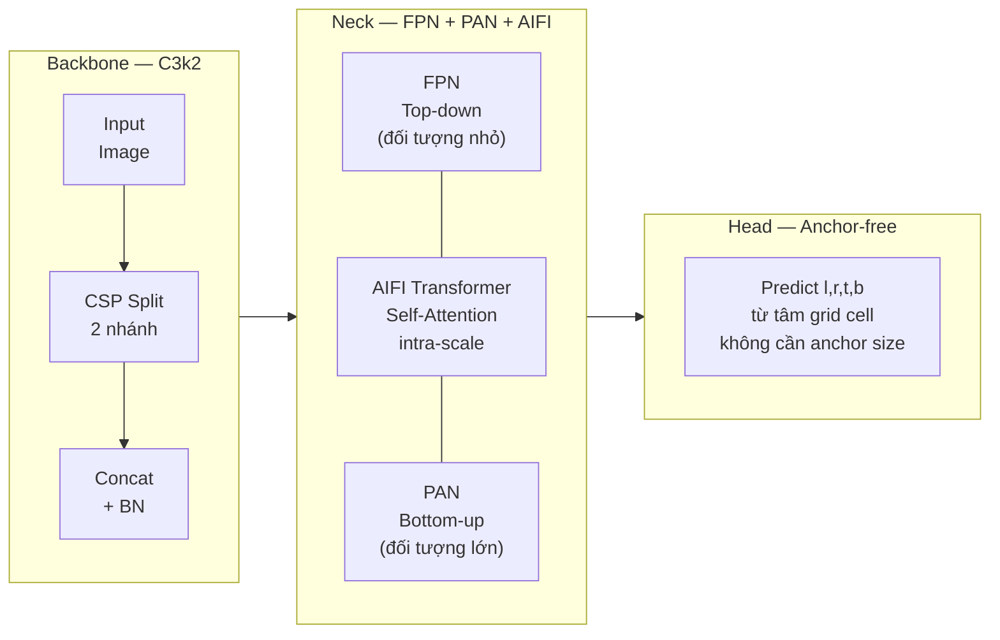
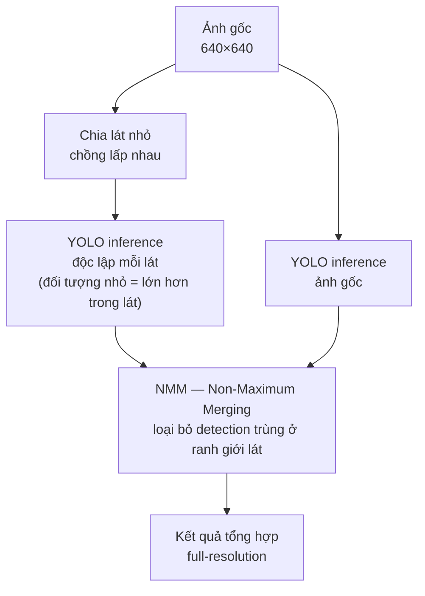
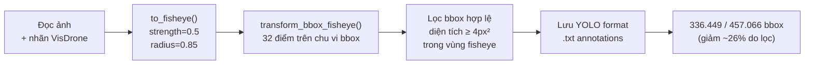
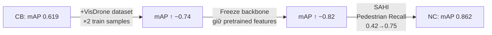
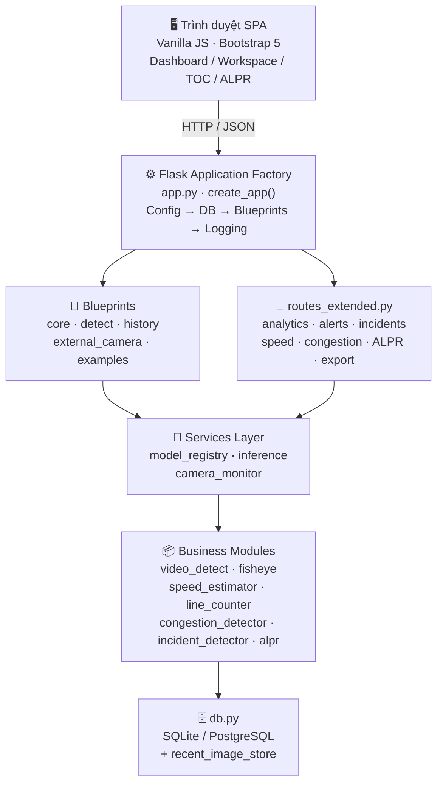
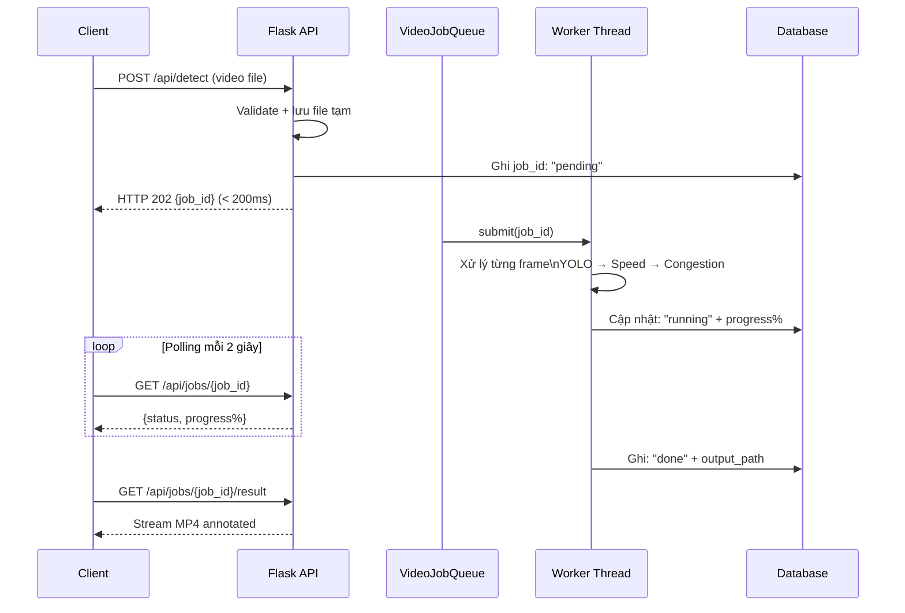
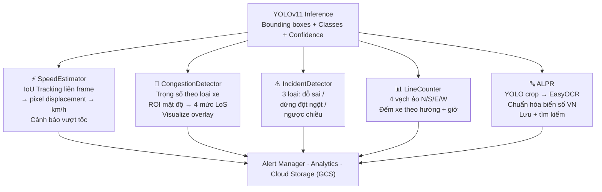
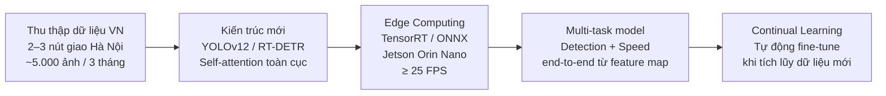

# Nội dung Slide Bảo Vệ Đồ Án Tốt Nghiệp

## Đề tài: Xây Dựng Hệ Thống Nhận Diện Vật Thể Qua Camera Mắt Cá

---

## SLIDE 1 — Trang Bìa

**Tên đề tài:**
XÂY DỰNG HỆ THỐNG NHẬN DIỆN VẬT THỂ QUA CAMERA MẮT CÁ

- **Sinh viên thực hiện:** Nguyễn Quốc Nam
- **Mã sinh viên:** 221220938
- **Lớp:** CNTT1-K63 · Khóa 63
- **Ngành:** Công nghệ Thông tin — Hệ chính quy
- **Giảng viên hướng dẫn:** TS. Nguyễn Đức Dư
- **Trường:** Đại học Giao thông Vận tải
- Hà Nội, 2026

---

## SLIDE 2 — Đặt Vấn Đề & Tại Sao Camera Fisheye

**Thực trạng giao thông đô thị Việt Nam:**
- Cả nước có **7,8 triệu ô tô** và **73 triệu xe máy** đang lưu hành *(Tổng cục Thống kê, 2024)*
- Năm 2023: hơn **10.000 vụ tai nạn giao thông nghiêm trọng**
- Camera CCTV truyền thống: giám sát thủ công, không phân tích tự động

**Camera fisheye giải quyết điều gì?**

| Tiêu chí | Camera thường | Camera fisheye |
|----------|:---:|:---:|
| Phủ toàn ngã tư | 4 camera | **1 camera** (180°–220°) |
| Chi phí lắp đặt | Cao | Thấp hơn đáng kể |
| Đếm đa hướng | Đồng bộ 4 luồng | **1 luồng**, 4 vạch ảo |
| Quản lý hạ tầng | Phức tạp | Đơn giản |

**Thách thức kỹ thuật đặc thù của fisheye:**
- **Barrel distortion:** mô hình AI thông thường không áp dụng trực tiếp được
- Đối tượng nhỏ (người đi bộ ở vùng biên) chỉ chiếm **10–30 pixel** chiều cao
- Kích thước đối tượng biến đổi **phi tuyến** theo vị trí trong ảnh

> *"Một camera fisheye thay cho bốn — toàn bộ chức năng ITS tại một điểm lắp đặt."*

---

## SLIDE 3 — Mục Tiêu & Phạm Vi

**Mục tiêu:** Xây dựng hệ thống ITS hoàn chỉnh trên camera fisheye, gồm 3 phần:



**Phạm vi — 5 lớp phương tiện:**

| Lớp | Tỉ lệ | Thách thức |
|-----|:---:|---|
| Car (ô tô) | ~45% | — |
| Pedestrian (người đi bộ) | ~20% | Nhỏ nhất, dễ bỏ sót |
| Motorbike (xe máy) | ~15% | Đặc thù Việt Nam |
| Truck (xe tải) | ~12% | Che khuất vật khác |
| Bus (xe buýt) | ~8% | Tỉ lệ thấp, class imbalance |

---

## SLIDE 4 — Cơ Sở Lý Thuyết: Mô Hình Fisheye

**Phương trình chiếu tổng quát:**

```
r(θ) = f · g(θ)
```

Trong đó `f` là tiêu cự, `θ` là góc tới, `g(θ)` là hàm chiếu đặc trưng.

**5 mô hình chiếu và ứng dụng:**

| Mô hình | Công thức g(θ) | Ứng dụng |
|---------|:---:|---|
| **Equidistant** *(đề tài dùng)* | θ | Camera an ninh — phổ biến nhất |
| Equisolid | 2·sin(θ/2) | Bảo toàn diện tích, đo lường |
| Orthographic | sin(θ) | Thiên văn, góc tối đa 180° |
| Stereographic | 2·tan(θ/2) | Bảo toàn góc (conformal) |
| Rectilinear | tan(θ) | Không méo đường thẳng, < 180° |

**Hậu quả barrel distortion lên mô hình AI:**



**Giải pháp của đề tài:** Hàm `to_fisheye()` — Inverse Mapping + Bilinear Interpolation
- Biến đổi bán kính: `r' = r^(1 + strength)`, tham số `strength=0.5`, `radius=0.85`
- Chuyển đổi bbox với **32 điểm** trên chu vi thay vì 4 góc → axis-aligned bbox chính xác vùng biên

---

## SLIDE 5 — Kiến Trúc YOLOv11-N

**Tại sao chọn YOLOv11-N (Nano)?** — 2,6M tham số · 6,5 GFLOPs · ~5,3MB weights
- mAP@0.5:0.95 = **39.5%** vs YOLOv8-N = 37.3%, ít tham số hơn (3.2M)
- Phù hợp edge deployment (Jetson, Raspberry Pi)

**Kiến trúc 3 tầng:**



**Điểm nổi bật với bài toán fisheye:**
- **C3k2:** Giảm bottleneck → ít params, gradient ổn định khi fine-tune dataset nhỏ
- **AIFI:** Mô hình hóa quan hệ không gian dài hạn — hữu ích khi xe buýt đi kèm dòng xe dài
- **Anchor-free:** Không cần chọn anchor ratio — tốt với đối tượng tỉ lệ bất thường (xe buýt nằm ngang)

---

## SLIDE 6 — Kỹ Thuật SAHI

**Vấn đề:** Người đi bộ xa tâm ảnh fisheye chỉ chiếm 10–30 pixel — model bỏ sót nhiều

**SAHI — Sliced Aided Hyper Inference** *(Akyon et al., IEEE ICIP 2022)*



**Lợi ích trong bài toán fisheye:**
- Mỗi lát có biến dạng cục bộ **ít hơn** toàn ảnh
- Đối tượng nhỏ ở vùng biên xuất hiện **tương đối lớn hơn** trong lát

**Kết quả thực nghiệm:**

| Chỉ số | Không SAHI | Có SAHI | Thay đổi |
|--------|:---:|:---:|:---:|
| Pedestrian Recall | 0,42 | **0,75** | **+78,6%** |
| Inference time | ~0,45s | 1,8–2,5s | 4–6× chậm hơn |

> *Phù hợp cho phân tích video offline và snapshot định kỳ mỗi 2–3 giây.*

---

## SLIDE 7 — Bộ Dữ Liệu & Pipeline Chuẩn Bị

**Hai nguồn dữ liệu kết hợp:**

| Nguồn | Đặc điểm | Train | Val |
|-------|---|:---:|:---:|
| **FishEye8K** *(CVPRW 2023)* | Camera overhead thực tế, Đài Loan | 4.230 ảnh | 1.058 ảnh |
| **VisDrone2019** *(ICCV 2019)* | UAV, độ cao 10–70m, Trung Quốc | 6.471 ảnh | 548 ảnh |
| **Kết hợp sau gộp** | | **11.296 ảnh · 406.355 nhãn** | **1.768 ảnh** |

**Pipeline chuyển đổi VisDrone → định dạng fisheye:**



**Ánh xạ lớp VisDrone → 5 lớp đề tài:** bicycle + tricycle → Motorbike · van → Truck · ignored-region → bỏ qua

---

## SLIDE 8 — Cấu Hình Huấn Luyện

**Môi trường:** Kaggle Notebooks · GPU Tesla P100-PCIE-16GB · CUDA 12.1

**So sánh 2 phiên bản huấn luyện:**

| Siêu tham số | Cơ Bản (CB) | Nâng Cao (NC) |
|---|:---:|:---:|
| Epochs | 50 | **80** |
| Image size | 640 | **960** |
| Optimizer | AdamW | **SGD + Cosine LR** |
| Freeze backbone | Không | **Có (10 lớp đầu)** |
| Dataset | FishEye8K | FishEye8K + **VisDrone** |
| SAHI | Không | **Có** |
| Augmentation mosaic | 1.0 | 0.8 |
| Augmentation mixup | 0.05 | 0.15 |
| Thời gian train | ~3,8 giờ | ~6,8 giờ |

**Xử lý class imbalance:**
- Copy-Paste Augmentation ưu tiên lớp thiểu số Bus, Truck
- Class weight tự động theo tần suất
- Oversampling ảnh chứa nhiều Bus/Truck

---

## SLIDE 9 — Kết Quả Mô Hình

**Bảng so sánh tổng thể:**

| Phiên bản | mAP@0.5 | mAP@0.5:0.95 | Precision | Recall | FPS (GPU) |
|-----------|:---:|:---:|:---:|:---:|:---:|
| Cơ Bản (FishEye8K only) | 0,619 | 0,363 | 0,650 | 0,570 | **~41** |
| **Nâng Cao** (+VisDrone+SAHI+Freeze) | **0,862** | **0,572** | **0,869** | **0,762** | ~12 *(SAHI)* |

**Chi tiết theo lớp — phiên bản Nâng Cao:**

| Lớp | Precision | Recall | mAP@0.5 | F1 |
|-----|:---:|:---:|:---:|:---:|
| Car | 0,920 | 0,840 | 0,910 | 0,878 |
| Motorbike | 0,906 | 0,790 | 0,900 | 0,845 |
| Pedestrian | 0,830 | 0,750 | 0,850 | 0,788 |
| Truck | 0,850 | 0,730 | 0,830 | 0,785 |
| Bus | 0,840 | 0,700 | 0,820 | 0,764 |

**Phân tích đóng góp từng kỹ thuật:**



---

## SLIDE 10 — Kiến Trúc Hệ Thống Flask

**Công nghệ:** Flask 3.x · Python 3.10 · YOLOv11 · OpenCV · EasyOCR · SQLite/PostgreSQL · Docker · GCP



---

## SLIDE 11 — Xử Lý Video Bất Đồng Bộ

**Vấn đề:** Video 30s, 1080p → ~95 giây xử lý — không thể trả về ngay (gây 504 timeout)

**Giải pháp: Job Queue bất đồng bộ — ThreadPoolExecutor**



**Cấu hình:** max_workers=2 · max_queue_size=10 *(tránh quá tải VRAM)*
**Trạng thái:** `pending` → `running` → `done` / `failed`

---

## SLIDE 12 — 5 Module Phân Tích Giao Thông ITS



**4 mức tắc nghẽn (CongestionDetector):**

| Mức | Density | Màu |
|-----|:---:|:---:|
| FREE | < 0,3 | 🟢 Xanh |
| MODERATE | 0,3–0,6 | 🟡 Vàng |
| HEAVY | 0,6–0,9 | 🟠 Cam |
| SEVERE | ≥ 0,9 | 🔴 Đỏ → Webhook |

---

## SLIDE 13 — Giao Diện Web

**Kiến trúc Frontend:** Vanilla JavaScript SPA — HTML5, Bootstrap 5, ES6 Modules

| Phân hệ | Chức năng chính |
|---------|---|
| **Dashboard** | KPIs thời gian thực, biểu đồ phân phối, system logs |
| **Workspace** | Kéo-thả ảnh/video · Async job queue cho video · Annotated output |
| **Live Streams** | MJPEG stream · Camera gốc song song detection overlay |
| **Run History** | Lịch sử phiên nhận diện · Tải ảnh/video annotated + metadata JSON |
| **TOC / ALPR** | Trung tâm điều hành · Nhận dạng & tra cứu biển số |
| **System Logs** | Terminal view · Server-Sent Events (SSE) · Lọc theo level |

**UX nguyên tắc:**
- Responsive: desktop 1920×1080 + tablet 1024×768
- Progressive disclosure: thông tin kỹ thuật ẩn mặc định
- Feedback tức thì: loading spinner, toast notification
- Error handling thân thiện: *"File quá lớn. Vui lòng chọn file < 500MB"*

---

## SLIDE 14 — Kiểm Thử & Hiệu Năng

**Kết quả kiểm thử chức năng (Black-box testing):**

| ID | Kịch bản | Kết quả | Thời gian |
|----|---|:---:|:---:|
| TC-01 | Upload ảnh JPEG 1920×1080 | ✅ PASS | 480ms |
| TC-02 | Upload file > 50MB | ✅ PASS (Error 413) | 50ms |
| TC-03 | Upload video 30s, 1080p | ✅ PASS (Job async 202) | < 200ms |
| TC-04 | Polling job khi running | ✅ PASS (status + progress%) | 45ms |
| TC-05 | SAHI inference ảnh đông người | ✅ PASS | 2,1s |
| TC-06 | Webhook khi SEVERE congestion | ✅ PASS | ~100ms |
| TC-07 | Concurrent 3 video jobs | ✅ PASS (Queue đúng thứ tự) | — |

**9/9 functional tests · 31/31 unit tests (pytest) → PASS**

**Hiệu năng thực tế (GPU GTX 1060 6GB):**

| Tác vụ | Kết quả | Yêu cầu |
|--------|:---:|:---:|
| Ảnh đơn 1080p | 380–520ms *(TB 450ms)* | ≤ 500ms ✅ |
| Submit video (async) | < 200ms | ≤ 200ms ✅ |
| SAHI inference | 1,8–2,5s/ảnh | — |
| VRAM sử dụng | ~2,1 GB *(FP16)* | ≤ 6 GB ✅ |

---

## SLIDE 15 — Kết Quả Tổng Kết

**Phần 1 — Nghiên cứu mô hình:**
- ✅ Pipeline VisDrone → fisheye với 32-point bbox transform
- ✅ Dataset: **11.296 ảnh train · 406.355 nhãn**
- ✅ YOLOv11-N Nâng cao: **mAP@0.5 = 0,862** (+39,3% so với baseline)
- ✅ SAHI: Pedestrian Recall **0,42 → 0,75** (+78,6%)
- ✅ Chỉ **2,6M tham số** — phù hợp edge deployment

**Phần 2 — Ứng dụng giám sát:**
- ✅ Flask Application Factory + Blueprint modular
- ✅ Xử lý video bất đồng bộ — không timeout
- ✅ **5 module ITS:** Speed · Congestion · Incident · Line Counter · ALPR
- ✅ Dashboard TOC + 6 phân hệ SPA
- ✅ Dual DB, Cloud Storage (GCS), CI/CD → GCP

---

## SLIDE 16 — Hạn Chế & Hướng Phát Triển

**Hạn chế hiện tại:**

| Hạn chế | Chi tiết |
|---------|---|
| Dữ liệu chưa có đặc thù VN | FishEye8K (Đài Loan) + VisDrone (Trung Quốc) — xe máy và phong cách lái VN khác biệt |
| Calibrate tốc độ thủ công | `pixels_per_meter = 8.0` đặt tay; cần camera calibration tự động |
| ROI tắc nghẽn thủ công | CongestionDetector cần user cấu hình ROI cố định |
| Chưa có edge deployment | Chạy server tập trung; chưa tối ưu Jetson Nano, Raspberry Pi |
| SAHI không đủ nhanh realtime | 12 FPS vs 25fps live stream |

**Hướng phát triển:**



---

## SLIDE 17 — Kết Luận

**Đồ án đã giải quyết bài toán ITS trên camera fisheye từ đầu đến cuối:**

**Mô hình:**
- Fine-tune YOLOv11-N đạt **mAP@0.5 = 0,862** — cải thiện +39,3% so với baseline FishEye8K
- SAHI tăng Recall người đi bộ từ **0,42 → 0,75** (+78,6%)
- Kiến trúc nhỏ gọn: **2,6M params · 6,5 GFLOPs**

**Ứng dụng:**
- Hệ thống ITS hoàn chỉnh với **5 module phân tích** giao thông
- **9/9 functional tests · 31/31 unit tests PASS**
- Xử lý ảnh **< 500ms** trên GPU, sẵn sàng production

**Ý nghĩa thực tiễn:**
- Một camera fisheye thay thế 4 camera thường tại ngã tư đô thị
- Nền tảng cho hệ thống đèn tín hiệu thông minh và phạt nguội tự động
- Đóng góp vào hệ thống ITS Việt Nam ứng dụng AI bản địa

---

## PHỤ LỤC — Câu Hỏi Phản Biện

**Q1: Tại sao chọn YOLOv11-N (Nano) mà không dùng phiên bản lớn hơn?**
→ 2,6M params, 6,5 GFLOPs — đủ tốt cho real-time với dataset đề tài. Phiên bản lớn cần nhiều VRAM và thời gian train dài hơn. Khi dataset VN được mở rộng, có thể nâng cấp lên YOLOv11-S/M.

**Q2: Tại sao Pedestrian có mAP thấp nhất ở phiên bản Cơ bản (0,550)?**
→ Hai nguyên nhân: (1) Người đi bộ chỉ chiếm 10–30 pixel ở vùng biên ảnh fisheye. (2) Bị che khuất bởi xe cộ. SAHI giải quyết vấn đề 1 (Recall +78,6%), vấn đề 2 cần thêm dữ liệu đa dạng.

**Q3: Hàm `to_fisheye()` khác gì `cv2.undistort()`?**
→ `cv2.undistort()` cần camera matrix từ calibration vật lý (checkerboard). `to_fisheye()` dùng mô hình toán học tham số hóa (`r' = r^(1+strength)`) — không cần calibration, phù hợp camera thiếu datasheet. Kém chính xác hơn với camera có thông số cụ thể.

**Q4: Tại sao dùng 32 điểm chuyển đổi bbox, không phải 4 góc?**
→ Biến dạng fisheye ở vùng biên rất lớn — 4 góc không bao chứa đủ đối tượng sau transform. 32 điểm trên chu vi → axis-aligned bbox đầy đủ → annotation chất lượng cao → mô hình học tốt hơn. Chi phí tính toán tăng không đáng kể.

**Q5: `pixels_per_meter = 8.0` được xác định như thế nào?**
→ Camera cao 5m, góc nhìn 45° → ước tính ~8–12 px/m vùng trung tâm. Đây là calibration thủ công — hạn chế của đề tài. Hướng cải thiện: đo từ vạch kẻ đường có độ dài chuẩn để tính chính xác px/m.

**Q6: SAHI làm chậm xuống 12 FPS, có dùng được cho live stream?**
→ 12 FPS không đủ cho stream 25fps thời gian thực. Phù hợp cho: (1) Phân tích video offline, (2) Snapshot định kỳ mỗi 2–3 giây từ camera live, (3) Trường hợp ưu tiên độ chính xác hơn tốc độ (phát hiện người đi bộ).

**Q7: Tại sao chọn Flask thay vì FastAPI?**
→ Flask có hệ sinh thái thành thục, dễ tích hợp với NumPy, OpenCV, Ultralytics. FastAPI phù hợp hơn khi bottleneck là I/O async — với hệ thống này bottleneck chính là GPU inference, không phải I/O.

**Q8: Dataset FishEye8K và VisDrone có phù hợp điều kiện Việt Nam không?**
→ Hạn chế được thừa nhận: FishEye8K từ Đài Loan, VisDrone từ Trung Quốc. Xe máy và phong cách lái xe Việt Nam khác biệt đáng kể. Hướng phát triển: thu thập thực tế tại Hà Nội ~5.000 ảnh trong 3 tháng.
