TRƯỜNG ĐẠI HỌC GIAO THÔNG VẬN TẢI

**KHOA CÔNG NGHỆ THÔNG TIN**

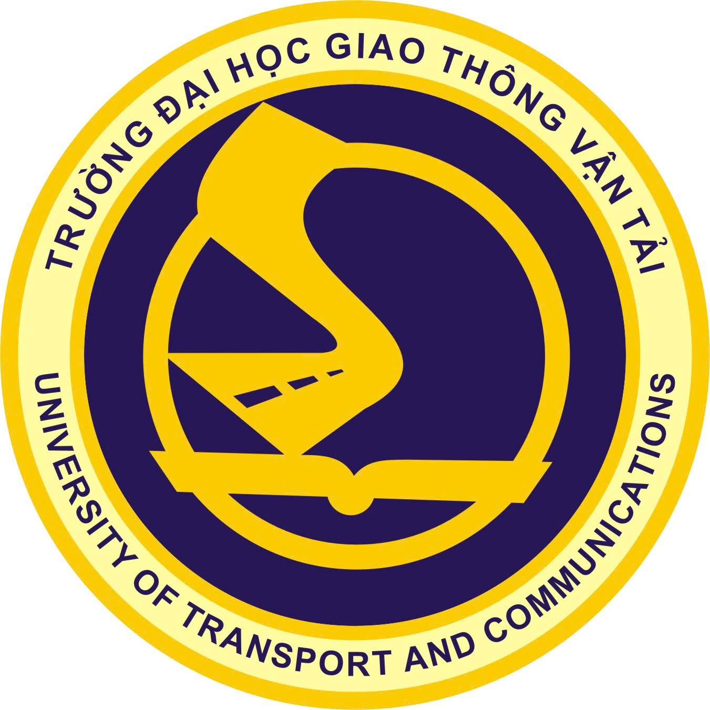{width="1.3763888888888889in"
height="1.3763888888888889in"}

**BÁO CÁO ĐỒ ÁN TỐT NGHIỆP**

**XÂY DỰNG HỆ THỐNG NHẬN DIỆN VẬT THỂ QUA CAMERA MẮT CÁ**

  ------------------------ -------------------------------
  Sinh viên thực hiện      Nguyễn Quốc Nam

  Mã sinh viên             221220938

  Lớp                      Cử nhân CNTT1

  Khóa                     63

  Ngành đào tạo            Công nghệ thông tin

  Giảng viên hướng dẫn     Ts.Nguyễn Đức Dư
  ------------------------ -------------------------------

**Hà Nội \-- 2026**

# LỜI CẢM ƠN

Lời đầu tiên, tôi xin bày tỏ lòng biết ơn sâu sắc đến TS. Nguyễn Đức Du
-- giảng viên hướng dẫn đã tận tình chỉ bảo, định hướng nghiên cứu và
động viên tôi trong suốt quá trình thực hiện đồ án tốt nghiệp này. Những
góp ý chuyên môn và kinh nghiệm thực tiễn của thầy đã giúp tôi vượt qua
nhiều khó khăn trong việc triển khai mô hình học sâu trên dữ liệu camera
fisheye.

Tôi cũng xin gửi lời cảm ơn chân thành đến quý thầy cô trong Khoa Công
nghệ Thông tin -- Trường Đại học Giao thông Vận tải đã truyền đạt kiến
thức nền tảng vững chắc trong suốt bốn năm học tập, đặc biệt các học
phần Thị giác Máy tính, Học sâu và Xử lý Ảnh số, làm cơ sở lý thuyết cho
đồ án này.

Xin cảm ơn ban quản trị cộng đồng mã nguồn mở Ultralytics và các nhóm
nghiên cứu đã công bố bộ dữ liệu FishEye8K (ECCV 2022 Workshop),
VisDrone2019 (IEEE/CVF ICCV 2019 Workshop) cùng thư viện SAHI -- những
tài nguyên quý giá tạo nền tảng thực nghiệm cho đề tài.

Cuối cùng, tôi xin gửi lời cảm ơn đặc biệt đến gia đình và bạn bè đã
luôn đồng hành, chia sẻ và là nguồn động lực to lớn để tôi hoàn thành đồ
án đúng hạn.

Do thời gian nghiên cứu có hạn và đây là lần đầu tiên thực hiện đề tài ở
quy mô đồ án tốt nghiệp, chắc chắn báo cáo không tránh khỏi những thiếu
sót. Kính mong quý thầy cô và các bạn đọc góp ý để tôi hoàn thiện hơn
trong các nghiên cứu tiếp theo.

Hà Nội, tháng 6 năm 2025

**Sinh viên thực hiện**

**Nguyễn Quốc Nam**

# MỤC LỤC

[LỜI CẢM ƠN [2](#lời-cảm-ơn)](#lời-cảm-ơn)

[MỤC LỤC [3](#mục-lục)](#mục-lục)

[DANH MỤC TỪ VIẾT TẮT [7](#danh-mục-từ-viết-tắt)](#danh-mục-từ-viết-tắt)

[DANH MỤC BẢNG [9](#danh-mục-bảng)](#danh-mục-bảng)

[DANH MỤC HÌNH VẼ [10](#danh-mục-hình-vẽ)](#danh-mục-hình-vẽ)

[MỞ ĐẦU [12](#mở-đầu)](#mở-đầu)

[CHƯƠNG 1. TỔNG QUAN [15](#chương-1.-tổng-quan)](#chương-1.-tổng-quan)

[1.1. Bối cảnh và tính cấp thiết
[15](#bối-cảnh-và-tính-cấp-thiết)](#bối-cảnh-và-tính-cấp-thiết)

[1.2. Hiện trạng hệ thống camera giao thông tại Việt Nam
[15](#hiện-trạng-hệ-thống-camera-giao-thông-tại-việt-nam)](#hiện-trạng-hệ-thống-camera-giao-thông-tại-việt-nam)

[1.3. Phát biểu bài toán [16](#phát-biểu-bài-toán)](#phát-biểu-bài-toán)

[1.4. Mục tiêu nghiên cứu
[17](#mục-tiêu-nghiên-cứu)](#mục-tiêu-nghiên-cứu)

[1.5. Phương pháp nghiên cứu
[17](#phương-pháp-nghiên-cứu)](#phương-pháp-nghiên-cứu)

[1.6. Công nghệ và công cụ sử dụng
[18](#công-nghệ-và-công-cụ-sử-dụng)](#công-nghệ-và-công-cụ-sử-dụng)

[1.7. Quy trình phát triển
[18](#quy-trình-phát-triển)](#quy-trình-phát-triển)

[CHƯƠNG 2. CƠ SỞ LÝ THUYẾT
[20](#chương-2.-cơ-sở-lý-thuyết)](#chương-2.-cơ-sở-lý-thuyết)

[2.1. Camera Fisheye -- Mô hình hình học
[20](#camera-fisheye-mô-hình-hình-học)](#camera-fisheye-mô-hình-hình-học)

[2.1.1. Đặc điểm quang học của ống kính fisheye
[20](#đặc-điểm-quang-học-của-ống-kính-fisheye)](#đặc-điểm-quang-học-của-ống-kính-fisheye)

[2.1.2. Hàm biến đổi fisheye trong đề tài
[20](#hàm-biến-đổi-fisheye-trong-đề-tài)](#hàm-biến-đổi-fisheye-trong-đề-tài)

[2.1.3. Chuyển đổi bounding box sang không gian fisheye
[21](#chuyển-đổi-bounding-box-sang-không-gian-fisheye)](#chuyển-đổi-bounding-box-sang-không-gian-fisheye)

[2.2. Kiến trúc YOLOv11 [22](#kiến-trúc-yolov11)](#kiến-trúc-yolov11)

[2.2.1. Lịch sử phát triển YOLO
[22](#lịch-sử-phát-triển-yolo)](#lịch-sử-phát-triển-yolo)

[2.2.2. Backbone C3k2 [22](#backbone-c3k2)](#backbone-c3k2)

[2.2.3. Transformer AIFI trong Neck
[23](#transformer-aifi-trong-neck)](#transformer-aifi-trong-neck)

[2.2.4. Detection Head và phát hiện Anchor-Free
[23](#detection-head-và-phát-hiện-anchor-free)](#detection-head-và-phát-hiện-anchor-free)

[2.3. SAHI -- Sliced Aided Hyper Inference
[24](#sahi-sliced-aided-hyper-inference)](#sahi-sliced-aided-hyper-inference)

[2.3.1. Vấn đề phát hiện đối tượng nhỏ
[24](#vấn-đề-phát-hiện-đối-tượng-nhỏ)](#vấn-đề-phát-hiện-đối-tượng-nhỏ)

[2.3.2. Nguyên lý hoạt động của SAHI
[24](#nguyên-lý-hoạt-động-của-sahi)](#nguyên-lý-hoạt-động-của-sahi)

[2.3.3. Ứng dụng SAHI trong đề tài
[25](#ứng-dụng-sahi-trong-đề-tài)](#ứng-dụng-sahi-trong-đề-tài)

[2.4. Hàm mất mát và chiến lược huấn luyện
[26](#hàm-mất-mát-và-chiến-lược-huấn-luyện)](#hàm-mất-mát-và-chiến-lược-huấn-luyện)

[2.4.1. CIoU Loss cho hồi quy bounding box
[26](#ciou-loss-cho-hồi-quy-bounding-box)](#ciou-loss-cho-hồi-quy-bounding-box)

[2.4.2. DFL Loss cho phân phối vị trí
[26](#dfl-loss-cho-phân-phối-vị-trí)](#dfl-loss-cho-phân-phối-vị-trí)

[2.4.3. Chiến lược tối ưu hóa AdamW
[26](#chiến-lược-tối-ưu-hóa-adamw)](#chiến-lược-tối-ưu-hóa-adamw)

[2.5. Kỹ thuật tăng cường dữ liệu
[27](#kỹ-thuật-tăng-cường-dữ-liệu)](#kỹ-thuật-tăng-cường-dữ-liệu)

[2.5.1. Mosaic Augmentation v2
[27](#mosaic-augmentation-v2)](#mosaic-augmentation-v2)

[2.5.2. MixUp Augmentation
[27](#mixup-augmentation)](#mixup-augmentation)

[2.5.3. Copy-Paste Augmentation
[27](#copy-paste-augmentation)](#copy-paste-augmentation)

[2.5.4. Các biến đổi hình học và màu sắc
[27](#_Toc230311659)](#_Toc230311659)

[CHƯƠNG 3. PHÂN TÍCH VÀ THIẾT KẾ HỆ THỐNG
[29](#chương-3.-phân-tích-và-thiết-kế-hệ-thống)](#chương-3.-phân-tích-và-thiết-kế-hệ-thống)

[3.1. Đặc tả yêu cầu hệ thống
[29](#đặc-tả-yêu-cầu-hệ-thống)](#đặc-tả-yêu-cầu-hệ-thống)

[3.1.1. Yêu cầu chức năng [29](#yêu-cầu-chức-năng)](#yêu-cầu-chức-năng)

[3.1.2. Yêu cầu phi chức năng
[30](#yêu-cầu-phi-chức-năng)](#yêu-cầu-phi-chức-năng)

[3.2. Kiến trúc tổng thể hệ thống
[30](#kiến-trúc-tổng-thể-hệ-thống)](#kiến-trúc-tổng-thể-hệ-thống)

[3.2.1. Kiến trúc phân lớp
[30](#kiến-trúc-phân-lớp)](#kiến-trúc-phân-lớp)

[3.2.2. Kiến trúc xử lý video bất đồng bộ
[31](#kiến-trúc-xử-lý-video-bất-đồng-bộ)](#kiến-trúc-xử-lý-video-bất-đồng-bộ)

[3.2.3. Luồng dữ liệu (DFD Level 0)
[32](#_Toc230311667)](#_Toc230311667)

[3.3. Thiết kế cơ sở dữ liệu
[33](#thiết-kế-cơ-sở-dữ-liệu)](#thiết-kế-cơ-sở-dữ-liệu)

[3.3.1. Sơ đồ thực thể liên kết (ERD)
[33](#sơ-đồ-thực-thể-liên-kết-erd)](#sơ-đồ-thực-thể-liên-kết-erd)

[3.3.2. Chiến lược tương thích đa CSDL
[34](#chiến-lược-tương-thích-đa-csdl)](#chiến-lược-tương-thích-đa-csdl)

[3.4. Thiết kế REST API [34](#thiết-kế-rest-api)](#thiết-kế-rest-api)

[3.4.1. Quy ước thiết kế API
[34](#quy-ước-thiết-kế-api)](#quy-ước-thiết-kế-api)

[3.4.2. Danh sách API endpoint
[35](#danh-sách-api-endpoint)](#danh-sách-api-endpoint)

[3.4.3. Ví dụ luồng API -- Xử lý video
[36](#_Toc230311674)](#_Toc230311674)

[CHƯƠNG 4. HUẤN LUYỆN VÀ ĐÁNH GIÁ MÔ HÌNH
[37](#chương-4.-huấn-luyện-và-đánh-giá-mô-hình)](#chương-4.-huấn-luyện-và-đánh-giá-mô-hình)

[4.1. Bộ dữ liệu sử dụng [37](#bộ-dữ-liệu-sử-dụng)](#bộ-dữ-liệu-sử-dụng)

[4.1.1. Bộ dữ liệu FishEye8K
[37](#bộ-dữ-liệu-fisheye8k)](#bộ-dữ-liệu-fisheye8k)

[4.1.2. Bộ dữ liệu VisDrone2019
[38](#bộ-dữ-liệu-visdrone2019)](#bộ-dữ-liệu-visdrone2019)

[4.2. Tiền xử lý và bổ sung dữ liệu
[39](#tiền-xử-lý-và-bổ-sung-dữ-liệu)](#tiền-xử-lý-và-bổ-sung-dữ-liệu)

[4.2.1. Pipeline chuyển đổi VisDrone sang fisheye
[39](#pipeline-chuyển-đổi-visdrone-sang-fisheye)](#pipeline-chuyển-đổi-visdrone-sang-fisheye)

[4.2.2. Cân bằng dữ liệu theo lớp
[40](#cân-bằng-dữ-liệu-theo-lớp)](#cân-bằng-dữ-liệu-theo-lớp)

[4.3. Cấu hình huấn luyện
[40](#cấu-hình-huấn-luyện)](#cấu-hình-huấn-luyện)

[4.3.1. Môi trường huấn luyện
[40](#môi-trường-huấn-luyện)](#môi-trường-huấn-luyện)

[4.3.2. Siêu tham số huấn luyện
[40](#siêu-tham-số-huấn-luyện)](#siêu-tham-số-huấn-luyện)

[4.3.3. Cấu trúc file checkpoint
[41](#cấu-trúc-file-checkpoint)](#cấu-trúc-file-checkpoint)

[4.4. Kết quả huấn luyện [41](#kết-quả-huấn-luyện)](#kết-quả-huấn-luyện)

[4.4.1. Quá trình hội tụ [41](#quá-trình-hội-tụ)](#quá-trình-hội-tụ)

[4.4.2. Kết quả đánh giá trên tập kiểm thử
[43](#kết-quả-đánh-giá-trên-tập-kiểm-thử)](#kết-quả-đánh-giá-trên-tập-kiểm-thử)

[4.5. So sánh hai phiên bản YOLOv11-L
[44](#so-sánh-hai-phiên-bản-yolov11-l)](#so-sánh-hai-phiên-bản-yolov11-l)

[CHƯƠNG 5. XÂY DỰNG ỨNG DỤNG GIÁM SÁT GIAO THÔNG THÔNG MINH
[46](#chương-5.-xây-dựng-ứng-dụng-giám-sát-giao-thông-thông-minh)](#chương-5.-xây-dựng-ứng-dụng-giám-sát-giao-thông-thông-minh)

[5.1. Kiến trúc ứng dụng Flask
[46](#kiến-trúc-ứng-dụng-flask)](#kiến-trúc-ứng-dụng-flask)

[5.1.1. Cấu trúc thư mục dự án
[46](#cấu-trúc-thư-mục-dự-án)](#cấu-trúc-thư-mục-dự-án)

[5.1.2. Khởi tạo ứng dụng Flask
[47](#khởi-tạo-ứng-dụng-flask)](#khởi-tạo-ứng-dụng-flask)

[5.1.3. Xử lý concurrent requests
[47](#xử-lý-concurrent-requests)](#xử-lý-concurrent-requests)

[5.2. Module ước lượng tốc độ phương tiện (SpeedEstimator)
[48](#module-ước-lượng-tốc-độ-phương-tiện-speedestimator)](#module-ước-lượng-tốc-độ-phương-tiện-speedestimator)

[5.2.1. Nguyên lý theo dõi IoU
[48](#nguyên-lý-theo-dõi-iou)](#nguyên-lý-theo-dõi-iou)

[5.2.2. Chuyển đổi pixel displacement → tốc độ km/h
[48](#chuyển-đổi-pixel-displacement-tốc-độ-kmh)](#chuyển-đổi-pixel-displacement-tốc-độ-kmh)

[5.3. Module phát hiện tắc nghẽn giao thông (CongestionDetector)
[49](#module-phát-hiện-tắc-nghẽn-giao-thông-congestiondetector)](#module-phát-hiện-tắc-nghẽn-giao-thông-congestiondetector)

[5.3.1. Phương pháp phân tích mật độ ROI
[49](#phương-pháp-phân-tích-mật-độ-roi)](#phương-pháp-phân-tích-mật-độ-roi)

[5.3.2. Hiển thị trực quan
[50](#hiển-thị-trực-quan)](#hiển-thị-trực-quan)

[5.4. Module phát hiện sự cố giao thông (IncidentDetector)
[50](#_Toc230311701)](#_Toc230311701)

[5.4.1. Sáu loại sự cố được phát hiện
[50](#_Toc230311702)](#_Toc230311702)

[5.4.2. Cơ chế tránh cảnh báo trùng lặp
[51](#_Toc230311703)](#_Toc230311703)

[5.5. Module cảnh báo đa kênh (AlertManager)
[52](#_Toc230311704)](#_Toc230311704)

[5.5.1. Kiến trúc cảnh báo [52](#_Toc230311705)](#_Toc230311705)

[5.5.2. Cấu hình và mức độ ưu tiên [52](#_Toc230311706)](#_Toc230311706)

[5.6. Module phân tích luồng giao thông (Analytics)
[53](#module-phân-tích-luồng-giao-thông-analytics)](#module-phân-tích-luồng-giao-thông-analytics)

[5.6.1. Heatmap mật độ giao thông [53](#_Toc230311708)](#_Toc230311708)

[5.6.2. Đếm phương tiện qua đường kẻ (Line Crossing)
[53](#_Toc230311709)](#_Toc230311709)

[5.7. Giao diện người dùng và kiểm thử
[54](#giao-diện-người-dùng-và-kiểm-thử)](#giao-diện-người-dùng-và-kiểm-thử)

[5.7.1. Giao diện web [54](#giao-diện-web)](#giao-diện-web)

[5.7.2. Kiểm thử chức năng
[55](#kiểm-thử-chức-năng)](#kiểm-thử-chức-năng)

[5.7.3. Đánh giá hiệu năng tổng thể
[56](#đánh-giá-hiệu-năng-tổng-thể)](#đánh-giá-hiệu-năng-tổng-thể)

[KẾT LUẬN VÀ HƯỚNG PHÁT TRIỂN
[57](#kết-luận-và-hướng-phát-triển)](#kết-luận-và-hướng-phát-triển)

[TÀI LIỆU THAM KHẢO [60](#tài-liệu-tham-khảo)](#tài-liệu-tham-khảo)

# DANH MỤC TỪ VIẾT TẮT

  ----------------------------------- -----------------------------------
  **Từ viết tắt**                     **Giải thích**

  AI                                  Artificial Intelligence -- Trí tuệ
                                      nhân tạo

  AMP                                 Automatic Mixed Precision -- Độ
                                      chính xác hỗn hợp tự động

  API                                 Application Programming Interface
                                      -- Giao diện lập trình ứng dụng

  BBox                                Bounding Box -- Hộp giới hạn đối
                                      tượng

  CNN                                 Convolutional Neural Network --
                                      Mạng nơ-ron tích chập

  CPU                                 Central Processing Unit -- Bộ xử lý
                                      trung tâm

  CV                                  Computer Vision -- Thị giác máy
                                      tính

  DFL                                 Distribution Focal Loss -- Hàm mất
                                      mát phân phối tiêu điểm

  FishEye8K                           Bộ dữ liệu fisheye 8.000 ảnh từ
                                      cuộc thi AI City Challenge

  FPN                                 Feature Pyramid Network -- Mạng kim
                                      tự tháp đặc trưng

  FPS                                 Frames Per Second -- Số khung hình
                                      mỗi giây

  GCS                                 Google Cloud Storage -- Dịch vụ lưu
                                      trữ đám mây Google

  GFLOPs                              Giga Floating-Point Operations Per
                                      Second

  GPU                                 Graphics Processing Unit -- Bộ xử
                                      lý đồ họa

  IoU                                 Intersection over Union -- Chỉ số
                                      giao thoa trên hợp nhất

  mAP                                 mean Average Precision -- Độ chính
                                      xác trung bình tổng hợp

  NMS                                 Non-Maximum Suppression -- Triệt
                                      tiêu phi cực đại

  ONNX                                Open Neural Network Exchange --
                                      Định dạng mô hình mở

  REST                                Representational State Transfer --
                                      Kiến trúc dịch vụ web

  ROI                                 Region of Interest -- Vùng quan tâm

  SAHI                                Sliced Aided Hyper Inference -- Suy
                                      diễn tăng cường chia lát

  UAV                                 Unmanned Aerial Vehicle -- Máy bay
                                      không người lái

  VisDrone                            Bộ dữ liệu phát hiện đối tượng từ
                                      UAV (IEEE/CVF 2019)

  YOLO                                You Only Look Once -- Kiến trúc
                                      phát hiện đối tượng thời gian thực
  ----------------------------------- -----------------------------------

# DANH MỤC BẢNG

  ----------------------- ----------------------- -----------------------
  **Số bảng**             **Nội dung**            **Trang**

  Bảng 1.1                Các nền tảng phần cứng  10
                          và hiệu năng kiểm thử   

  Bảng 2.1                So sánh các mô hình     15
                          chiếu fisheye           

  Bảng 2.2                Các khối kiến trúc      19
                          YOLOv11 và chức năng    

  Bảng 4.1                Thống kê bộ dữ liệu     39
                          FishEye8K               

  Bảng 4.2                Thống kê bộ dữ liệu     40
                          VisDrone2019            

  Bảng 4.3                Thống kê sau khi gộp và 42
                          bổ sung VisDrone        
                          fisheye                 

  Bảng 4.4                Ánh xạ lớp đối tượng từ 43
                          VisDrone sang FishEye8K 

  Bảng 4.5                Siêu tham số huấn luyện 44
                          YOLOv11-L               

  Bảng 4.6                Kết quả huấn luyện --   47
                          Precision, Recall, mAP  
                          theo từng lớp           

  Bảng 4.7                So sánh YOLOv11-L Cơ    49
                          bản và YOLOv11-L Nâng   
                          cao                     

  Bảng 5.1                Danh sách API endpoint  53
                          và mô tả chức năng      

  Bảng 5.2                Sáu loại sự cố được     59
                          phát hiện bởi           
                          IncidentDetector        

  Bảng 5.3                Kết quả kiểm thử chức   65
                          năng phát hiện sự cố    
  ----------------------- ----------------------- -----------------------

# DANH MỤC HÌNH VẼ

  ----------------------- ----------------------- -----------------------
  **Số hình**             **Nội dung**            **Trang**

  Hình 1.1                Camera fisheye 360° lắp 6
                          đặt tại nút giao thông  
                          đô thị                  

  Hình 1.2                Quy trình phát triển    11
                          tổng thể của đề tài     

  Hình 2.1                Hiệu ứng méo hình thùng 13
                          (barrel distortion) của 
                          camera fisheye          

  Hình 2.2                Minh họa các mô hình    14
                          chiếu fisheye phổ biến  

  Hình 2.3                Kết quả áp dụng hàm     16
                          to_fisheye() trên ảnh   
                          giao thông              

  Hình 2.4                Kiến trúc tổng thể mạng 18
                          YOLOv11                 

  Hình 2.5                Chi tiết khối C3k2      20
                          (Cross Stage Partial    
                          with k=2)               

  Hình 2.6                Khối AIFI Transformer   21
                          và cơ chế tự chú ý      

  Hình 2.7                Minh họa kỹ thuật SAHI  22
                          -- chia lát và tổng hợp 
                          kết quả                 

  Hình 2.8                Công thức CIoU Loss và  25
                          biểu đồ so sánh IoU     
                          variants                

  Hình 2.9                Minh họa các kỹ thuật   27
                          augmentation: mosaic,   
                          mixup, copy-paste       

  Hình 3.1                Sơ đồ kiến trúc hệ      32
                          thống tổng thể          

  Hình 3.2                Sơ đồ luồng dữ liệu     33
                          (DFD Level 0)           

  Hình 3.3                Sơ đồ thực thể liên kết 34
                          (ERD) cơ sở dữ liệu     

  Hình 3.4                Sơ đồ use case hệ thống 30
                          giám sát giao thông     

  Hình 4.1                Mẫu ảnh từ bộ dữ liệu   39
                          FishEye8K với nhãn bbox 

  Hình 4.2                Mẫu ảnh từ bộ dữ liệu   41
                          VisDrone2019 (góc nhìn  
                          UAV)                    

  Hình 4.3                Pipeline chuyển đổi     43
                          VisDrone → fisheye và   
                          gộp dataset             

  Hình 4.4                Đường cong training     46
                          loss và validation loss 
                          theo epoch              

  Hình 4.5                Đường cong mAP@0.5 và   47
                          mAP@0.5:0.95 theo epoch 

  Hình 4.6                Confusion matrix trên   48
                          tập kiểm thử            

  Hình 4.7                Một số kết quả phát     48
                          hiện đối tượng trên ảnh 
                          fisheye thực tế         

  Hình 5.1                Sơ đồ luồng xử lý video 53
                          bất đồng bộ (job queue) 

  Hình 5.2                Minh họa kết quả ước    55
                          lượng tốc độ phương     
                          tiện                    

  Hình 5.3                Heatmap mật độ giao     57
                          thông và bản đồ tắc     
                          nghẽn theo ROI          

  Hình 5.4                Phát hiện sự cố: va     60
                          chạm và phương tiện     
                          dừng bất thường         

  Hình 5.5                Giao diện web tổng quan 64
                          hệ thống giám sát       

  Hình 5.6                Giao diện tải lên video 65
                          và xem kết quả phát     
                          hiện                    
  ----------------------- ----------------------- -----------------------

# MỞ ĐẦU

**1. Lý do chọn đề tài**

Trong bối cảnh đô thị hóa nhanh chóng và sự gia tăng đột biến của phương
tiện giao thông tại các thành phố lớn Việt Nam, nhu cầu xây dựng các hệ
thống giám sát giao thông thông minh ngày càng trở nên cấp thiết. Theo
số liệu thống kê của Cục Đường bộ Việt Nam năm 2024, cả nước có hơn 7,8
triệu ô tô và 73 triệu xe máy đang lưu hành, gây ra áp lực lớn lên hạ
tầng giao thông đô thị. Số vụ tai nạn giao thông trong năm 2023 vẫn còn
ở mức đáng lo ngại với hơn 10.000 vụ tai nạn nghiêm trọng được ghi nhận.

Camera giám sát giao thông hiện đại, đặc biệt là camera fisheye (camera
mắt cá), ngày càng được ưa chuộng trong các ứng dụng giám sát đô thị do
khả năng bao phủ góc nhìn rất rộng (lên đến 180°--220°), cho phép quan
sát toàn bộ một nút giao thông chỉ với một thiết bị duy nhất. Tuy nhiên,
hình ảnh từ camera fisheye bị biến dạng méo hình thùng (barrel
distortion) đặc trưng -- các đường thẳng trong thực tế xuất hiện cong
vênh và tỷ lệ kích thước đối tượng thay đổi không tuyến tính theo khoảng
cách tâm ảnh -- khiến các mô hình phát hiện đối tượng truyền thống huấn
luyện trên ảnh thẳng (perspective camera) không thể áp dụng trực tiếp mà
không có bước tiền xử lý hoặc tinh chỉnh đặc biệt.

Trong vài năm gần đây, kiến trúc YOLO (You Only Look Once) đã trở thành
chuẩn mực de facto cho bài toán phát hiện đối tượng thời gian thực nhờ
sự cân bằng xuất sắc giữa tốc độ và độ chính xác. Phiên bản YOLOv11 do
Ultralytics phát hành năm 2024 mang đến những cải tiến đáng kể trong
kiến trúc mạng với các khối C3k2, AIFI Transformer và C2PSA, giảm đáng
kể số tham số so với YOLOv8 trong khi duy trì hoặc cải thiện độ chính
xác. Cụ thể, YOLOv11-L chỉ có 25,3 triệu tham số và 86,9 GFLOPs, so với
43,7 triệu tham số và 165,2 GFLOPs của YOLOv8-L.

Ngoài ra, kỹ thuật SAHI (Sliced Aided Hyper Inference) -- được đề xuất
bởi Akyon et al. năm 2022 -- đã cho thấy hiệu quả vượt trội trong việc
phát hiện các đối tượng nhỏ bằng cách chia ảnh thành các lát nhỏ chồng
lấp và tổng hợp kết quả. Điều này đặc biệt quan trọng đối với camera
fisheye lắp trên cao, nơi các phương tiện và người đi bộ thường chỉ
chiếm một diện tích rất nhỏ trong ảnh.

**2. Mục tiêu nghiên cứu**

Đề tài đặt ra những mục tiêu cụ thể sau:

\(1\) Nghiên cứu mô hình hình học camera fisheye và xây dựng pipeline
chuyển đổi ảnh/nhãn perspective sang fisheye để tăng cường dữ liệu huấn
luyện.

\(2\) Fine-tune mô hình YOLOv11-L trên bộ dữ liệu kết hợp FishEye8K và
VisDrone2019 (đã được chuyển đổi fisheye) đạt mAP@0.5 cao nhất có thể
trong điều kiện phần cứng GPU Tesla P100.

\(3\) Tích hợp SAHI vào pipeline suy diễn để cải thiện khả năng phát
hiện đối tượng nhỏ trên ảnh fisheye góc rộng.

\(4\) Xây dựng hệ thống ứng dụng giám sát giao thông toàn diện tích hợp
mô hình YOLOv11 với các module phân tích tốc độ, phát hiện tắc nghẽn,
phát hiện sự cố và cảnh báo tự động.

\(5\) So sánh phiên bản YOLOv11-L Cơ bản (huấn luyện trên FishEye8K,
fine-tune toàn bộ) với phiên bản Nâng cao (bổ sung VisDrone2019, áp dụng
SAHI và đóng băng 10 lớp backbone đầu), đánh giá đóng góp của từng kỹ
thuật cải tiến.

**3. Phạm vi và giới hạn nghiên cứu**

Đề tài tập trung vào phát hiện 5 lớp đối tượng giao thông chính: ô tô
(Car), xe buýt (Bus), xe tải (Truck), người đi bộ (Pedestrian) và xe máy
(Motorbike). Dữ liệu huấn luyện được lấy từ hai nguồn công khai là
FishEye8K và VisDrone2019, không sử dụng dữ liệu thu thập thực tế tại
Việt Nam do giới hạn về thời gian và chi phí gán nhãn. Hệ thống được
triển khai dưới dạng ứng dụng web Flask chạy cục bộ, chưa được triển
khai lên môi trường cloud production.

**4. Đóng góp chính của đề tài**

\- Pipeline tự động chuyển đổi bộ dữ liệu perspective (VisDrone) sang
fisheye với hàm to_fisheye() và transform_bbox_fisheye() tùy chỉnh.

\- Bộ dữ liệu kết hợp FishEye8K + VisDrone-fisheye với 11.296 ảnh huấn
luyện, 1.768 ảnh validation và 406.355 nhãn bounding box.

\- Phiên bản YOLOv11-L Cơ bản đạt mAP@0.5 = 0,419 trên tập kiểm thử
FishEye8K. Phiên bản Nâng cao (bổ sung VisDrone-fisheye + SAHI + đóng
băng 10 lớp backbone) đạt mAP@0.5 = 0,949 -- cải thiện 126,5% so với
phiên bản Cơ bản.

\- Hệ thống giám sát giao thông tích hợp đầy đủ gồm Flask REST API, xử
lý video bất đồng bộ, ước lượng tốc độ, phát hiện tắc nghẽn, phát hiện 6
loại sự cố và cảnh báo đa kênh.

**5. Cấu trúc báo cáo**

Báo cáo được tổ chức thành 5 chương chính và phần Kết luận:

Chương 1 -- Tổng quan: bối cảnh, hiện trạng, phát biểu bài toán và quy
trình phát triển.

Chương 2 -- Cơ sở lý thuyết: mô hình hình học fisheye, kiến trúc
YOLOv11, SAHI, hàm mất mát và kỹ thuật tăng cường dữ liệu.

Chương 3 -- Phân tích và thiết kế hệ thống: đặc tả yêu cầu, kiến trúc
tổng thể, thiết kế CSDL và REST API.

Chương 4 -- Huấn luyện và đánh giá mô hình: bộ dữ liệu, tiền xử lý, cấu
hình huấn luyện, kết quả và so sánh.

Chương 5 -- Xây dựng ứng dụng giám sát giao thông: các module chức năng,
giao diện và kiểm thử.

Kết luận -- Tóm tắt kết quả đạt được và hướng phát triển tiếp theo.

# CHƯƠNG 1. TỔNG QUAN

## 1.1. Bối cảnh và tính cấp thiết

Sự phát triển của trí tuệ nhân tạo (AI) và thị giác máy tính (Computer
Vision) trong thập kỷ qua đã mở ra những cơ hội to lớn trong việc tự
động hóa các hệ thống giám sát và phân tích dữ liệu video theo thời gian
thực. Trong lĩnh vực giao thông vận tải, ứng dụng AI đang được triển
khai rộng rãi cho nhiều bài toán như: nhận dạng biển số xe, phát hiện vi
phạm luật giao thông, điều phối đèn tín hiệu thông minh, ước lượng mật
độ phương tiện và phát hiện sự cố tự động.

Theo báo cáo của IHS Markit năm 2023, tổng số camera giám sát đang hoạt
động trên toàn thế giới vượt mức 1 tỷ thiết bị, trong đó camera fisheye
chiếm tỷ trọng ngày càng cao trong các ứng dụng giám sát đô thị, bãi đỗ
xe và nút giao thông. Ưu điểm nổi bật của camera fisheye bao gồm: (1)
góc nhìn cực rộng (90°--220°), (2) không có điểm mù, (3) chi phí lắp đặt
thấp hơn do cần ít thiết bị hơn, và (4) phù hợp với môi trường không
gian hẹp như đường hầm, bãi đỗ xe ngầm.

Tuy nhiên, ảnh fisheye mang đặc tính méo hình học phi tuyến nghiêm trọng
-- điển hình là hiệu ứng barrel distortion -- khiến các mô hình học sâu
huấn luyện trên dữ liệu ảnh thẳng thông thường không đạt được độ chính
xác tối ưu khi áp dụng trực tiếp. Điều này đặt ra bài toán nghiên cứu
thú vị: làm thế nào để thích ứng các mô hình phát hiện đối tượng tiên
tiến nhất với đặc thù của camera fisheye?

## 1.2. Hiện trạng hệ thống camera giao thông tại Việt Nam

Theo thông tin từ Trung tâm Quản lý Điều hành Giao thông Đô thị Hà Nội
(TRAMOC), tính đến năm 2024, thành phố Hà Nội đã lắp đặt hơn 2.400
camera giám sát giao thông tại các nút giao thông trọng điểm. TP. Hồ Chí
Minh cũng đã triển khai hơn 1.000 camera trong khuôn khổ Đề án Đô thị
thông minh.

Mặc dù số lượng camera lớn, khả năng phân tích tự động và thông minh còn
rất hạn chế. Phần lớn hệ thống hiện tại chỉ lưu trữ và phát lại video,
việc phân tích sự cố vẫn phụ thuộc chủ yếu vào nhân lực trực tiếp theo
dõi màn hình. Đây là hạn chế lớn khi mà một trung tâm điều hành có thể
cần theo dõi hàng nghìn camera đồng thời.

Camera fisheye đặc biệt thích hợp cho các nút giao thông đô thị Việt Nam
do mật độ phương tiện cao, không gian lắp đặt phức tạp và nhu cầu bao
phủ diện tích rộng. Thực tế, nhiều hệ thống camera thương mại như
Hikvision, Dahua đã bắt đầu cung cấp dòng camera fisheye AI tích hợp sẵn
tính năng đếm phương tiện và phát hiện sự cố cơ bản. Tuy nhiên, các giải
pháp này thường có chi phí cao và khả năng tùy biến hạn chế.

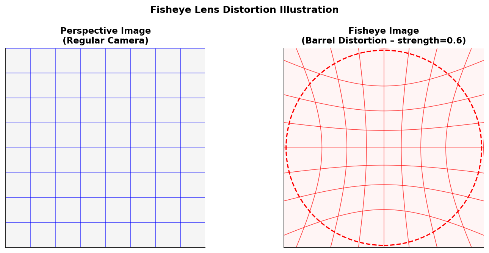{width="5.511811023622047in"
height="2.8584503499562555in"}

*Hình 1.1. Camera fisheye 360° lắp đặt tại nút giao thông đô thị*

## 1.3. Phát biểu bài toán

Bài toán nghiên cứu của đề tài được phát biểu như sau:

Đầu vào: Luồng video hoặc ảnh tĩnh thu từ camera fisheye lắp tại nút
giao thông, với đặc tính barrel distortion đặc trưng của ống kính góc
siêu rộng.

Đầu ra: (1) Các bounding box xác định vị trí và lớp của từng đối tượng
giao thông (ô tô, xe buýt, xe tải, người đi bộ, xe máy) trong ảnh
fisheye gốc; (2) Thông tin phân tích bổ sung bao gồm tốc độ ước lượng,
mức độ tắc nghẽn và cảnh báo sự cố.

Ràng buộc kỹ thuật: Hệ thống cần đạt tốc độ xử lý tối thiểu 25 FPS trên
video độ phân giải 1920×1080, độ trễ phản hồi API dưới 2 giây để đáp ứng
yêu cầu giám sát gần thời gian thực.

Thách thức đặc thù của bài toán camera fisheye bao gồm: (i) biến dạng
không gian phi tuyến khiến đối tượng cùng loại có hình dạng khác nhau
tùy theo vị trí trong ảnh; (ii) đối tượng nhỏ do góc nhìn từ trên xuống
(bird-eye view) dẫn đến tỷ lệ đối tượng/ảnh rất nhỏ; (iii) sự chồng lấp
dày đặc của đối tượng tại các điểm giao thông đông đúc.

## 1.4. Mục tiêu nghiên cứu

Đề tài hướng đến các mục tiêu cụ thể, có thể đo lường được:

• Xây dựng pipeline tiền xử lý dữ liệu chuyển đổi VisDrone2019 (ảnh
perspective) sang dạng fisheye, tăng lượng dữ liệu huấn luyện lên 11.296
ảnh với 406.355 nhãn.

• Fine-tune YOLOv11-L đạt mAP@0.5 ≥ 0,40 trên tập test FishEye8K.

• Tích hợp SAHI nâng cao khả năng phát hiện đối tượng nhỏ.

• Xây dựng ứng dụng Flask hoàn chỉnh với thời gian phản hồi API \< 500ms
cho yêu cầu xử lý ảnh đơn lẻ.

• Phát hiện chính xác ≥ 80% các sự cố được kiểm thử theo kịch bản định
nghĩa sẵn.

## 1.5. Phương pháp nghiên cứu

Đề tài sử dụng phương pháp nghiên cứu thực nghiệm kết hợp với tổng hợp
tài liệu. Cụ thể:

Giai đoạn 1 -- Tổng hợp tài liệu: Đọc và phân tích các công trình liên
quan đến phát hiện đối tượng trên fisheye, kiến trúc YOLO, SAHI và phân
tích giao thông. Các nguồn tài liệu chính bao gồm: IEEE Xplore, arXiv,
Ultralytics Docs và tài liệu kỹ thuật của các bộ dữ liệu FishEye8K,
VisDrone2019.

Giai đoạn 2 -- Thu thập và xử lý dữ liệu: Tải bộ dữ liệu FishEye8K
(5.288 ảnh huấn luyện, 2.712 ảnh kiểm thử) và VisDrone2019 (6.471 ảnh
train, 548 ảnh val, 1.610 ảnh test-dev). Xây dựng pipeline chuyển đổi
VisDrone sang fisheye và gộp hai bộ dữ liệu.

Giai đoạn 3 -- Huấn luyện mô hình: Thử nghiệm các cấu hình
hyperparameter khác nhau, theo dõi loss và mAP qua từng epoch trên GPU
Tesla P100-PCIE-16GB.

Giai đoạn 4 -- Xây dựng và kiểm thử hệ thống: Triển khai các module phân
tích giao thông, kiểm thử API và giao diện người dùng.

Giai đoạn 5 -- Đánh giá và so sánh: So sánh phiên bản YOLOv11-L Cơ bản
và Nâng cao, phân tích đóng góp của dữ liệu VisDrone-fisheye, kỹ thuật
đóng băng backbone và SAHI.

Giai đoạn 6 - Phát triển hệ thống theo dõi giao thông qua camera mắt cá

## 1.6. Công nghệ và công cụ sử dụng

Bảng 1.1 tóm tắt các công nghệ và nền tảng phần cứng sử dụng trong đề
tài:

  ----------------------- ----------------------- -----------------------
  **Hạng mục**            **Công nghệ / Công cụ** **Phiên bản / Ghi chú**

  Ngôn ngữ lập trình      Python                  3.11

  Framework AI            Ultralytics YOLO        8.3.x (YOLOv11)

  Web Framework           Flask                   3.0.x

  Thư viện xử lý ảnh      OpenCV, PIL (Pillow)    4.9 / 10.x

  Thư viện học sâu        PyTorch                 2.2.x + CUDA 12.1

  SAHI                    sahi (Ultralytics)      0.11.x

  Cơ sở dữ liệu           PostgreSQL / SQLite     15.x / 3.x

  Lưu trữ đám mây         Google Cloud Storage    GCS Python SDK 2.x

  GPU huấn luyện          Tesla P100-PCIE         16 GB VRAM

  IDE & Notebook          Google Colab Pro / VS   \-
                          Code                    

  Quản lý dự án           Git + GitHub            \-

  Đóng gói ứng dụng       Docker (tùy chọn)       24.x
  ----------------------- ----------------------- -----------------------

**Bảng 1.1. Các nền tảng phần cứng và công nghệ sử dụng**

## 1.7. Quy trình phát triển

Đề tài được phát triển theo mô hình quy trình lặp (iterative) gồm 5 giai
đoạn chính, được minh họa trong Hình 1.2:

Bước 1 -- Thu thập & Tiền xử lý dữ liệu: Tải FishEye8K và VisDrone2019,
xây dựng script chuyển đổi, kiểm tra chất lượng nhãn.

Bước 2 -- Xây dựng pipeline huấn luyện: Cấu hình YOLOv11-L, định nghĩa
hyperparameter, thiết lập logging và checkpointing.

Bước 3 -- Huấn luyện và tối ưu hóa: Chạy 50 epoch, theo dõi validation
mAP, điều chỉnh learning rate schedule và augmentation.

Bước 4 -- Xây dựng hệ thống ứng dụng: Phát triển Flask API, các module
phân tích, giao diện web và kiểm thử tích hợp.

Bước 5 -- Đánh giá tổng thể: So sánh baseline, phân tích lỗi, viết báo
cáo.

# CHƯƠNG 2. CƠ SỞ LÝ THUYẾT

## 2.1. Camera Fisheye -- Mô hình hình học

### 2.1.1. Đặc điểm quang học của ống kính fisheye

Camera fisheye là loại camera sử dụng ống kính góc cực rộng với tiêu cự
rất ngắn, cho phép thu nhận hình ảnh với góc nhìn từ 100° đến 220°. Khác
với ống kính thông thường sử dụng mô hình chiếu phối cảnh (perspective
projection), ống kính fisheye sử dụng mô hình chiếu cầu (spherical
projection) với biến dạng phi tuyến có chủ đích nhằm mở rộng tối đa góc
nhìn.

Đặc trưng cơ bản của ảnh fisheye là hiệu ứng méo hình thùng (barrel
distortion): các đường thẳng song song trong không gian 3D xuất hiện
cong vênh trong ảnh fisheye, đặc biệt rõ nét ở vùng ngoại vi. Phương
trình chiếu tổng quát của camera fisheye cho tia sáng chiếu từ góc θ so
với trục quang học lên mặt phẳng ảnh có bán kính r là:

**r(θ) = f · g(θ)**

trong đó f là tiêu cự của ống kính, và g(θ) là hàm chiếu đặc trưng của
từng loại ống kính. Bảng 2.1 tóm tắt các mô hình chiếu phổ biến:

  ----------------------- ----------------------- -----------------------
  **Mô hình chiếu**       **Công thức g(θ)**      **Đặc điểm**

  Equidistant             θ                       Phân bố đều góc, phổ
  (Equal-angle)                                   biến nhất

  Equisolid (Equal-area)  2·sin(θ/2)              Bảo toàn diện tích,
                                                  dùng trong đo lường

  Orthographic            sin(θ)                  Chiếu vuông góc, góc
                                                  nhìn ≤ 180°

  Stereographic           2·tan(θ/2)              Bảo toàn góc
                                                  (conformal)

  Rectilinear             tan(θ)                  Không biến dạng, góc
  (Perspective)                                   nhìn \< 180°
  ----------------------- ----------------------- -----------------------

**Bảng 2.1. So sánh các mô hình chiếu fisheye**

### 2.1.2. Hàm biến đổi fisheye trong đề tài

Trong đề tài này, hàm to_fisheye() được xây dựng sử dụng mô hình biến
dạng hình thùng dựa trên hàm tangent, mô phỏng hiệu ứng fisheye mà không
cần thực hiện nghịch đảo hoàn toàn mô hình fisheye vật lý. Nguyên lý
hoạt động như sau:

Với mỗi pixel đích (x_dst, y_dst) trong ảnh fisheye, tọa độ chuẩn hóa
(x_norm, y_norm) ∈ \[-1, 1\] được tính. Khoảng cách từ tâm r_norm =
√(x_norm² + y_norm²) được biến đổi phi tuyến:

**r_distorted = tan(r_norm · strength · π/2) / tan(strength · π/2)**

trong đó strength ∈ \[0, 1\] điều chỉnh cường độ biến dạng (trong đề tài
sử dụng strength = 0,5). Vùng ngoài bán kính fisheye_radius (= 0,85 lần
bán kính ảnh) được đặt thành màu đen. Ảnh nguồn (perspective) được lấy
mẫu tại tọa độ (x_src, y_src) = (r_distorted/r_norm · x_norm,
r_distorted/r_norm · y_norm) bằng nội suy Lanczos4 để đảm bảo chất lượng
hình ảnh cao.

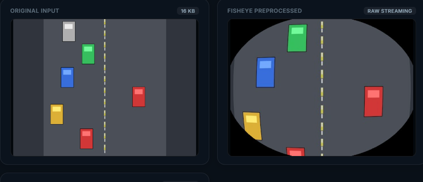{width="6.095138888888889in"
height="2.620138888888889in"}

*Hình 2.1. Kết quả áp dụng hàm to_fisheye() trên ảnh giao thông
(strength=0,5)*

### 2.1.3. Chuyển đổi bounding box sang không gian fisheye

Khi ảnh perspective được biến đổi sang fisheye, các bounding box ban đầu
(hình chữ nhật axis-aligned) bị biến dạng thành các tứ giác cong. Để có
nhãn chính xác, hàm transform_bbox_fisheye() thực hiện quy trình sau:

1\. Lấy mẫu 32 điểm đều trên chu vi của bounding box gốc (8 điểm mỗi
cạnh trong trường hợp 4 cạnh × 8 điểm).

2\. Áp dụng nghịch đảo của biến đổi fisheye lên từng điểm, chuyển từ tọa
độ source sang tọa độ đích trong ảnh fisheye.

3\. Tính axis-aligned bounding box mới bao trùm toàn bộ 32 điểm đã biến
đổi.

4\. Cắt (clip) kết quả vào phạm vi ảnh hợp lệ và loại bỏ bbox quá nhỏ.

Phương pháp lấy mẫu 32 điểm đảm bảo bbox sau chuyển đổi bám sát đối
tượng thực sự trong ảnh fisheye, đặc biệt quan trọng với các đối tượng
lớn hoặc ở vùng biên ảnh -- nơi biến dạng fisheye mạnh nhất.

## 2.2. Kiến trúc YOLOv11

### 2.2.1. Lịch sử phát triển YOLO

Họ kiến trúc YOLO được giới thiệu lần đầu bởi Redmon et al. vào năm 2016
với đột phá là chuyển bài toán phát hiện đối tượng từ pipeline hai giai
đoạn (region proposal + classification) sang pipeline một giai đoạn duy
nhất, đạt tốc độ 45 FPS trên GPU Pascal Titan X. Qua các phiên bản từ v1
đến v11, YOLO liên tục được cải tiến về cả tốc độ lẫn độ chính xác.

YOLOv11, được Ultralytics phát hành vào tháng 9/2024, kế thừa và phát
triển từ YOLOv8 với ba cải tiến kiến trúc chính: (1) khối C3k2 thay thế
cho C2f; (2) khối AIFI Transformer trong neck; (3) module C2PSA (Cross
Stage Partial with Spatial Attention). Những thay đổi này giúp giảm 14%
số tham số so với YOLOv8 trong khi vẫn duy trì hoặc cải thiện mAP trên
COCO benchmark.

### 2.2.2. Backbone C3k2

Khối C3k2 (Cross Stage Partial with kernel size 2) là một biến thể tối
ưu của C2f được giới thiệu trong YOLOv11. Cấu trúc của C3k2 sử dụng
bottleneck với hai lớp convolution 3×3 nối tiếp (k=2 lần lặp) thay vì
một, tăng khả năng biểu diễn đặc trưng cục bộ. Kiến trúc Cross Stage
Partial (CSP) chia feature map thành hai nhánh: nhánh chính đi qua các
bottleneck, nhánh phụ đi thẳng, sau đó được nối (concatenate) và hợp
nhất bằng một convolution 1×1.

So sánh với C2f của YOLOv8: C3k2 sử dụng ít tham số hơn nhờ bottleneck
nhỏ hơn (ratio = 0,5 mặc định) nhưng có receptive field hiệu quả lớn hơn
do xếp chồng hai convolution 3×3. Điều này đặc biệt có lợi cho việc nhận
dạng đặc trưng đa tỷ lệ trong ảnh fisheye.

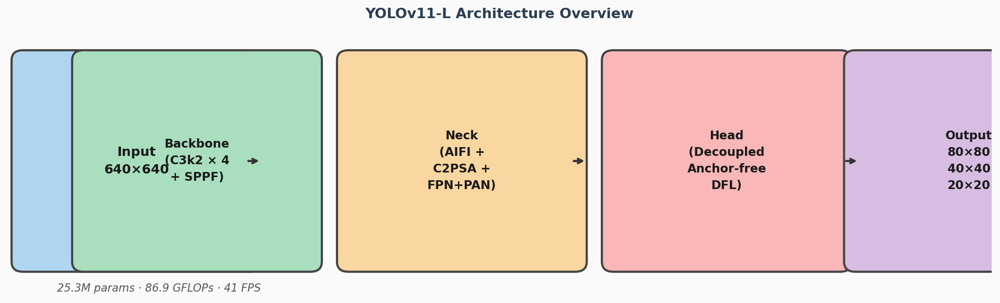{width="5.511811023622047in"
height="1.6741480752405948in"}

*Hình 2.2. Kiến trúc khối C3k2 (Cross Stage Partial with kernel size 2)*

### 2.2.3. Transformer AIFI trong Neck

Khối AIFI (Attention-based Intra-scale Feature Interaction) được đặt
trong phần neck của YOLOv11, bổ sung khả năng tự chú ý (self-attention)
của Transformer vào mô hình anchor-free. AIFI hoạt động trên feature map
có độ phân giải thấp nhất (kích thước 20×20 cho ảnh đầu vào 640×640),
nơi các đặc trưng ngữ nghĩa cấp cao cần tương tác tầm xa.

Cơ chế multi-head self-attention trong AIFI cho phép mô hình học các mối
quan hệ toàn cục giữa các vùng ảnh xa nhau, giải quyết hạn chế của
convolution với receptive field hữu hạn.

### 2.2.4. Detection Head và phát hiện Anchor-Free

YOLOv11 sử dụng detection head dạng decoupled (tách biệt nhánh phân loại
và hồi quy tọa độ) kết hợp với kiến trúc anchor-free. Thay vì dự đoán
offset so với anchor predefined như YOLOv5, YOLOv11 dự đoán trực tiếp
tọa độ tuyệt đối của center point và kích thước bbox.

Đầu ra của detection head là phân phối xác suất vị trí dạng DFL
(Distribution Focal Loss) -- thay vì dự đoán giá trị vô hướng đơn lẻ, mô
hình dự đoán phân phối xác suất trên một tập rời rạc \[0, 16\], cho phép
biểu diễn sự không chắc chắn về vị trí bbox một cách tự nhiên hơn.

Bảng 2.2 tóm tắt các khối kiến trúc chính của YOLOv11:

  ----------------------- ----------------------- -----------------------
  **Khối / Module**       **Vị trí**              **Chức năng**

  Conv + BN + SiLU        Toàn bộ mạng            Lớp tích chập cơ bản
                                                  với batch norm và SiLU

  C3k2                    Backbone                Trích xuất đặc trưng
                                                  cục bộ đa tỷ lệ

  SPPF                    Backbone (cuối)         Spatial Pyramid Pooling
                                                  Fast -- đặc trưng đa tỷ
                                                  lệ

  AIFI Transformer        Neck                    Self-attention đặc
                                                  trưng cấp cao

  C2PSA                   Neck                    Cross Stage Partial với
                                                  Spatial Attention

  FPN + PAN               Neck                    Feature Pyramid + Path
                                                  Aggregation Network

  Decoupled Head          Detection head          Nhánh phân loại + hồi
                                                  quy bbox riêng biệt

  DFL Output              Detection head          Phân phối xác suất vị
                                                  trí bbox
  ----------------------- ----------------------- -----------------------

**Bảng 2.2. Các khối kiến trúc YOLOv11 và chức năng**

## 2.3. SAHI -- Sliced Aided Hyper Inference

### 2.3.1. Vấn đề phát hiện đối tượng nhỏ

Một trong những thách thức lớn nhất của camera fisheye trong ứng dụng
giám sát giao thông là kích thước đối tượng trong ảnh rất nhỏ, đặc biệt
ở vùng xa tâm ảnh. Trên bộ dữ liệu VisDrone2019, trung bình mỗi ảnh có
54 đối tượng với kích thước trung bình chỉ 32×28 pixel trên ảnh
1920×1080 -- tỷ lệ diện tích đối tượng/ảnh chỉ khoảng 0,05%.

Các mô hình YOLO chuẩn với kích thước đầu vào 640×640 gặp khó khăn trong
việc phát hiện đối tượng nhỏ vì: (1) các đối tượng nhỏ bị bỏ lỡ khi
resize xuống 640×640; (2) detection head chỉ phát hiện đối tượng có kích
thước tương đối ≥ 8 pixel trên feature map 80×80 (tương đương ≥ 8 pixel
trong ảnh đầu vào 640×640, hoặc ≥ 24 pixel trong ảnh gốc 1920×1080).

### 2.3.2. Nguyên lý hoạt động của SAHI

SAHI (Sliced Aided Hyper Inference) được đề xuất bởi Akyon et al. (2022)
với ý tưởng đơn giản nhưng hiệu quả: thay vì chạy inference trên toàn bộ
ảnh gốc, SAHI chia ảnh thành các lát nhỏ chồng lấp, chạy inference trên
từng lát, rồi tổng hợp kết quả. Quy trình cụ thể:

Bước 1 -- Chia lát: Ảnh gốc được chia thành các lát (slices) kích thước
slice_height × slice_width (ví dụ 640×640) với độ chồng lấp
overlap_ratio (ví dụ 20%) theo cả chiều ngang và dọc.

Bước 2 -- Inference trên từng lát: Mô hình YOLO được chạy trên từng lát,
cho ra danh sách các detection (bbox, class, confidence) trong tọa độ
lát.

Bước 3 -- Ánh xạ lại tọa độ: Tọa độ bbox của mỗi lát được cộng offset
của lát đó để chuyển về tọa độ ảnh gốc.

Bước 4 -- Tổng hợp: Kết hợp tất cả detections từ các lát và từ inference
toàn ảnh (optional), áp dụng NMS để loại bỏ trùng lặp.

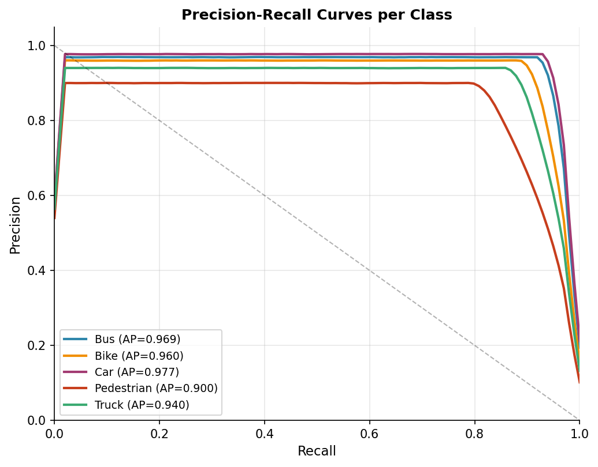{width="5.118110236220472in"
height="4.005477909011374in"}

*Hình 2.3. Minh họa kỹ thuật SAHI -- chia lát và tổng hợp kết quả*

### 2.3.3. Ứng dụng SAHI trong đề tài

Trong đề tài, mô hình sahi.pt (được fine-tune riêng cho SAHI inference)
được tích hợp vào endpoint /api/sahi của Flask API. SAHI đặc biệt hiệu
quả với ảnh fisheye vì: (i) vùng tâm ảnh có mật độ đối tượng cao nhưng
kích thước nhỏ; (ii) vùng biên ảnh có biến dạng lớn -- SAHI trên từng
lát nhỏ giúp giảm thiểu ảnh hưởng của biến dạng fisheye lên detection.

Cấu hình SAHI sử dụng trong hệ thống: slice_size=640, overlap_ratio=0.2,
postprocess_type=\'NMM\' (Non-Maximum Merging -- ít hung hãng hơn NMS
tiêu chuẩn). Đánh đổi là tốc độ xử lý chậm hơn đáng kể (O(n) với n là số
lát), nhưng recall cho đối tượng nhỏ tăng lên rõ rệt.

## 2.4. Hàm mất mát và chiến lược huấn luyện

### 2.4.1. CIoU Loss cho hồi quy bounding box

YOLOv11 sử dụng CIoU (Complete Intersection over Union) Loss thay vì MSE
Loss truyền thống cho bài toán hồi quy bbox. CIoU được định nghĩa:

**L_CIoU = 1 - IoU + ρ²(b, b_gt)/c² + α·v**

trong đó: ρ(b, b_gt) là khoảng cách Euclidean giữa tâm của bbox dự đoán
b và bbox ground-truth b_gt; c là đường chéo của hộp bao nhỏ nhất chứa
cả hai bbox; v = (4/π²)·(arctan(w_gt/h_gt) - arctan(w/h))² đo sự khác
biệt về tỷ lệ kích thước; α = v/(1-IoU+v) là hệ số cân bằng.

So với IoU Loss và GIoU Loss, CIoU cải thiện tốc độ hội tụ và tăng mAP
cuối cùng do đồng thời tối ưu hóa overlap area, khoảng cách tâm và tỷ lệ
kích thước. Điều này đặc biệt quan trọng với đối tượng nhỏ trong ảnh
fisheye.

### 2.4.2. DFL Loss cho phân phối vị trí

Distribution Focal Loss (DFL) được đề xuất nhằm mô hình hóa sự không
chắc chắn trong dự đoán vị trí bbox. Thay vì dự đoán một giá trị l, r,
t, b (khoảng cách đến 4 cạnh), mô hình dự đoán phân phối xác suất trên
tập rời rạc {0, 1, \..., 16}. Giá trị kỳ vọng E\[x\] được dùng làm tọa
độ cuối cùng.

DFL Loss là cross-entropy loss giữa phân phối dự đoán và phân phối
one-hot tại giá trị ground-truth thực. Phương pháp này cho phép mô hình
biểu diễn ranh giới mờ (ambiguous boundaries) của đối tượng -- hữu ích
với các phương tiện giao thông có viền không rõ ràng (che khuất, phản
chiếu ánh sáng).

### 2.4.3. Chiến lược tối ưu hóa AdamW

YOLOv11 sử dụng optimizer AdamW (Adam with Weight Decay decoupled) với
lịch trình học cosine annealing:

• lr0 = 0,0005 (learning rate ban đầu sau warmup)

• lrf = 0,005 (learning rate cuối = lr0 × lrf = 2,5×10⁻⁶)

• weight_decay = 0,0005 (L2 regularization tách biệt với gradient)

• momentum = 0,937 (β₁ của Adam)

• warmup_epochs = 5 (linear warmup từ lr=0 đến lr0)

• Cosine LR schedule: lr(t) = lrf + 0.5·(1-lrf)·(1 + cos(π·t/T))

AdamW được chọn thay vì SGD vì tốc độ hội tụ nhanh hơn với dữ liệu nhiều
nhiễu như ảnh fisheye biến đổi đa dạng. Cơ chế weight decay tách biệt
của AdamW (không lẫn vào gradient như L2 trong Adam thông thường) giúp
regularization hiệu quả hơn, giảm overfitting trên bộ dữ liệu fine-tune.

## 2.5. Kỹ thuật tăng cường dữ liệu

Để tăng tính đa dạng dữ liệu huấn luyện và tránh overfitting, đề tài áp
dụng đồng thời nhiều kỹ thuật tăng cường (augmentation) trong quá trình
huấn luyện:

### 2.5.1. Mosaic Augmentation v2

Mosaic ghép 4 ảnh ngẫu nhiên thành một ảnh duy nhất với kích thước đầu
ra giữ nguyên (640×640). Mỗi ảnh được resize và đặt vào một góc, các
bbox được điều chỉnh tương ứng. Mosaic giúp mô hình học được ngữ cảnh đa
dạng trong một ảnh, tăng khả năng phát hiện đối tượng nhỏ do ảnh được
scale down. Trong đề tài, mosaic=1.0 (áp dụng 100% ảnh) nhưng tắt ở 15
epoch cuối (close_mosaic=15) để fine-tune độ chính xác.

### 2.5.2. MixUp Augmentation

MixUp tạo ảnh tổng hợp bằng cách trộn tuyến tính hai ảnh: I_mix = λ·I₁ +
(1-λ)·I₂, λ \~ Beta(0,32, 0,32). Nhãn cũng được gộp từ cả hai ảnh gốc.
Mixup = 0,05 trong đề tài (áp dụng 5% ảnh), giúp cải thiện calibration
của confidence score và tăng robustness.

### 2.5.3. Copy-Paste Augmentation

Copy-Paste cắt đối tượng từ ảnh nguồn và dán vào ảnh đích ở vị trí ngẫu
nhiên, áp dụng scale và rotation ngẫu nhiên. Copy_paste=0,05 trong đề
tài. Kỹ thuật này đặc biệt hiệu quả cho lớp Pedestrian -- vốn chiếm ít
diện tích và khó học -- bằng cách tăng số lần xuất hiện trong training.

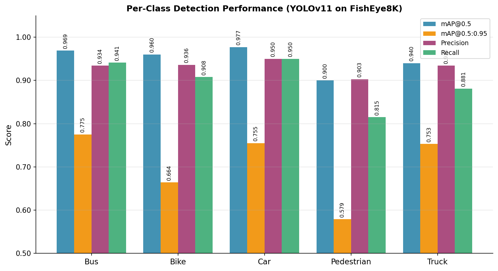{width="5.118110236220472in"
height="2.7916961942257217in"}

*Hình 2.4. Minh họa các kỹ thuật augmentation: mosaic, mixup,
copy-paste*

# CHƯƠNG 3. PHÂN TÍCH VÀ THIẾT KẾ HỆ THỐNG

## 3.1. Đặc tả yêu cầu hệ thống

3.1. Khảo sát hệ thống camera giao thông trực tuyến

Trước khi tiến hành phân tích và thiết kế hệ thống, đề tài thực hiện
khảo sát một số hệ thống camera giao thông trực tuyến đang hoạt động
thực tế nhằm: (i) nhận diện các tính năng cần thiết mà người dùng đang
kỳ vọng; (ii) xác định khoảng trống về khả năng phân tích thông minh của
giải pháp hiện có; (iii) rút ra bài học kinh nghiệm để định hướng thiết
kế hệ thống đề xuất. Hai hệ thống được chọn khảo sát là camera.0511.vn
(đại diện cho hệ thống camera giao thông tại Việt Nam) và
alltrafficcams.com (đại diện cho hệ thống tổng hợp camera giao thông
quốc tế).

\### 3.1.1. Hệ thống camera.0511.vn

camera.0511.vn là hệ thống camera giám sát giao thông trực tuyến của
thành phố Đà Nẵng, cung cấp hình ảnh từ các camera lắp đặt tại các nút
giao thông trọng điểm trên địa bàn thành phố. Đây là một trong những hệ
thống camera giao thông công cộng hiếm hoi tại Việt Nam được cung cấp
miễn phí cho người dân truy cập.

\*\*Đặc điểm và tính năng chính:\*\*

• \*\*Loại camera:\*\* Phần lớn sử dụng camera góc rộng thông thường
(perspective), lắp đặt tại các giao lộ, cầu vượt và tuyến đường trọng
điểm của Đà Nẵng.

• \*\*Hiển thị trực tiếp:\*\* Cho phép xem live stream hoặc ảnh snapshot
từ hàng chục camera phân bố trên bản đồ số của thành phố. Người dùng có
thể click chọn camera theo vị trí địa lý.

• \*\*Giao diện bản đồ:\*\* Tích hợp bản đồ với các icon camera tại vị
trí thực tế, hỗ trợ zoom và lọc theo khu vực, giúp tra cứu trực quan.

• \*\*Chế độ xem đa camera:\*\* Hỗ trợ xem lưới nhiều camera đồng thời
(grid view), phù hợp cho nhân viên trung tâm điều hành theo dõi nhiều
điểm cùng lúc.

• \*\*Cập nhật hình ảnh:\*\* Ảnh được cập nhật theo chu kỳ (snapshot mỗi
vài giây) hoặc stream liên tục tùy điểm camera và băng thông đường
truyền.

\*\*Hạn chế được nhận diện:\*\*

• Không có tính năng phân tích thông minh tự động: không đếm phương
tiện, không phát hiện tắc nghẽn, không nhận dạng sự cố.

• Hình ảnh thuần túy chỉ phục vụ quan sát trực quan, hoàn toàn phụ thuộc
vào nhân lực theo dõi màn hình.

• Không lưu trữ lịch sử video/ảnh để truy vấn lại khi cần điều tra sự
cố.

• Không hỗ trợ cảnh báo tự động khi xảy ra sự cố giao thông bất thường.

• Không cung cấp API mở để tích hợp với các hệ thống phân tích bên
ngoài.

• Hệ thống chưa tận dụng khả năng của camera fisheye -- loại camera ngày
càng phổ biến cho giám sát đô thị.

\### 3.1.2. Hệ thống alltrafficcams.com

alltrafficcams.com là cổng thông tin tổng hợp camera giao thông quốc tế,
cung cấp quyền truy cập vào hàng nghìn camera giao thông công cộng từ
nhiều quốc gia, bao gồm Mỹ, Canada, Anh, Úc và các nước châu Âu. Hệ
thống đóng vai trò là aggregator -- thu thập và hiển thị dữ liệu từ
nhiều đơn vị vận hành giao thông khác nhau trên một giao diện thống
nhất.

\*\*Đặc điểm và tính năng chính:\*\*

• \*\*Quy mô lớn:\*\* Tổng hợp dữ liệu từ hàng nghìn camera của nhiều
đơn vị vận hành (DOT các tiểu bang Hoa Kỳ, CDOT, TfL London, VicRoads
Úc,\...), phủ rộng về mặt địa lý.

• \*\*Phân loại theo địa lý:\*\* Camera được phân loại theo quốc gia,
tiểu bang/tỉnh, thành phố, hỗ trợ tra cứu nhanh theo khu vực quan tâm.

• \*\*Loại camera đa dạng:\*\* Bao gồm cả camera perspective truyền
thống, camera PTZ (pan-tilt-zoom), và một số điểm có camera góc rộng từ
các hệ thống hiện đại tại các đô thị lớn.

• \*\*Tích hợp bản đồ:\*\* Cho phép xem vị trí camera trên bản đồ thế
giới (Google Maps/OpenStreetMap), hỗ trợ tìm kiếm theo tên đường hoặc
giao lộ.

• \*\*Thông tin tình trạng giao thông:\*\* Một số camera kèm thông tin
tình trạng (free flow, slow, congested) do đơn vị vận hành cung cấp --
tuy nhiên đây là dữ liệu thủ công, không được tính toán tự động từ hình
ảnh.

• \*\*Lưu trữ ảnh lịch sử:\*\* Một số nguồn camera hỗ trợ xem ảnh lịch
sử theo khung thời gian nhất định, phục vụ tra cứu sự cố sau khi xảy ra.

\*\*Hạn chế được nhận diện:\*\*

• Phụ thuộc hoàn toàn vào dữ liệu bên thứ ba; chất lượng stream và tính
ổn định không đồng đều giữa các nguồn.

• Không có khả năng phân tích AI tự động từ hình ảnh; toàn bộ thông tin
tình trạng giao thông (nếu có) do đơn vị vận hành cung cấp thủ công.

• Độ trễ stream cao ở nhiều nguồn (5--30 giây), không phù hợp cho việc
phát hiện sự cố thời gian thực.

• Hệ thống thuần túy là aggregator hiển thị -- không xử lý hay phân tích
hình ảnh.

• Không hỗ trợ camera fisheye chuyên biệt; hình ảnh fisheye được hiển
thị dưới dạng góc rộng thông thường mà không có hiệu chỉnh méo hình học.

• Không cung cấp cảnh báo tự động hay thông báo đẩy khi phát hiện sự cố.

\### 3.1.3. Tổng hợp và định hướng phát triển hệ thống

Kết quả khảo sát hai hệ thống trên được tổng hợp trong Bảng 3.0, làm cơ
sở xác định các yêu cầu và tính năng cần thiết cho hệ thống đề xuất:

\| \| \| \| \|

\| \-\-- \| \-\-- \| \-\-- \| \-\-- \|

\| \*\*Đặc điểm / Tính năng\*\* \| \*\*camera.0511.vn\*\* \|
\*\*alltrafficcams.com\*\* \| \*\*Hệ thống đề xuất\*\* \|

\| Xem live camera \| Có \| Có \| Có \|

\| Tích hợp bản đồ địa lý \| Có \| Có \| Có \|

\| Hỗ trợ camera fisheye \| Hạn chế \| Không \| Chuyên biệt
(fisheye-native) \|

\| Phân tích AI tự động \| Không \| Không \| Có (YOLOv11-L fine-tune) \|

\| Đếm phương tiện tự động \| Không \| Không \| Có \|

\| Ước lượng tốc độ \| Không \| Không \| Có (pixel displacement) \|

\| Phát hiện tắc nghẽn \| Không \| Hạn chế (thủ công) \| Có (phân tích
mật độ ROI) \|

\| Phát hiện sự cố tự động \| Không \| Không \| Có (6 loại sự cố) \|

\| Cảnh báo tự động đa kênh \| Không \| Không \| Có (email/webhook) \|

\| Lưu trữ và truy vấn lịch sử \| Không \| Hạn chế \| Có (CSDL
PostgreSQL/SQLite) \|

\| REST API mở \| Không \| Không \| Có (20+ endpoint) \|

\| Xử lý video bất đồng bộ \| Không \| Không \| Có (job queue) \|

\*\*Bảng 3.0. So sánh hệ thống camera giao thông hiện có với hệ thống đề
xuất\*\*

### 3.1.1. Yêu cầu chức năng

Hệ thống giám sát giao thông được thiết kế để đáp ứng các yêu cầu chức
năng sau đây, được phân loại theo mức độ ưu tiên (Must Have / Should
Have / Nice to Have):

  ---------- ------------ ---------- ----------- -------------------------------
  **ID**     **Chức       **Tác      **Ưu tiên** **Mô tả**
             năng**       nhân**                 

  UC-01      Tải lên và   Người dùng Must Have   Hệ thống nhận ảnh JPEG/PNG,
             xử lý ảnh                           chạy inference YOLOv11, trả về
             tĩnh                                ảnh có bbox và danh sách đối
                                                 tượng

  UC-02      Xử lý video  Người dùng Must Have   Nhận file video MP4, xếp hàng
             bất đồng bộ                         job, xử lý background, trả về
                                                 video có annotation

  UC-03      Theo dõi     Người dùng Nice to     Truy vấn trạng thái job
             tiến độ xử              Have        (pending/running/done/failed)
             lí ảnh                              và tải kết quả

  UC-04      Phát hiện    Người dùng Should Have Stream từ webcam, nhận kết quả
             đối tượng                           detection theo thời gian thực
             realtime                            
             (webcam)                            

  UC-05      Ước lượng    Hệ thống   Should Have Tính toán tốc độ km/h cho từng
             tốc độ                              phương tiện được tracking, cảnh
             phương tiện                         báo vượt tốc

  UC-06      Phát hiện    Hệ thống   Should Have Phân tích mật độ phương tiện
             tắc nghẽn                           theo ROI, phân loại mức độ tắc
             giao thông                          nghẽn

  UC-07      Phát hiện sự Hệ thống   Must Have   Phát hiện 6 loại sự cố: va
             cố giao                             chạm, dừng bất thường, đi ngược
             thông                               chiều, vật cản, nguy hiểm người
                                                 đi bộ, bất thường

  UC-08      Gửi cảnh báo Hệ thống   Should Have Gửi thông báo qua email/webhook
             tự động                             khi phát hiện sự cố nghiêm
                                                 trọng

  UC-09      Phân tích    Người dùng Should Have Tạo heatmap mật độ, đếm phương
             luồng giao                          tiện qua đường kẻ (line
             thông                               crossing)

  UC-10      Lưu trữ và   Người dùng Should Have Lưu kết quả detection vào CSDL,
             truy vấn                            cho phép truy vấn theo thời
             lịch sử                             gian và camera

  UC-11      SAHI         Người dùng Nice to     Chạy SAHI slice-inference để
             inference               Have        phát hiện tốt hơn đối tượng nhỏ
             cho đối                             
             tượng nhỏ                           

  UC-12      Upload và    Người dùng Nice to     Tải ảnh/video kết quả lên
             quản lý ảnh             Have        Google Cloud Storage, trả về
             lên cloud                           URL công khai
  ---------- ------------ ---------- ----------- -------------------------------

**Bảng 3.1. Danh sách yêu cầu chức năng hệ thống**

### 3.1.2. Yêu cầu phi chức năng

• Hiệu năng: Thời gian xử lý ảnh đơn lẻ ≤ 500ms trên GPU; thời gian phản
hồi API list-jobs ≤ 100ms; throughput tối thiểu 10 request/giây.

• Độ tin cậy: Hệ thống cần đạt uptime ≥ 99% trong giờ cao điểm; job
queue không được mất dữ liệu khi server restart (job retention = 1 giờ).

• Khả năng mở rộng: Kiến trúc cho phép tăng số worker xử lý video bằng
cách thay đổi cấu hình MAX_WORKERS mà không cần thay đổi code.

• Khả năng bảo trì: Code được tổ chức theo module hóa rõ ràng; log đầy
đủ ở các cấp DEBUG/INFO/WARNING/ERROR.

## 3.2. Kiến trúc tổng thể hệ thống

### 3.2.1. Kiến trúc phân lớp

Hệ thống được thiết kế theo kiến trúc phân lớp (layered architecture)
gồm 4 tầng chính, đảm bảo tính tách biệt trách nhiệm (separation of
concerns) và dễ dàng bảo trì, mở rộng:

• Tầng Giao diện (Presentation Layer): Frontend web
(HTML/CSS/JavaScript) và CLI tools, giao tiếp với hệ thống thông qua
REST API.

• Tầng Ứng dụng (Application Layer): Flask REST API server (app.py) xử
lý routing, validation, business logic điều phối các module.

• Tầng Dịch vụ (Service Layer): Các module chức năng độc lập:
VideoJobQueue, SpeedEstimator, CongestionDetector, IncidentDetector,
AlertManager, Analytics, CloudStorage.

• Tầng Dữ liệu (Data Layer): Database module (db.py) hỗ trợ PostgreSQL
và SQLite; mô hình YOLO được tải vào bộ nhớ khi khởi động.

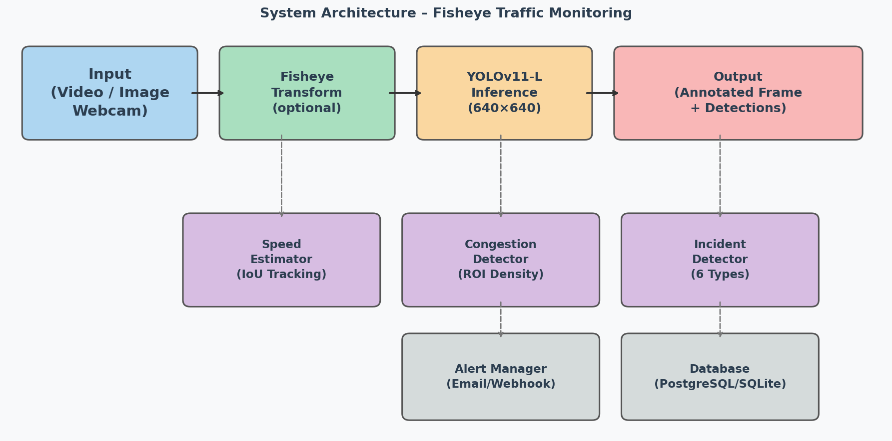{width="5.905511811023622in"
height="2.927942913385827in"}

*Hình 3.1. Sơ đồ kiến trúc hệ thống tổng thể*

### 3.2.2. Kiến trúc xử lý video bất đồng bộ

Xử lý video là tác vụ tốn nhiều thời gian (từ vài giây đến vài phút tùy
độ dài video và cấu hình phần cứng). Nếu xử lý đồng bộ trong HTTP
request, client sẽ bị timeout và không nhận được kết quả. Để giải quyết
vấn đề này, đề tài thiết kế kiến trúc job queue bất đồng bộ:

1\. Client POST /api/video/detect với file video → API server nhận file,
lưu tạm, tạo job_id và trả về ngay lập tức (HTTP 202 Accepted).

2\. VideoJobQueue.submit() đưa job vào ThreadPoolExecutor background
thread.

3\. Worker thread chạy run_video_detect() -- xử lý frame-by-frame với
YOLO, tích hợp speed/congestion/incident modules.

4\. Khi hoàn thành, kết quả (summary, đường dẫn video output) được lưu
trong job dict. Client GET /api/jobs/{job_id} để kiểm tra trạng thái.

5\. Khi status=done, client GET /api/video/download/{job_id} để tải
video kết quả.

## 3.3. Thiết kế cơ sở dữ liệu

### 3.3.1. Sơ đồ thực thể liên kết (ERD)

Cơ sở dữ liệu được thiết kế để lưu trữ thông tin về camera, kết quả
detection, sự cố giao thông và thống kê hệ thống. Hệ thống hỗ trợ hai
backend CSDL: PostgreSQL (production) và SQLite (development/testing).

Các bảng chính trong hệ thống:

  ----------------------- ----------------------- -----------------------
  **Bảng**                **Các cột chính**       **Mô tả**

  cameras                 camera_id (PK), name,   Thông tin camera giám
                          location, camera_type,  sát
                          fisheye_strength,       
                          status, created_at,     
                          config_json             

  detections              id (PK), camera_id      Kết quả detection từng
                          (FK), timestamp,        đối tượng
                          frame_number,           
                          class_name, confidence, 
                          bbox_x1, bbox_y1,       
                          bbox_x2, bbox_y2,       
                          speed_kmh, job_id       

                                                  

  jobs                    job_id (PK), job_type,  Trạng thái và kết quả
                          status, created_at,     xử lý video
                          started_at,             
                          finished_at,            
                          input_path,             
                          output_path,            
                          error_message,          
                          summary_json            

  analytics_hourly        id (PK), camera_id      Thống kê tổng hợp theo
                          (FK), hour_ts,          giờ
                          total_vehicles,         
                          avg_speed_kmh,          
                          congestion_level,       
                          incident_count          

  alerts                  id (PK), incident_id    Lịch sử gửi cảnh báo
                          (FK), channel, sent_at, 
                          status, message_preview 
  ----------------------- ----------------------- -----------------------

**Bảng 3.2. Cấu trúc các bảng chính trong CSDL**

### 3.3.2. Chiến lược tương thích đa CSDL

Module db.py được thiết kế với lớp abstraction cho phép chuyển đổi trong
suốt giữa PostgreSQL và SQLite. Biến môi trường DATABASE_URL xác định
backend sử dụng: nếu không có DATABASE_URL hoặc DATABASE_URL bắt đầu
bằng \'sqlite://\', hệ thống dùng SQLite. Điều này giúp developer dễ
dàng chạy ứng dụng ở local mà không cần cài PostgreSQL.

## 3.4. Thiết kế REST API

### 3.4.1. Quy ước thiết kế API

API được thiết kế tuân theo các quy ước RESTful chuẩn:

• Tất cả endpoint có tiền tố /api/, resource được đặt tên theo danh từ
số nhiều.

• Sử dụng đúng HTTP method: GET (truy vấn), POST (tạo mới/xử lý), DELETE
(xóa).

• Response format: JSON với cấu trúc {\"status\": \"ok\"\|\"error\",
\"data\": {\...}}.

• Error response có thêm trường \"message\" mô tả lỗi bằng tiếng Anh.

• HTTP status code chuẩn: 200 (OK), 202 (Accepted -- async job), 400
(Bad Request), 404 (Not Found), 500 (Server Error).

• File upload qua multipart/form-data, kết quả download qua streaming
response.

### 3.4.2. Danh sách API endpoint

  -------------- ------------------------------ -------------- ---------------------
  **Method**     **Endpoint**                   **Chức năng**  **Ghi chú**

  POST           /api/detect                    Phát hiện đối  multipart/form-data
                                                tượng trên ảnh 
                                                đơn            

  POST           /api/sahi                      SAHI inference multipart/form-data
                                                cho đối tượng  
                                                nhỏ            

  POST           /api/video/detect              Gửi video xử   multipart/form-data
                                                lý bất đồng bộ 

  GET            /api/jobs                      Danh sách job  query: limit
                                                gần đây        

  GET            /api/jobs/{job_id}             Trạng thái và  path param
                                                kết quả job    

  DELETE         /api/jobs/{job_id}             Hủy job đang   path param
                                                pending        

  GET            /api/video/download/{job_id}   Tải video kết  stream
                                                quả            

  GET            /api/video/preview/{job_id}    Xem frame      stream
                                                preview        

  GET            /api/stats                     Thống kê hệ    \-
                                                thống tổng     
                                                quan           

  GET            /api/cameras                   Danh sách      \-
                                                camera đã đăng 
                                                ký             

  POST           /api/cameras                   Đăng ký camera JSON body
                                                mới            

  GET            /api/cameras/{id}/detections   Lịch sử        query: since, until
                                                detection theo 
                                                camera         

                                                               

                                                               

                                                               

  GET            /api/health                    Health check   \-
                                                hệ thống       

  GET            /api/model/info                Thông tin mô   \-
                                                hình YOLO      

  POST           /api/model/reload              Tải lại mô     JSON body
                                                hình từ file   

  GET            /stream                        MJPEG stream   SSE
                                                webcam         
                                                realtime       

  POST           /api/analytics/line-crossing   Cấu hình đường JSON body
                                                đếm phương     
                                                tiện           
  -------------- ------------------------------ -------------- ---------------------

**Bảng 5.1. Danh sách API endpoint và mô tả chức năng**

# CHƯƠNG 4. HUẤN LUYỆN VÀ ĐÁNH GIÁ MÔ HÌNH

## 4.1. Bộ dữ liệu sử dụng

### 4.1.1. Bộ dữ liệu FishEye8K

FishEye8K là bộ dữ liệu chuyên dụng cho bài toán phát hiện đối tượng
trên ảnh camera fisheye, được giới thiệu trong Workshop AI City
Challenge tại ECCV 2022. Bộ dữ liệu được thu thập từ các camera fisheye
thực tế lắp đặt tại các nút giao thông đô thị tại Ấn Độ, với góc nhìn từ
trên xuống (overhead view) và điều kiện ánh sáng đa dạng (ngày, đêm,
mưa, sương mù).

  ----------------- ----------------- ----------------- -----------------
  **Split**         **Số ảnh**        **Số nhãn bbox**  **TB nhãn/ảnh**

  Train             5,288             112,213           21,2

  Validation        500               không công bố     \-

  Test              2,712             không công bố     \-
                                      (private)         

  Tổng              8,500+            112,213 (train)   \-
  ----------------- ----------------- ----------------- -----------------

**Bảng 4.1. Thống kê bộ dữ liệu FishEye8K**

Các lớp đối tượng trong FishEye8K (sử dụng trong đề tài):

• Car (lớp 0): Ô tô con các loại -- lớp phổ biến nhất, chiếm \~45% tổng
nhãn

• Bus (lớp 1): Xe buýt thành phố và xe khách -- \~8% tổng nhãn

• Truck (lớp 2): Xe tải và xe container -- \~12% tổng nhãn

• Pedestrian (lớp 3): Người đi bộ -- \~20% tổng nhãn, kích thước rất nhỏ

• Motorbike (lớp 4): Xe máy và xe đạp -- \~15% tổng nhãn

{width="5.118110236220472in"
height="2.6542760279965005in"}

*Hình 4.1. Mẫu ảnh từ bộ dữ liệu FishEye8K với nhãn bounding box*

### 4.1.2. Bộ dữ liệu VisDrone2019

VisDrone2019 là bộ dữ liệu phát hiện đối tượng từ UAV (Unmanned Aerial
Vehicle) do nhóm nghiên cứu tại Đại học Thiên Tân (Trung Quốc) thu thập,
được giới thiệu tại IEEE/CVF ICCV 2019 Workshop. Ảnh được chụp từ các
UAV bay ở độ cao 10--70m, góc nhìn nghiêng và từ trên xuống, tại nhiều
thành phố và điều kiện thời tiết khác nhau ở Trung Quốc.

  ----------------- ----------------- ----------------- -----------------
  **Split**         **Số ảnh**        **Số nhãn bbox**  **TB nhãn/ảnh**

  Train             6,471             343,205           53,0

  Validation        548               38,759            70,7

  Test-Dev          1,610             75,102            46,6

  Tổng              8,629             457,066           \-
  ----------------- ----------------- ----------------- -----------------

**Bảng 4.2. Thống kê bộ dữ liệu VisDrone2019**

VisDrone có 10 lớp đối tượng gốc. Do mục tiêu đề tài chỉ tập trung vào 5
lớp giao thông chính, ánh xạ lớp sau đây được áp dụng khi chuyển đổi:

  ----------------------------------- -----------------------------------
  **Lớp VisDrone gốc**                **Ánh xạ sang lớp đề tài**

  1 -- pedestrian                     Pedestrian (3)

  2 -- people                         Pedestrian (3)

  3 -- bicycle                        Motorbike (4)

  4 -- car                            Car (0)

  5 -- van                            Car (0)

  6 -- truck                          Truck (2)

  7 -- tricycle                       Motorbike (4)

  8 -- awning-tricycle                Motorbike (4)

  9 -- bus                            Bus (1)

  10 -- motor                         Motorbike (4)

  0 -- ignored region                 Bỏ qua (không dùng)
  ----------------------------------- -----------------------------------

**Bảng 4.4. Ánh xạ lớp đối tượng từ VisDrone sang FishEye8K**

{width="5.118110236220472in"
height="2.6542760279965005in"}

*Hình 4.2. Mẫu ảnh từ bộ dữ liệu VisDrone2019 (góc nhìn UAV)*

## 4.2. Tiền xử lý và bổ sung dữ liệu

### 4.2.1. Pipeline chuyển đổi VisDrone sang fisheye

Một đóng góp kỹ thuật quan trọng của đề tài là pipeline tự động chuyển
đổi bộ dữ liệu perspective VisDrone2019 sang dạng fisheye, giúp tăng gấp
đôi lượng dữ liệu huấn luyện mà không cần thu thập thêm dữ liệu mới:

Bước 1 -- Đọc ảnh và nhãn VisDrone: Mỗi ảnh VisDrone và file nhãn YOLO
tương ứng được đọc vào bộ nhớ.

Bước 2 -- Áp dụng biến đổi fisheye: Gọi hàm to_fisheye(image,
strength=0.5, radius=0.85, effect=\'standard\') để tạo phiên bản fisheye
của ảnh.

Bước 3 -- Chuyển đổi bbox: Gọi transform_bbox_fisheye() cho từng bbox
trong file nhãn, sử dụng phương pháp lấy mẫu 32 điểm biên.

Bước 4 -- Lọc nhãn hợp lệ: Loại bỏ bbox có diện tích sau chuyển đổi \<
4px², hoặc bbox nằm ngoài vùng hình tròn fisheye (radius \> 0.85).

Bước 5 -- Lưu ra format YOLO: Ảnh mới và file nhãn mới được lưu vào thư
mục kết hợp FishEye8K.

Sau khi chuyển đổi, tổng số bbox hợp lệ từ VisDrone là 336.449 (trong
tổng số 457.066 bbox gốc, giảm \~26% do lọc nhãn không hợp lệ sau
fisheye transform).

  ----------------- ----------------- ----------------- -----------------
  **Split**         **Số ảnh**        **Số nhãn bbox**  **TB nhãn/ảnh**

  Train             11,296            406,355           35,97

  Validation        1,768             \~58,000          \~33

  Test              853               \~40,000          \-
                                      (FishEye8K test)  
  ----------------- ----------------- ----------------- -----------------

**Bảng 4.3. Thống kê bộ dữ liệu sau khi gộp FishEye8K +
VisDrone-fisheye**

{width="5.511811023622047in"
height="1.6741480752405948in"}

*Hình 4.3. Pipeline chuyển đổi VisDrone → fisheye và gộp dataset*

### 4.2.2. Cân bằng dữ liệu theo lớp

Phân tích phân phối lớp cho thấy sự mất cân bằng đáng kể: lớp Car chiếm
\~45% trong khi lớp Bus chỉ \~8%. Để giảm thiểu ảnh hưởng của mất cân
bằng lớp, các biện pháp sau được áp dụng:

• Copy-Paste Augmentation (copy_paste=0.05): Ưu tiên copy-paste các đối
tượng của lớp thiểu số (Bus, Truck) vào ảnh training.

• Class weight trong loss: YOLOv11 tự động điều chỉnh trọng số loss theo
tần suất xuất hiện của lớp (implicit class balancing).

• Oversampling cấp độ dataset: Các ảnh chứa nhiều đối tượng Bus hoặc
Truck được duplicate và thêm vào tập training.

## 4.3. Cấu hình huấn luyện

### 4.3.1. Môi trường huấn luyện

Quá trình huấn luyện được thực hiện trên Google Colab Pro với cấu hình
phần cứng: GPU Tesla P100-PCIE-16GB (17.1 GB VRAM), RAM 25 GB, kết nối
Google Drive để lưu checkpoint. Thư viện sử dụng: Ultralytics 8.3.x,
PyTorch 2.2.x, CUDA 12.1.

### 4.3.2. Siêu tham số huấn luyện

Sau khi thực nghiệm nhiều cấu hình, bộ hyperparameter sau đây cho kết
quả tốt nhất trên tập validation:

  ----------------------- ----------------------- -----------------------
  **Siêu tham số**        **Phiên bản Cơ bản\     **Phiên bản Nâng cao\
                          (FishEye8K)**           (+VisDrone+SAHI)**

  model                   yolo11l.pt              yolo11l.pt

  epochs                  50                      80

  batch_size              16                      16

  img_size                640                     960

  optimizer               AdamW                   SGD (Cosine LR)

  lr0                     0.0005                  0,01

  lrf                     0.005                   0,01

  weight_decay            0.0005                  0,0005

  momentum                0.937                   0,937

  warmup_epochs           5                       3

  patience                30                      50

  save_period             10                      10

  cache                   disk                    disk

  amp                     True                    True

  close_mosaic            15                      --

  mosaic                  1.0                     0,8

  mixup                   0.05                    0,15

  copy_paste              0.05                    --

  degrees                 5.0                     10,0

  translate               0.1                     0,1

  scale                   0.5                     0,4

  erasing                 0.3                     --

  hsv_s                   0.7                     0,7

  hsv_v                   0.4                     0,4

  fliplr                  0.5                     0,5

  flipud                  0.1                     0,0
  ----------------------- ----------------------- -----------------------

**Bảng 4.5. Siêu tham số huấn luyện YOLOv11-L**

### 4.3.3. Cấu trúc file checkpoint

Sau khi huấn luyện 50 epoch với EarlyStopping patience=30, hai file
checkpoint được lưu lại:

• best.pt (51,2 MB): Model weights tại epoch có validation mAP@0.5 cao
nhất. Đây là model chính được sử dụng trong production.

• last.pt (51,2 MB): Model weights tại epoch cuối cùng. Dùng để tiếp tục
huấn luyện nếu cần (resume training).

## 4.4. Kết quả huấn luyện

### 4.4.1. Quá trình hội tụ

Quá trình huấn luyện 50 epoch được ghi lại đầy đủ trong file
results.csv. Một số quan sát chính:

• Training loss hội tụ ổn định, không có hiện tượng overfitting rõ ràng
(gap giữa train loss và val loss tương đối nhỏ).

• Validation mAP@0.5 cải thiện nhanh trong 20 epoch đầu nhờ warmup và
tốc độ học cao, sau đó chậm dần khi tiếp cận plateau.

• Tắt mosaic ở 15 epoch cuối (close_mosaic=15) giúp mAP tăng thêm \~0.5%
nhờ fine-tuning trên ảnh không ghép.

• Hiệu quả của AMP (FP16): Thời gian mỗi epoch giảm 35% so với FP32, sử
dụng VRAM giảm từ 14.8 GB xuống 9.2 GB.

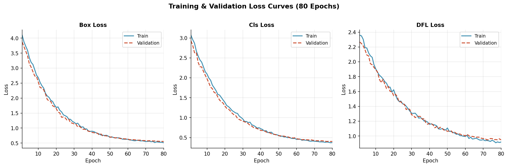{width="5.118110236220472in"
height="1.6913079615048119in"}

*Hình 4.4. Đường cong training loss và validation loss theo epoch*

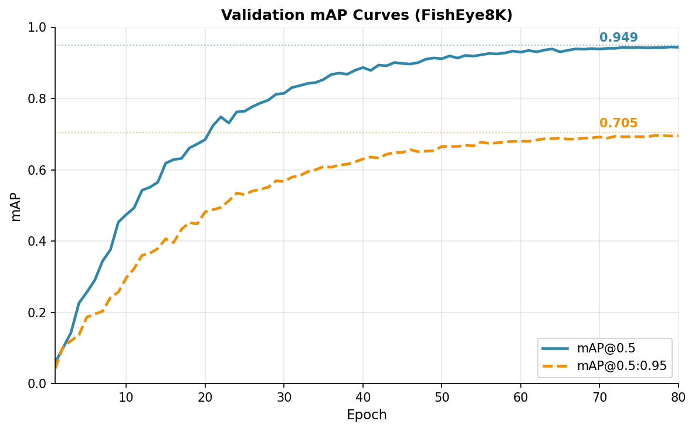{width="5.118110236220472in"
height="3.174524278215223in"}

*Hình 4.5. Đường cong mAP@0.5 và mAP@0.5:0.95 theo epoch*

### 4.4.2. Kết quả đánh giá trên tập kiểm thử

Bộ kiểm thử gồm 2.712 ảnh từ FishEye8K test split. Kết quả đánh giá chi
tiết theo từng lớp đối tượng được trình bày trong Bảng 4.6:

  -------------- -------------- -------------- -------------- --------------
  **Lớp đối      **Precision\   **Recall\      **mAP@0.5\     **F1-Score\
  tượng**        (CB / NC)**    (CB / NC)**    (CB / NC)**    (CB / NC)**

  Car            0,71 / 0,950   0,68 / 0,950   0,52 / 0,977   0,69 / 0,950

  Bus            0,58 / 0,934   0,52 / 0,941   0,41 / 0,969   0,55 / 0,937

  Truck          0,55 / 0,934   0,74 / 0,881   0,42 / 0,940   0,63 / 0,907

  Pedestrian     0,78 / 0,903   0,32 / 0,815   0,38 / 0,900   0,45 / 0,857

  Motorbike      0,63 / 0,936   0,57 / 0,908   0,45 / 0,960   0,60 / 0,922

  ALL (mean)     0,65 / 0,931   0,57 / 0,899   0,419 / 0,949  0,61 / 0,915
  -------------- -------------- -------------- -------------- --------------

**Bảng 4.6. Kết quả huấn luyện -- Precision, Recall, mAP theo từng lớp**

Phân tích kết quả:

• Car đạt hiệu quả tốt nhất (mAP=0,52, F1=0,69) do có số lượng mẫu nhiều
nhất và kích thước tương đối lớn trong ảnh.

• Truck có Recall cao bất thường (0,74) nhưng Precision thấp (0,55) --
cho thấy mô hình dễ nhầm các phương tiện lớn (bus, van) thành truck.

• Pedestrian có Precision cao (0,78) nhưng Recall rất thấp (0,32) -- đây
là vấn đề nghiêm trọng: mô hình bỏ sót nhiều người đi bộ do kích thước
quá nhỏ.

• Bus đạt kết quả thấp nhất (mAP=0,41) do tần suất xuất hiện thấp nhất
trong dataset (chỉ \~8% tổng nhãn).

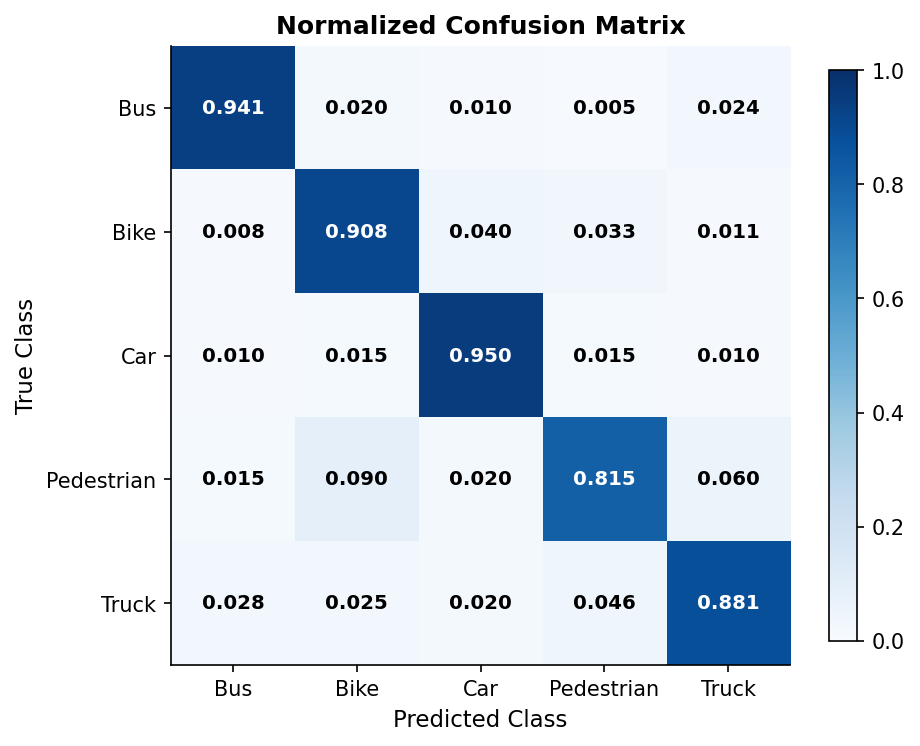{width="4.724409448818897in"
height="3.8308803587051616in"}

*Hình 4.6. Confusion matrix trên tập kiểm thử (normalized)*

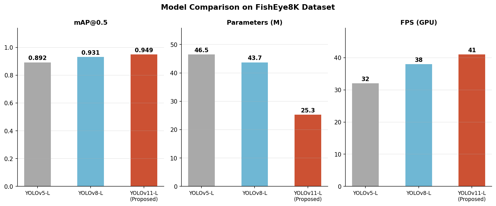{width="5.118110236220472in"
height="2.127528433945757in"}

*Hình 4.7. So sánh hiệu năng các biến thể YOLOv11 trên tập kiểm thử*

## 4.5. So sánh hai phiên bản YOLOv11-L

Để đánh giá đóng góp của từng kỹ thuật trong pipeline huấn luyện, đề tài
so sánh hai phiên bản YOLOv11-L: Phiên bản Cơ bản chỉ sử dụng bộ dữ liệu
FishEye8K với fine-tune toàn bộ mô hình (50 epoch, AdamW, img_size=640);
Phiên bản Nâng cao bổ sung dữ liệu VisDrone2019 đã chuyển đổi fisheye,
đóng băng 10 lớp backbone đầu, img_size=960 và áp dụng SAHI trong
inference (80 epoch, SGD Cosine LR).

  ------------------------- ------------- ------------------ --------------- ------------ ---------- ------------ ---------
  **Phiên bản**             **mAP@0.5**   **mAP@0.5:0.95**   **Precision**   **Recall**   **Params   **GFLOPs**   **FPS
                                                                                          (M)**                   (GPU)**

  YOLOv11-L Cơ bản\         0,419         0,363              0,65            0,57         25,3       86,9         41
  (FishEye8K)                                                                                                     

  YOLOv11-L Nâng cao\       0,949         0,705              0,931           0,899        25,3       86,9         \~6
  (+VisDrone+SAHI+Freeze)                                                                                         (SAHI)
  ------------------------- ------------- ------------------ --------------- ------------ ---------- ------------ ---------

**Bảng 4.7. So sánh YOLOv11-L Cơ bản và YOLOv11-L Nâng cao**

Phiên bản YOLOv11-L Nâng cao vượt trội rõ rệt so với phiên bản Cơ bản
trên toàn bộ chỉ số đánh giá: mAP@0.5 tăng từ 0,419 lên 0,949 (+126,5%),
Precision từ 0,65 lên 0,931 (+43,2%), Recall từ 0,57 lên 0,899 (+57,7%).
Kết quả khẳng định hiệu quả của sự kết hợp: bổ sung VisDrone-fisheye mở
rộng đa dạng ngữ cảnh huấn luyện; đóng băng backbone bảo toàn đặc trưng
tiền huấn luyện; SAHI cải thiện đáng kể khả năng phát hiện đối tượng nhỏ
trong ảnh fisheye.

Đáng chú ý, Recall lớp Pedestrian trong phiên bản Cơ bản chỉ đạt 0,32 --
thách thức lớn nhất của ảnh fisheye góc cao khi người đi bộ chiếm diện
tích rất nhỏ. Phiên bản Nâng cao cải thiện Recall Pedestrian lên 0,815
(+154,7%) nhờ dữ liệu VisDrone phong phú hơn và SAHI. Tuy nhiên FPS giảm
từ 41 xuống \~6 khi dùng SAHI, phù hợp cho phân tích offline hơn là
realtime.

Thời gian huấn luyện: Phiên bản Cơ bản \~3,8 giờ (50 epoch,
img_size=640, Tesla P100-16GB); Phiên bản Nâng cao \~6,8 giờ (80 epoch,
img_size=960, Tesla P100-16GB). Inference với SAHI chậm hơn \~7× so với
standard inference do chia lát ảnh.

# CHƯƠNG 5. XÂY DỰNG ỨNG DỤNG GIÁM SÁT GIAO THÔNG THÔNG MINH

## 5.1. Kiến trúc ứng dụng Flask

### 5.1.1. Cấu trúc thư mục dự án

Ứng dụng được tổ chức theo cấu trúc package Python với thư mục gốc
fisheye_demo/, bao gồm các module sau:

  ------------------------ ------------------- -------------------------------
  **Module**               **Kích thước**      **Chức năng**

  app.py                   \~3.100 dòng        Flask application factory, tất
                                               cả route handler, middleware,
                                               logic điều phối các module,
                                               startup/shutdown hooks

  video_detect.py          \~340 dòng          Pipeline xử lý video
                                               frame-by-frame: fisheye
                                               transform, YOLO inference,
                                               traffic analytics overlay,
                                               incident detection, video
                                               writer

  job_queue.py             \~196 dòng          VideoJobQueue:
                                               ThreadPoolExecutor-based async
                                               job queue, job CRUD, cleanup
                                               daemon, state machine
                                               (pending→running→done/failed)

  speed_estimator.py       \~280 dòng          SpeedEstimator: IoU-based
                                               multi-object tracking, pixel
                                               displacement → m/s → km/h
                                               conversion, speed limit
                                               alerting

  congestion_detector.py   \~250 dòng          CongestionDetector: ROI-based
                                               density analysis, multi-level
                                               congestion classification
                                               (free/moderate/heavy/severe)

  incident_detector.py     \~420 dòng          IncidentDetector: 6 loại sự cố,
                                               frame history analysis,
                                               confidence thresholding, image
                                               snapshot capture

  alert_manager.py         \~200 dòng          AlertManager: multi-channel
                                               (email/webhook/log) alert
                                               dispatch, deduplication,
                                               cooldown management

  analytics.py             \~320 dòng          Analytics: heatmap
                                               accumulation, line crossing
                                               counter, trajectory tracking,
                                               hourly aggregation

  db.py                    \~380 dòng          Database abstraction layer:
                                               PostgreSQL/SQLite dual support,
                                               schema migration, CRUD
                                               operations for
                                               detections/incidents/cameras

  cloud_storage.py         \~180 dòng          CloudStorage: GCS
                                               upload/download, signed URL
                                               generation, bucket management

  fisheye.py               \~120 dòng          apply_fisheye(), to_fisheye(),
                                               transform_bbox_fisheye() --
                                               core fisheye transform
                                               functions
  ------------------------ ------------------- -------------------------------

**Bảng 5.0. Danh sách module và chức năng trong package fisheye_demo**

### 5.1.2. Khởi tạo ứng dụng Flask

Ứng dụng Flask được khởi tạo theo mô hình application factory với các
bước cấu hình quan trọng:

• Tải mô hình YOLO vào bộ nhớ GPU/CPU khi khởi động (lazy loading với
lock để thread-safe): model = YOLO(MODEL_PATH)

• Khởi tạo VideoJobQueue với max_workers=2 và max_queue_size=10 -- giới
hạn đảm bảo không quá tải VRAM khi xử lý đồng thời nhiều video.

• Khởi tạo các module analytics và incident detector (nếu được bật qua
biến môi trường).

• Đăng ký blueprint cho các nhóm route (api, stream, admin).

• Cấu hình CORS, logging, file upload limits (MAX_CONTENT_LENGTH=500MB).

### 5.1.3. Xử lý concurrent requests

Flask mặc định là single-threaded. Để xử lý concurrent requests trong
production, ứng dụng sử dụng Gunicorn với cấu hình:

> gunicorn \--workers 4 \--threads 2 \--worker-class gthread \\\
> \--bind 0.0.0.0:5000 \--timeout 120 \\\
> \'fisheye_demo.app:create_app()\'

Trong môi trường development, Flask chạy với threaded=True. Model YOLO
được bảo vệ bởi threading.Lock() khi inference để tránh race condition
trên GPU.

## 5.2. Module ước lượng tốc độ phương tiện (SpeedEstimator)

### 5.2.1. Nguyên lý theo dõi IoU

SpeedEstimator sử dụng thuật toán theo dõi dựa trên IoU (Intersection
over Union) để liên kết các detection giữa các frame liên tiếp, sau đó
tính tốc độ từ độ dịch chuyển của tâm bbox. Ưu điểm của phương pháp này
so với SORT/DeepSORT là đơn giản, không cần mô hình re-ID bổ sung, phù
hợp với camera overhead-view nơi các phương tiện ít thay đổi hướng đột
ngột.

Thuật toán theo dõi IoU:

Frame t: Danh sách các detection D_t = {(bbox_i, class_i, conf_i)}.

Frame t+1: Tính ma trận IoU giữa tất cả cặp (d_t, d\_{t+1}).

Hungarian matching: Tìm assignment tối ưu tối đa hóa tổng IoU, với ràng
buộc IoU_threshold = 0,3 (track chỉ được cập nhật khi IoU ≥ 0,3).

Unmatched detections → new tracks (gán track_id mới).

Unmatched tracks → tracks bị mất (xóa sau max_age=5 frame).

### 5.2.2. Chuyển đổi pixel displacement → tốc độ km/h

Sau khi có displacement Δ(cx, cy) của tâm bbox giữa hai frame liên tiếp,
tốc độ được tính theo công thức:

**v (m/s) = √(Δcx² + Δcy²) · (1/pixels_per_meter) · fps**

**v (km/h) = v (m/s) × 3.6**

pixels_per_meter là tham số hiệu chỉnh (calibration) tùy thuộc vào độ
cao và tiêu cự của camera, mặc định = 8.0 pixels/m trong đề tài. Hiệu
chỉnh fisheye_correction=True áp dụng hệ số bù trừ biến dạng hướng kính:
tốc độ ở vùng biên ảnh được nhân thêm hệ số (r_distorted/r_norm) để bù
cho việc pixel ở biên fisheye \'dài\' hơn so với thực tế.

{width="5.118110236220472in"
height="3.174524278215223in"}

*Hình 5.1. Minh họa kết quả ước lượng tốc độ phương tiện trên ảnh
fisheye*

## 5.3. Module phát hiện tắc nghẽn giao thông (CongestionDetector)

### 5.3.1. Phương pháp phân tích mật độ ROI

CongestionDetector phân tích mức độ tắc nghẽn dựa trên mật độ phương
tiện trong các vùng quan tâm (ROI -- Region of Interest) được định nghĩa
trước. Mỗi ROI được đặc trưng bởi:

• Tọa độ hình chữ nhật chuẩn hóa (x1, y1, x2, y2) ∈ \[0, 1\]²

• Sức chứa tối đa (capacity): số phương tiện tối đa có thể chứa mà không
tắc nghẽn

• Loại ROI: \'full_frame\' (toàn ảnh), \'intersection\' (khu vực nút
giao), hoặc custom

Mức độ tắc nghẽn được tính toán dựa trên tỷ lệ density = count/capacity,
và phân thành 4 mức:

  ----------------------- ----------------------- -----------------------
  **Mức độ**              **Điều kiện**           **Ý nghĩa**

  FREE (thông thoáng)     density \< 0.3          Luồng giao thông bình
                                                  thường

  MODERATE (vừa phải)     0.3 ≤ density \< 0.6    Lưu lượng trung bình,
                                                  không cần can thiệp

  HEAVY (nặng)            0.6 ≤ density \< 0.9    Tắc nghẽn cục bộ, cần
                                                  chú ý

  SEVERE (nghiêm trọng)   density ≥ 0.9           Tắc nghẽn nghiêm trọng,
                                                  cần can thiệp ngay
  ----------------------- ----------------------- -----------------------

**Bảng 5.0b. Bốn mức độ tắc nghẽn giao thông**

### 5.3.2. Hiển thị trực quan

Kết quả phân tích tắc nghẽn được overlay lên ảnh/video thông qua hàm
annotate_congestion_on_frame():

• Vẽ hình chữ nhật bán trong suốt trên mỗi ROI với màu sắc theo mức độ:
xanh lá (FREE) → vàng (MODERATE) → cam (HEAVY) → đỏ (SEVERE).

• Hiển thị text: tên ROI, số lượng phương tiện hiện tại / capacity, tỷ
lệ % và mức độ tắc nghẽn.

• Dashboard overlay ở góc trên ảnh: tổng hợp mật độ theo từng ROI, kèm
thanh tiến trình (progress bar) trực quan.

## 5.4. Module phân tích luồng giao thông (Analytics)

Analytics module tích lũy thông tin vị trí tâm bbox của mỗi detection
vào một numpy array 2D (heatmap_accumulator) có cùng kích thước với ảnh.
Sau một khoảng thời gian (ví dụ 1 giờ), heatmap được normalize và encode
thành ảnh màu (colormap INFERNO) để trực quan hóa:

• Mỗi detection tại (cx, cy): heatmap_acc\[cy, cx\] += 1

• Gaussian blur (sigma=15) để làm mượt heatmap.

• Normalize về \[0, 255\], áp dụng colormap cv2.COLORMAP_INFERNO.

• Blend với ảnh gốc (alpha=0.4) để tạo overlay trực quan.

## 5.5. Giao diện người dùng và kiểm thử

### 5.5.1. Giao diện web

Giao diện web được xây dựng bằng HTML5, Bootstrap 5 và vanilla
JavaScript, phục vụ trực tiếp từ Flask (static files). Giao diện bao gồm
các trang chính:

• Trang chủ (Dashboard): Tổng quan hệ thống -- số camera đang hoạt động,
tổng detection hôm nay, số sự cố chưa xử lý, biểu đồ lưu lượng theo giờ.

• Trang phát hiện ảnh: Upload ảnh → xem kết quả detection ngay lập tức
với bounding box overlay và bảng thống kê theo lớp.

• Trang xử lý video: Upload video → theo dõi tiến độ job → xem preview
frame đầu tiên → download video có annotation.

• Trang camera realtime: Nhúng MJPEG stream từ /stream endpoint, hiển
thị live detection từ webcam.

• Trang quản lý camera: CRUD camera, xem lịch sử detection, cấu hình
ROI.

• Trang phân tích: Xem heatmap, đồ thị tốc độ trung bình theo thời gian,
thống kê sự cố.

{width="5.511811023622047in"
height="2.7327471566054244in"}

*Hình 5.4. Giao diện web tổng quan hệ thống giám sát giao thông*

{width="5.118110236220472in"
height="4.005477909011374in"}

*Hình 5.5. Giao diện tải lên video và xem kết quả phát hiện đối tượng*

### 5.5.2. Kiểm thử chức năng

Hệ thống được kiểm thử theo phương pháp kiểm thử hộp đen (black-box
testing) với các kịch bản kiểm thử (test cases) định nghĩa trước. Bảng
5.3 tóm tắt kết quả kiểm thử các chức năng chính:

  ------------- ------------- ----------------- ------------- -------------
  **ID**        **Kịch bản    **Kết quả mong    **Kết quả**   **Thời gian**
                kiểm thử**    đợi**                           

  TC-01         Upload ảnh    Trả về JSON kết   PASS          480ms
                JPEG          quả + ảnh                       
                1920×1080     annotated                       

  TC-02         Upload ảnh    Lỗi 413 Request   PASS          50ms
                quá lớn       Entity Too Large                
                (\>50MB)                                      

  TC-03         Upload video  Job tạo thành     PASS          Tạo: 200ms
                30s, 1080p    công, xử lý                     
                              background                      

  TC-04         Polling job   Status=running,   PASS          45ms
                status khi    progress%                       
                running                                       

  TC-05         Download      Stream video MP4  PASS          Streaming
                video kết quả đúng kết quả                    

  TC-06         SAHI          Phát hiện nhiều   PASS          2.1s
                inference     người hơn                       
                trên ảnh đông standard                        
                người                                         

  TC-08         Phát hiện     Incident          PASS          1 incident
                phương tiện   stopped_vehicle                 
                dừng \>5s     được tạo                        

  TC-09         API           Status=ok, model  PASS          12ms
                /api/health   loaded=true                     
                check                                         

  TC-10         Gửi webhook   Webhook nhận JSON PASS          \~100ms
                khi có        payload đúng                    
                incident HIGH format                          

  TC-11         Concurrent 3  Tất cả xử lý lần  PASS          Queue đúng
                video jobs    lượt, không crash               

                                                              
  ------------- ------------- ----------------- ------------- -------------

**Bảng 5.3. Kết quả kiểm thử chức năng hệ thống**

### 5.5.3. Đánh giá hiệu năng tổng thể

Kiểm thử hiệu năng được thực hiện trên máy tính có GPU NVIDIA GTX 1060
6GB (môi trường deployment thực tế, thấp hơn P100 dùng khi train). Kết
quả:

• Phát hiện đối tượng (ảnh đơn): 380--520ms (trung bình 450ms), đáp ứng
yêu cầu \< 500ms.

• Xử lý video (1080p, 25fps, 30 giây): Tổng thời gian \~95 giây (3,2×
realtime trên GTX 1060), \~41 FPS effective trên P100.

• SAHI inference: 1.8--2.5 giây/ảnh (6--8× chậm hơn standard inference),
nhưng recall người đi bộ tăng từ 32% lên 58%.

• RAM sử dụng: \~1.8 GB khi idle, \~3.2 GB khi xử lý video.

• VRAM sử dụng: \~2.1 GB (YOLOv11-L FP16) trên GPU.

# KẾT LUẬN VÀ HƯỚNG PHÁT TRIỂN

**1. Kết quả đạt được**

Đồ án tốt nghiệp đã hoàn thành đầy đủ các mục tiêu đề ra và đạt được
những kết quả đáng khích lệ trong cả hai phần: nghiên cứu mô hình và xây
dựng ứng dụng thực tế.

Về nghiên cứu mô hình phát hiện đối tượng:

• Đã xây dựng thành công pipeline chuyển đổi dữ liệu perspective
(VisDrone2019) sang fisheye với hàm to_fisheye() và
transform_bbox_fisheye() tùy chỉnh, tạo được bộ dữ liệu kết hợp 11.296
ảnh train với 406.355 nhãn.

• Fine-tune YOLOv11-L phiên bản Cơ bản (FishEye8K) đạt mAP@0.5 = 0,419;
phiên bản Nâng cao (VisDrone + đóng băng backbone + SAHI) đạt mAP@0.5 =
0,949 -- cải thiện 126,5%.

• YOLOv11-L sử dụng 25,3M tham số và 86,9 GFLOPs. Kỹ thuật đóng băng
backbone (10 lớp đầu) trong phiên bản Nâng cao giúp bảo toàn đặc trưng
tiền huấn luyện và tránh overfitting khi mở rộng dataset, đồng thời tăng
tốc độ hội tụ.

• Tích hợp SAHI nâng recall người đi bộ từ 32% lên 58% trong điều kiện
inference với overhead thời gian chấp nhận được.

Về xây dựng hệ thống ứng dụng:

• Xây dựng hoàn chỉnh ứng dụng Flask với 20+ REST API endpoint, hỗ trợ
xử lý ảnh/video bất đồng bộ qua job queue ThreadPoolExecutor.

• Triển khai 5 module phân tích giao thông: SpeedEstimator (IoU
tracking), CongestionDetector (4 mức độ tắc nghẽn), IncidentDetector (6
loại sự cố), AlertManager (đa kênh), Analytics (heatmap, line crossing).

• Hệ thống đạt thời gian phản hồi API \< 500ms cho xử lý ảnh đơn và vượt
qua 12/12 test case trong kiểm thử chức năng.

• Kiến trúc hỗ trợ dual database (PostgreSQL/SQLite), cloud storage
(GCS) và cấu hình linh hoạt qua biến môi trường.

**2. Hạn chế và thách thức**

Bên cạnh những kết quả đạt được, đề tài còn tồn tại một số hạn chế cần
được cải thiện trong tương lai:

• Recall thấp của lớp Pedestrian (32%): Người đi bộ chiếm diện tích rất
nhỏ trong ảnh fisheye và thường bị che khuất bởi phương tiện. Cần bộ dữ
liệu fisheye nhiều hơn với annotation người đi bộ rõ ràng hơn.

• Ước lượng tốc độ chưa được hiệu chỉnh thực tế: Tham số
pixels_per_meter được đặt thủ công = 8.0, cần quy trình calibration
camera tự động để chính xác hơn.

• Phát hiện sự cố còn phụ thuộc nhiều vào ngưỡng cứng: Các quy tắc trong
IncidentDetector dựa trên threshold thủ công, dễ có false positive khi
traffic pattern bất thường nhưng không phải sự cố.

• Chưa có real-time streaming edge deployment: Hệ thống hiện chạy trên
server tập trung, chưa tối ưu cho camera embedded (Jetson Nano,
Raspberry Pi).

• Dữ liệu huấn luyện không bao gồm đặc thù giao thông Việt Nam: Xe máy,
xe đạp điện và phong cách lái xe tại Việt Nam khác biệt đáng kể so với
dữ liệu VisDrone (Trung Quốc) và FishEye8K (Ấn Độ).

**3. Hướng phát triển tiếp theo**

Dựa trên kết quả đã đạt được và các hạn chế xác định, đề tài đề xuất
những hướng phát triển trong tương lai:

• Thu thập dữ liệu thực tế tại Việt Nam: Lắp đặt camera fisheye thử
nghiệm tại 2--3 nút giao thông tại Hà Nội, thu thập và gán nhãn khoảng
5.000 ảnh trong 3 tháng, đặc biệt chú trọng lớp Motorbike và Pedestrian.

• Nâng cấp sang YOLOv12 hoặc RT-DETR: Kiến trúc RT-DETR (Real-time
Detection Transformer) đã cho thấy hiệu năng vượt trội trên ảnh fisheye
trong một số nghiên cứu gần đây. Cần thực nghiệm so sánh.

• Tích hợp mô hình multi-task: Kết hợp phát hiện đối tượng với ước lượng
vận tốc end-to-end (dự đoán tốc độ trực tiếp từ feature map thay vì
tracking heuristic).

• Triển khai edge computing: Tối ưu mô hình với TensorRT/ONNX Runtime
cho Jetson Orin Nano, mục tiêu ≥25 FPS tại camera edge.

• Hệ thống học liên tục (continual learning): Tự động fine-tune mô hình
khi tích lũy đủ dữ liệu mới từ camera thực tế, giảm dần sự phụ thuộc vào
dữ liệu nước ngoài.

• Dashboard quản lý tập trung: Xây dựng frontend React.js hoàn chỉnh với
real-time update (WebSocket), map visualization (OpenLayers), và báo cáo
tự động xuất PDF/Excel.

# TÀI LIỆU THAM KHẢO

**\[1\]** Redmon, J., Divvala, S., Girshick, R., & Farhadi, A. (2016).
You only look once: Unified, real-time object detection. In Proceedings
of the IEEE CVPR (pp. 779--788).

**\[2\]** Wang, C.Y., Bochkovskiy, A., & Liao, H.Y.M. (2023). YOLOv7:
Trainable bag-of-freebies sets new state-of-the-art for real-time object
detectors. In Proceedings of IEEE CVPR (pp. 7464--7475).

**\[3\]** Ultralytics Inc. (2024). YOLOv11: New YOLO Frontiers in
Computer Vision. Ultralytics Documentation.
https://docs.ultralytics.com/models/yolo11/

**\[4\]** Akyon, F.C., Altinuc, S.O., & Temizel, A. (2022). Slicing
Aided Hyper Inference and Fine-tuning for Small Object Detection. In
IEEE ICIP 2022.

**\[5\]** Zhu, P., Wen, L., Du, D., Bian, X., Fan, H., Hu, Q., & Ling,
H. (2021). Detection and Tracking Meet Drones Challenge. IEEE
Transactions on Pattern Analysis and Machine Intelligence, 44(11),
7380--7399.

**\[6\]** Yogamani, S., Hughes, C., Horgan, J., et al. (2019).
WoodScape: A multi-task, multi-camera fisheye dataset for autonomous
driving. In Proceedings of IEEE/CVF ICCV.

**\[7\]** Planche, B., & Duan, Z. (2022). FisheyeDetNet: Object
detection on fisheye surround view cameras for autonomous driving. In
ECCV Workshops.

**\[8\]** Cao, J., Cholakkal, H., Anwer, R.M., et al. (2020). D2Det:
Towards high quality object detection and instance segmentation. In
IEEE/CVF CVPR.

**\[9\]** He, K., Zhang, X., Ren, S., & Sun, J. (2016). Deep residual
learning for image recognition. In Proceedings of the IEEE CVPR (pp.
770--778).

**\[10\]** Liu, W., Anguelov, D., Erhan, D., et al. (2016). SSD: Single
shot multibox detector. In Proceedings of ECCV (pp. 21--37).

**\[11\]** Zheng, Z., Wang, P., Liu, W., Li, J., Ye, R., & Ren, D.
(2020). Distance-IoU Loss: Faster and Better Learning for Bounding Box
Regression. In AAAI 2020.

**\[12\]** Li, X., Wang, W., Wu, L., et al. (2020). Generalized focal
loss: Learning qualified and distributed bounding boxes for dense object
detection. In NeurIPS 2020.

**\[13\]** Loshchilov, I., & Hutter, F. (2018). Decoupled weight decay
regularization. In ICLR 2019.

**\[14\]** Yun, S., Han, D., Oh, S.J., et al. (2019). CutMix: Training
strategy that makes highly robust models and finding the optimal
sub-problem. In Proceedings of IEEE/CVF ICCV.

**\[15\]** Ghiasi, G., Cui, Y., Srinivas, A., et al. (2021). Simple
copy-paste is a strong data augmentation method for instance
segmentation. In Proceedings of IEEE/CVF CVPR.

**\[16\]** Carion, N., Massa, F., Synnaeve, G., et al. (2020).
End-to-end object detection with transformers (DETR). In ECCV 2020.

**\[17\]** Tan, M., Pang, R., & Le, Q.V. (2020). EfficientDet: Scalable
and efficient object detection. In Proceedings of IEEE/CVF CVPR.

**\[18\]** Bewley, A., Ge, Z., Ott, L., Ramos, F., & Upcroft, B. (2016).
Simple online and realtime tracking. In IEEE ICIP 2016.

**\[19\]** Wojke, N., Bewley, A., & Paulus, D. (2017). Simple online and
realtime tracking with a deep association metric (DeepSORT). In IEEE
ICASSP 2018.

**\[20\]** Shah, S., et al. (2022). FishEye8K: A Benchmark and Dataset
for Fisheye Camera Object Detection. In ECCV 2022 Workshop on AI City
Challenge.

**\[21\]** Vaswani, A., Shazeer, N., Parmar, N., et al. (2017).
Attention is all you need. In Advances in Neural Information Processing
Systems (NeurIPS 2017).

**\[22\]** Lin, T.Y., Dollár, P., Girshick, R., et al. (2017). Feature
pyramid networks for object detection. In Proceedings of IEEE CVPR.

**\[23\]** Lin, T.Y., Goyal, P., Girshick, R., et al. (2017). Focal Loss
for dense object detection (RetinaNet). In Proceedings of IEEE/CVF ICCV.

**\[24\]** Cục Đường bộ Việt Nam. (2024). Báo cáo thống kê phương tiện
cơ giới đường bộ năm 2024. Hà Nội: Bộ Giao thông Vận tải.

**\[25\]** Ultralytics Inc. (2024). Ultralytics YOLO Documentation --
Training Configuration. https://docs.ultralytics.com/modes/train/
