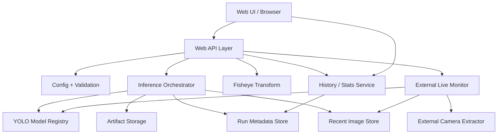
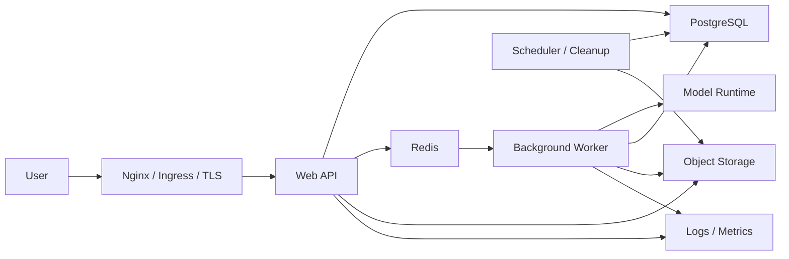
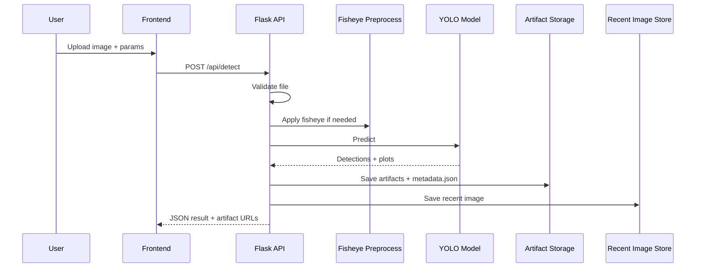
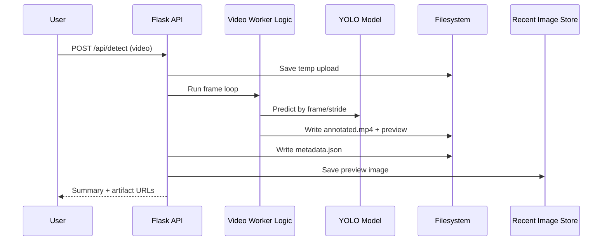
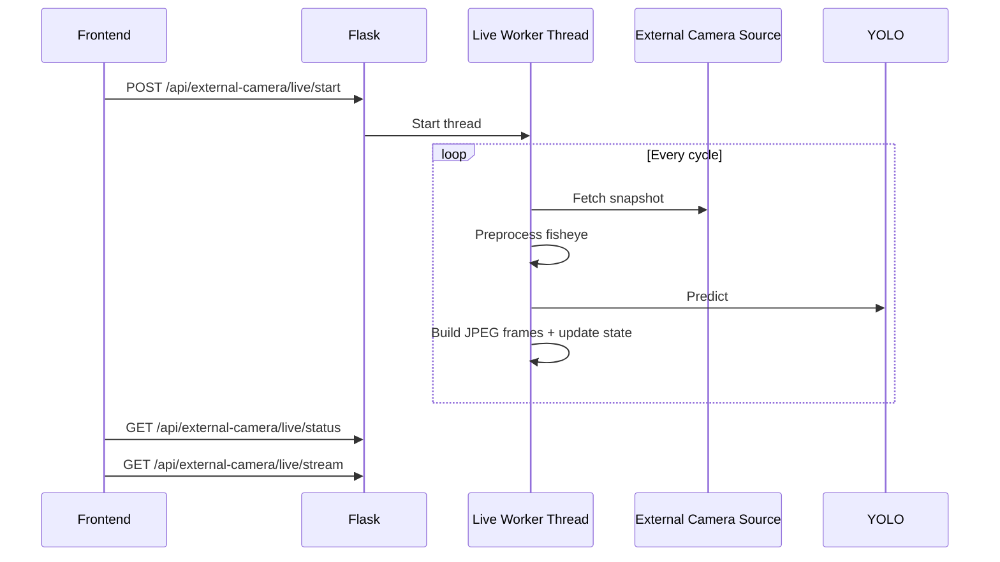

# System Architech

## 1. Muc dich tai lieu

Tai lieu nay mo ta chi tiet kien truc he thong `fisheye_demo` theo goc nhin thiet ke he thong.

Neu `SYSTEM_OVERVIEW.md` tra loi cau hoi:

- he thong dang co gi,
- workflow tong quat ra sao,
- can deploy theo huong nao,

thi tai lieu nay tra loi sau hon:

- tung thanh phan trong he thong lam gi,
- phu thuoc qua lai nhu the nao,
- data chay theo duong nao,
- can dat service nao khi deploy,
- he thong se scale, monitor va failover ra sao,
- can refactor thanh module nao de len production.

Tai lieu nay co the dung nhu:

- ban ve kien truc cho team ky thuat,
- tai lieu onboarding cho backend / ML / DevOps,
- checklist de dua codebase tu demo sang production.

## 2. Pham vi he thong

He thong phuc vu bai toan:

1. Detect doi tuong tren anh fisheye.
2. Detect tren anh thuong sau khi bien dang sang fisheye.
3. Detect tren video va tra artifact `annotated.mp4`.
4. Convert anh / video sang fisheye.
5. Detect tren snapshot camera ngoai.
6. Live monitor camera ngoai bang detect lap lai.

Pham vi ky thuat cua he thong bao gom:

- frontend dashboard,
- web API,
- fisheye preprocessing,
- model inference runtime,
- metadata storage,
- artifact storage,
- recent image index,
- external live pipeline,
- monitoring va deployment stack.

## 3. Kien truc tong the

### 3.1 Logical architecture



### 3.2 Deployment architecture muc tieu



## 4. Thanh phan trong codebase hien tai

### 4.1 `app.py`

Day la file trung tam hien tai.

Trach nhiem:

- tao Flask app,
- load env,
- build `AppSettings`,
- expose route API,
- quan ly model registry,
- validate request,
- orchestration detect / convert,
- luu metadata ra filesystem,
- tong hop history / stats,
- chay live monitor,
- expose recent image API.

Van de:

- dang dong vai tro qua lon,
- de tao coupling cao giua storage, route va runtime.

### 4.2 `fisheye.py`

Module xu ly preprocessing.

Trach nhiem:

- barrel distortion bang inverse mapping,
- bilinear interpolation,
- support profile `standard`, `extreme`, `subtle`, `traffic_camera`,
- support off-center, elliptical, `full_frame`.

Module nay nen giu tinh chat pure-processing, khong nen phu thuoc web layer.

### 4.3 `video_detect.py`

Module batch processing cho video.

Trach nhiem:

- mo video bang OpenCV,
- doc frame,
- tuy chon preprocess truoc infer,
- YOLO predict,
- ghi `annotated.mp4`,
- tao preview,
- tinh thong ke throughput va inference.

Trong production, module nay nen chay trong worker process thay vi request process.

### 4.4 `external_camera_detector.py`

Module adapter cho nguon camera ngoai.

Trach nhiem:

- parse HTML de lay iframe camera,
- suy ra `youtube_id`,
- tai snapshot tu YouTube static image,
- build collage overview.

Rui ro:

- phu thuoc layout HTML ben ngoai,
- de vo khi nguon doi markup,
- chua phai adapter stream thuc.

### 4.5 `recent_image_store.py`

Module storage nho tren SQLite.

Trach nhiem:

- luu toi da 100 anh gan nhat,
- expose metadata gallery,
- luu image bytes va metadata rut gon,
- prune ban ghi cu.

Module nay hop ly cho:

- single-host,
- local demo,
- dashboard nhanh.

Khong nen la source of truth cho multi-instance production.

### 4.6 `templates/index.html`

Frontend 1 trang.

Trach nhiem:

- upload media,
- config preprocessing,
- goi detect / convert,
- hien thi artifact,
- hien thi history,
- hien thi stats,
- dieu khien external camera live.

Van de:

- HTML / CSS / JS dang tron 1 file lon,
- kho maintain khi UI tang do phuc tap.

### 4.7 `tests/test_app.py`

Bo test hien tai bao phu:

- route co ban,
- detect image,
- detect video,
- convert image,
- external camera detect,
- live status / stream,
- recent image retention,
- thong ke va config.

Khoang trong:

- integration test co network that,
- browser e2e,
- load test,
- deployment smoke test.

## 5. Thanh phan logic cua he thong

### 5.1 Presentation layer

Gom:

- browser,
- dashboard HTML/JS,
- preview image/video,
- live external camera panel.

Nhiem vu:

- thu input nguoi dung,
- validate co ban phia client,
- trigger request,
- poll / render ket qua.

### 5.2 API layer

Gom:

- Flask routes,
- request parsing,
- response formatting JSON,
- artifact URL mapping.

Nhiem vu:

- gateway cho frontend va API client,
- validate media type,
- validate threshold,
- dispatch workflow phu hop.

### 5.3 Application service layer

Trong code hien tai chua tach thanh package rieng, nhung ve logic no gom:

- detect service,
- convert service,
- external camera service,
- history service,
- stats service,
- recent image service.

Day la layer nen duoc tach ra dau tien khi refactor.

### 5.4 Domain processing layer

Gom:

- fisheye transform,
- image inference,
- video inference,
- camera snapshot preprocessing.

### 5.5 Storage layer

Hien tai gom:

1. Filesystem artifact storage
2. Metadata JSON per run
3. SQLite recent image store

Production nen gom:

1. Postgres metadata store
2. Object storage artifact store
3. Redis queue / cache

## 6. Cau truc du lieu

### 6.1 Don vi nghiep vu chinh: Run

Moi detect / convert thanh cong tao ra 1 `run`.

Run hien tai duoc bieu dien bang `metadata.json`.

Field tong quat:

- `id`
- `task`
- `media_type`
- `filename`
- `created_at`
- `summary`
- `preprocessing`
- `parameters`
- `model`
- `artifacts`

### 6.2 Don vi nghiep vu phu: Artifact

Artifact la file sinh ra tu run.

Loai artifact co the gom:

- `original.jpg`
- `preprocessed.jpg`
- `annotated.jpg`
- `fisheye.jpg`
- `annotated.mp4`
- `fisheye.mp4`
- `preview_annotated.jpg`
- `preview_fisheye.jpg`
- `overview_annotated.jpg`

### 6.3 Don vi nghiep vu phu: Recent image

Recent image la anh dai dien cho 1 run de phuc vu gallery nhanh.

Data dang luu:

- `source_key`
- `source_result_id`
- `task`
- `media_type`
- `image_role`
- `filename`
- `mime_type`
- `width`
- `height`
- `created_at`
- `metadata_json`
- `image_blob`

### 6.4 Don vi nghiep vu phu: Live session

Trong code hien tai live session duoc giu trong RAM.

State gom:

- `running`
- `status`
- `source_url`
- `camera_limit`
- `interval_seconds`
- `conf_threshold`
- `iou_threshold`
- `preprocessing`
- `cycle_count`
- `last_cycle_duration_ms`
- `actual_cycle_fps`
- `stream_ready`
- `last_result`

Trong production, state nay nen chuyen sang Redis / Postgres.

## 7. Luong du lieu chi tiet

### 7.1 Detect image flow



### 7.2 Detect video flow



### 7.3 External live flow



## 8. Storage architecture

### 8.1 Filesystem storage hien tai

Muc dich:

- giu artifact run,
- de debug,
- de dashboard co the truy cap URL truc tiep.

Diem manh:

- don gian,
- de xem tay,
- de backup thu cong.

Diem yeu:

- kho scale multi-instance,
- kho prune,
- stats scan cham dan khi artifact tang.

### 8.2 SQLite recent image storage

Muc dich:

- gallery nhanh,
- khong can quet artifact folder moi lan.

Diem manh:

- nhe,
- co prune,
- API don gian.

Diem yeu:

- local-node only,
- khong phai source of truth phan tan.

### 8.3 Production storage de xuat

Nen tach nhu sau:

- Postgres: metadata, run, user, job, camera config
- Object storage: artifact lon
- Redis: queue, cache, transient live state

## 9. Cau hinh va secrets

### 9.1 Config hien tai

Nguon config:

1. `SETTINGS_OVERRIDES`
2. environment variables
3. `.env`
4. default trong code

Mot so bien quan trong:

- `FISHEYE_RESULTS_DIR`
- `FISHEYE_RECENT_IMAGE_DB`
- `FISHEYE_RECENT_IMAGE_LIMIT`
- `FISHEYE_DEFAULT_CONF`
- `FISHEYE_DEFAULT_IOU`
- `FISHEYE_DEVICE`
- `FISHEYE_MODEL_PATH`
- `FISHEYE_PRELOAD_MODEL`

### 9.2 Production config de xuat

Can tach:

- app config
- storage config
- db config
- redis config
- auth config
- external camera config
- model runtime config

Secrets khong nen dat trong file commit.

Nen dung:

- env secret manager,
- Docker secret,
- Kubernetes secret,
- Vault hoac tuong duong.

## 10. API architecture

### 10.1 Nhom endpoint

Nhom API hien tai:

1. Health / config
2. Detect / convert
3. History / stats / artifact
4. Recent image
5. External camera
6. Live camera

### 10.2 Hop dong response

Da so endpoint tra:

- `request_id`
- `task`
- `media_type`
- `summary`
- `preprocessing`
- `model`
- `record`

`record` la object quan trong vi no la cau noi giua:

- workflow logic,
- artifact storage,
- UI rendering.

### 10.3 API production de xuat

Nen bo sung:

- `POST /api/jobs`
- `GET /api/jobs/<job_id>`
- `POST /api/uploads/signed-url`
- `GET /api/runs`
- `GET /api/runs/<run_id>`
- `GET /api/runs/<run_id>/artifacts`
- `DELETE /api/runs/<run_id>`

De giam request dai, video nen chuyen qua `job API`.

## 11. Model runtime architecture

### 11.1 Model registry hien tai

Trach nhiem:

- tim checkpoint phu hop,
- preload neu can,
- cache model object,
- tra health snapshot.

Thu tu uu tien model:

1. file co `fisheye`
2. file co `best`
3. file co `resume`
4. file co `yolo11`
5. fallback `yolo11n.pt`

### 11.2 Production model strategy

Nen xac dinh ro:

- model version nao dang active,
- rollback model nhu the nao,
- model duoc mount local hay pull tu registry,
- worker nao duoc phep dung GPU.

Nen luu them:

- `model_name`
- `model_version`
- `model_checksum`
- `loaded_from`

vao metadata run.

## 12. External camera subsystem

### 12.1 Thanh phan

Gom:

- source page parser,
- snapshot downloader,
- fisheye profile preset,
- one-shot detect pipeline,
- live worker,
- MJPEG streamer.

### 12.2 Diem nghen

- network latency
- snapshot freshness
- parser de vo
- live stream that chua duoc decode truc tiep

### 12.3 Huong nang cap

Production nen ho tro:

- RTSP / HLS / WebRTC neu co nguon stream that,
- camera config luu trong DB,
- scheduler rieng cho live sessions,
- per-camera fisheye preset.

## 13. Security architecture

### 13.1 Rui ro hien tai

- upload file lon de gay nghen
- khong co auth
- khong co rate limit
- artifact co the doc truc tiep neu biet URL
- external fetch co the gap request treo / fail

### 13.2 Kien truc bao mat muc tieu

Can co:

1. TLS
2. Auth
3. Role / scope API
4. Upload validation
5. Rate limit
6. Signed URL cho artifact neu can
7. Audit log
8. Network egress policy cho external source

## 14. Reliability va failure handling

### 14.1 Cac failure mode hien tai

- model khong load duoc
- video loi / khong doc duoc
- disk day
- external source doi HTML
- live thread die giua chung
- upload qua lon

### 14.2 Cach xu ly hien tai

- tra JSON error
- xoa result dir neu workflow fail mot phan
- live logger tach event ket noi / frame / stop

### 14.3 Production failure strategy

Nen bo sung:

- retry co gioi han cho external fetch
- dead-letter queue cho job loi
- idempotent job handling
- object storage upload retry
- circuit breaker cho external camera source
- health probe cho web / worker

## 15. Performance architecture

### 15.1 Diem ton tai nguyen chinh

- OpenCV frame loop
- fisheye transformation
- YOLO inference
- video writer
- base64 / JPEG encode

### 15.2 Scale len bang cach nao

Scale ngang:

- nhan ban web instances
- nhan ban worker instances

Scale doc:

- GPU worker
- CPU / RAM cao hon
- SSD cho artifact tam

Toi uu:

- dung stride cho video detect
- resize input hop ly
- batch neu phu hop
- tach preview generation

## 16. Observability architecture

### 16.1 Logging

Nen co:

- request id
- run id
- job id
- model info
- upload size
- infer ms
- camera source

### 16.2 Metrics

Nen theo doi:

- request latency
- error rate
- video processing fps
- queue depth
- disk usage
- stored artifact count
- recent image count
- external camera fetch fail rate

### 16.3 Tracing

Neu he thong tach web / worker, tracing se giup thay:

- request vao web
- web tao job
- worker xu ly
- artifact upload
- db update

## 17. Kien truc deployment chi tiet

### 17.1 Single-host deployment

Phu hop cho:

- demo,
- lab,
- MVP.

Thanh phan:

- Nginx
- Flask web
- 1 worker
- Redis
- Postgres
- local volume cho artifact

### 17.2 Multi-host deployment

Phu hop cho:

- nhieu user,
- video workload nang,
- can uptime cao hon.

Thanh phan:

- load balancer
- 2+ web instances
- 2+ worker instances
- Postgres managed
- Redis managed
- object storage
- log / metrics stack

### 17.3 GPU-aware deployment

Neu can throughput cao:

- worker CPU cho metadata / convert nhe
- worker GPU cho detect video nang
- queue route job theo capability

## 18. Refactor architecture de xuat

Nen chuyen codebase sang cau truc:

```text
fisheye_demo/
|-- app/
|   |-- api/
|   |-- core/
|   |-- services/
|   |-- storage/
|   |-- workers/
|   |-- domain/
|   `-- schemas/
|-- templates/
|-- static/
|-- tests/
|-- deploy/
|-- migrations/
`-- docs/
```

### 18.1 `api/`

- route definitions
- auth decorators
- request/response schema

### 18.2 `services/`

- detect service
- convert service
- recent image service
- camera service
- stats service

### 18.3 `storage/`

- postgres repositories
- object storage client
- artifact lifecycle manager

### 18.4 `workers/`

- video detect worker
- video convert worker
- external live worker
- cleanup worker

## 19. Roadmap kien truc

### Stage 1

- tach `app.py`
- dua video sang worker
- them Postgres
- them Redis

### Stage 2

- chuyen artifact sang object storage
- bo sung auth
- bo sung cleanup va retention
- bo sung monitoring

### Stage 3

- live camera service rieng
- signed URL / CDN
- GPU scheduling
- quota / RBAC / audit

## 20. Ket luan

Kien truc hien tai cua `fisheye_demo` da co du thanh phan logic de chay end-to-end tren local: preprocessing, inference, artifact, recent image gallery va external live monitor. Tuy nhien, kien truc thuc thi van dang o muc demo-centric.

De tro thanh he thong hoan chinh, can chuyen doi tu:

- monolithic Flask process
- local filesystem + SQLite nho
- synchronous heavy request

sang:

- web API + worker separation
- Postgres + Redis + object storage
- monitored, secured, scalable deployment

Tai lieu nay la ban mo ta chi tiet de team co the dung lam nen khi thiet ke, refactor va deploy he thong trong giai doan tiep theo.
