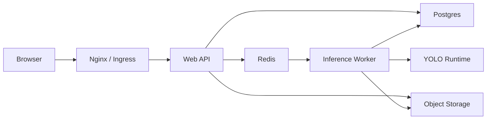

# Refactor Plan

## 1. Muc tieu

Tai lieu nay chia refactor he thong `fisheye_demo` thanh 2 huong lam song song:

1. Local test track
2. Production deploy track

Muc tieu khong phai viet lai toan bo he thong trong mot lan, ma la dua codebase tu demo Flask local sang mot he thong co the:

- test on dinh tren may local,
- dong goi bang Docker,
- deploy len Runpod / server GPU khi can demo,
- mo rong dan thanh production voi worker, database va object storage.

## 2. Nguyen tac refactor

- Giu workflow hien tai chay duoc.
- Tach nhung phan co rui ro thap truoc: entrypoint, config, deploy files, docs.
- Sau do moi tach service layer va worker.
- Moi phase phai co cach test ro rang.
- Khong dua Postgres / Redis vao code core truoc khi co abstraction storage.

## 3. Trang thai hien tai

He thong hien la 1 Flask app gom:

- `app.py`: route, config, inference orchestration, storage, live monitor.
- `fisheye.py`: fisheye transform.
- `video_detect.py`: detect video.
- `external_camera_detector.py`: external camera adapter.
- `recent_image_store.py`: SQLite recent image store.
- `templates/index.html`: UI 1 trang.

He thong hien co:

- local artifact storage trong `static/results`,
- upload temp trong `static/uploads`,
- recent image SQLite,
- synchronous video processing,
- internal thread cho external live monitor.

## 4. Huong A: Local test track

### 4.1 Muc tieu

Local track dung de:

- chay app nhanh tren may dev,
- test route va workflow,
- debug model / video / camera,
- validate refactor truoc khi build image deploy.

### 4.2 Local run truc tiep

Lenh chay:

```powershell
cd C:\Using\NCKH\fisheye_demo
python app.py
```

URL:

```text
http://127.0.0.1:5000
```

### 4.3 Local test

Lenh test:

```powershell
cd C:\Using\NCKH
python -m unittest discover -s fisheye_demo\tests -t .
```

Luu y:

- moi truong hien tai cua may nay chua co Python runtime sau `py.exe`, nen can cai Python truoc khi chay test.
- test da co mock cho nhieu workflow nang, nhung video/OpenCV van can dependency dung.

### 4.4 Local Docker test

Lenh build va chay:

```powershell
cd C:\Using\NCKH\fisheye_demo
docker compose -f deploy\docker-compose.local.yml up --build
```

URL:

```text
http://127.0.0.1:5000
```

Local Docker track dung CPU mac dinh va mount source code vao container.

### 4.5 Acceptance criteria cho local track

Mot thay doi duoc xem la an toan khi:

- `GET /api/health` tra `200`,
- `GET /api/config` tra `200`,
- UI mo duoc,
- detect image co response hop le,
- recent images API tra du lieu sau khi detect / convert,
- test suite chay qua tren moi truong co Python dependency day du.

## 5. Huong B: Production deploy track

### 5.1 Muc tieu

Production deploy track dung de:

- dong goi app thanh Docker image,
- chay Flask qua Gunicorn,
- tach artifact/upload/recent DB ra volume,
- deploy len Runpod khi can demo,
- lam nen cho production that sau nay.

### 5.2 Production baseline hien tai

Baseline sau refactor nay gom:

- `wsgi.py`: WSGI entrypoint cho Gunicorn.
- `requirements-prod.txt`: dependency runtime production.
- `deploy/Dockerfile`: image build, co `BASE_IMAGE` de local dung CPU image va production dung CUDA image.
- `deploy/docker-compose.prod.yml`: compose profile cho server / Runpod.
- `.env.production.example`: bien moi truong production mau.

Day la production baseline cho single-node deployment.

### 5.3 Production run bang Docker Compose

Lenh build va chay:

```powershell
cd C:\Using\NCKH\fisheye_demo
docker compose -f deploy\docker-compose.prod.yml up --build -d
```

URL:

```text
http://127.0.0.1:5000
```

Khi deploy Runpod:

- expose port `5000`,
- dung GPU machine co NVIDIA runtime,
- dung `FISHEYE_BASE_IMAGE=pytorch/pytorch:2.3.1-cuda12.1-cudnn8-runtime` hoac CUDA/PyTorch image tuong duong,
- mount volume cho `/app/static/results`, `/app/static/uploads`, `/app/data`,
- stop Pod sau khi demo de giam chi phi.

### 5.4 Acceptance criteria cho production track

Deploy baseline duoc xem la dat khi:

- container boot duoc,
- Gunicorn bind port `5000`,
- `/api/health` tra `200`,
- upload va artifact ghi vao volume,
- restart container khong mat artifact neu volume con ton tai,
- model load duoc tu file custom hoac fallback `yolo11n.pt`.

## 6. Lo trinh refactor code

### Phase 0: Deployment baseline

Trang thai: da thuc hien trong refactor hien tai.

Muc tieu:

- them WSGI entrypoint,
- them Dockerfile,
- them local/prod compose,
- them env mau,
- them tai lieu refactor.

### Phase 1: Tach config va app factory

Muc tieu:

- dua `AppSettings`, env parsing, constants sang `config.py`,
- giu `create_app()` nhe hon,
- dam bao tests van import app duoc.

File du kien:

- `config.py`
- `app.py`

### Phase 2: Tach storage service

Muc tieu:

- tach artifact helpers ra `storage/artifacts.py`,
- tach recent image service ra `storage/recent_images.py`,
- tao interface de sau nay thay filesystem/SQLite bang Postgres/object storage.

File du kien:

- `storage/artifacts.py`
- `storage/recent_images.py`
- `recent_image_store.py`

### Phase 3: Tach inference service

Muc tieu:

- tach model registry,
- tach image detect,
- tach video detect orchestration,
- tach preprocessing options.

File du kien:

- `services/model_registry.py`
- `services/image_detection.py`
- `services/video_detection.py`
- `services/preprocessing.py`

### Phase 4: Tach routes

Muc tieu:

- `routes/core.py`
- `routes/detect.py`
- `routes/history.py`
- `routes/external_camera.py`

Ket qua mong muon:

- `app.py` chi con app factory va wiring.

### Phase 5: Async worker

Muc tieu:

- video detect / convert chuyen sang job async,
- them Redis queue,
- them worker process,
- web API tra `job_id`.

Production sau phase nay moi that su phu hop video dai.

### Phase 6: Production storage

Muc tieu:

- Postgres cho run/job/artifact metadata,
- object storage cho file lon,
- signed URL neu can,
- cleanup job theo retention policy.

## 7. Kien truc dich production

Kien truc muc tieu:



Trong giai doan demo Runpod, co the gop:

- Web API
- YOLO runtime
- local artifact volume
- SQLite recent image store

vao cung 1 container de giam chi phi va do phuc tap.

## 8. Runpod demo mode

Phu hop khi:

- chi can bat he thong luc demo,
- muon tiet kiem chi phi GPU,
- chua can multi-user production.

Quy trinh:

1. Build Docker image.
2. Tao Runpod template tu image.
3. Mount network volume neu can giu artifact/model.
4. Start Pod truoc demo.
5. Mo web port `5000`.
6. Stop Pod sau demo.

Cau hinh khuyen nghi:

- GPU: NVIDIA L4 24GB
- RAM: 32GB
- CPU: 8 vCPU tro len
- container disk: 20-40GB
- network volume: 20-50GB neu muon giu output/model

## 9. Rui ro con lai

- External live hien van la snapshot loop, chua phai realtime stream decode.
- Video detect van sync trong request o baseline hien tai.
- SQLite recent image store phu hop single-node, khong phu hop multi-instance.
- Filesystem artifact storage can volume ben vung khi deploy.
- Chua co auth/rate limit.
- Chua co queue worker production.

## 10. Viec nen lam tiep theo

Thu tu khuyen nghi:

1. Chay local Docker compose va kiem tra `/api/health`.
2. Deploy thu Docker image len Runpod.
3. Tach `config.py`.
4. Tach `storage/artifacts.py`.
5. Tach route theo blueprint.
6. Dua video workflow sang worker.
7. Them Postgres/Redis khi can production that.
